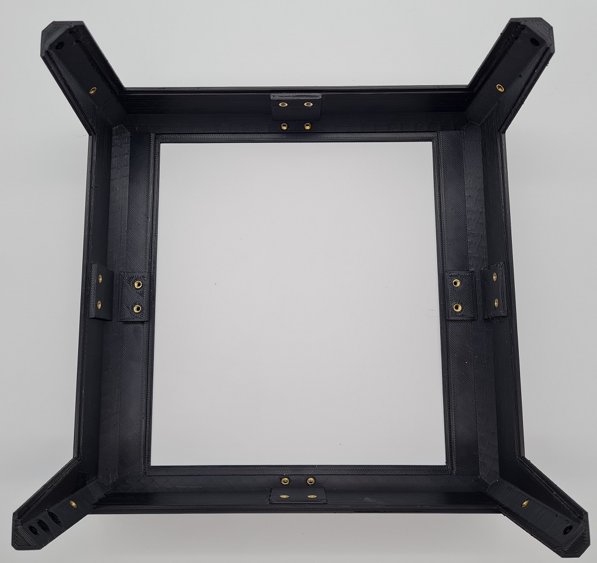

# TipTophat

TipTophat is an alternative Tophat for the Voron v0.1 which uses the BOM panels. It provides 30mm in additional height as well as better access via the additional door. It places the side panels fully virtically to make the tophat square. It also comes with hinges that can be used with the [Tophat hinge  mod](https://github.com/VoronDesign/VoronUsers/tree/master/printer_mods/MSiemons/TophatHingeV0.1).

For the bleeding edge releases, see [my development repo](https://github.com/waytotheweb/voron)

## Printing:

- Use the Voron defaults and print in ABS. I have successfully printed the main body part(s) using 0.5mm layer width and 0.25mm layer height with 25% infill. This reduces both the time to print and the amount of filament used
- The parts are orientated correctly in the STLs
- If using the rear hing, print the appropriate Hinge_panel_left and Hinge_panel_right from [Tophat hinge  mod](https://github.com/VoronDesign/VoronUsers/tree/master/printer_mods/MSiemons/TophatHingeV0.1)

There is the choice of printing the whole body using the Unibody if you have a printer with a print bed of at least 238x238mm. Otherwise, you can print the separate quarters on a printer with at least 119x119mm printer bed. So they can be printed on a Voron v0, but it will be tight!

## BOM:

- Original BOM panels (panels of 2.5mm and 3.0mm have been tested)
- 28x M3x8mm** SHCS/BHCS (2x door frame hinge, 4x rear hinge (optional), 18x panel connectors, 4x tophat pins (optional))
- 1x M3x12mm SHCS/BHCS (door hinge)
- 1x M3x25mm SHCS/BHCS (door hinge)
- 28x Brass heat inserts (2x door frame hinge, 4x rear hinge (optional), 18x panel connectors, 4x tophat pins (optional))
- 2x 6x3mm Neodymium magnets
- VHB tape

** If your panels are 3mm in depth you will need to substitute 4x M3x8mm screws for 4x M3x(10 or 12)mm screws for the four mid connectors

## Assembly:

Note: These instructions use directions based on the tophat in front of you being upside down with the back facing away from you and the front in front of you. Once you place the tophat on the printer, instruction directions are as you look at the printer from the front.

### Building the frame and inserting the panels:

Place brass heat inserts into all the holes you are going to use. This is likely to be everything apart from the top 4 holes. Those top 4 holes are if you use the stock style pins to locate the tophat on the printer instead of using hinges at the back.

If you are building using the unibody instead of the four quadrants, you need to arrange the four quadrants with Q1 at the back left, Q2 back right, Q3 front left, Q4 front right. They need to be aligned correctly.

Place the top panel into the center of the bed and attach four connectors being very careful not to overtighten them, otherwise you can easily crack the print or the panels. It's better to have the connectors loose initially and tighten slightly until the panel doesn't move.

Now work from the left, to the back, to the right, using the side and bottom connectors for each panel.

### Building the door:

The door connector takes a single 6x3mm Neodymium magnet. You should be able to press fit the magnet into the hole. If it's too loose, use a bit of superglue. If it's too tight, use a file  of drill bit to widen it a little. Attach this to the frame.

Take the two door hinge parts and assemble. The screws go into plastic, so do not tighten. The hinges should be a little bit loose so that it moves cleanly without binding. This can be adjusted later.

Put VHB tape on the panel hinge.

With the hinge open, put the panel into place abutting the panel into the hinge and centered. Press the panel to the hinge with some pressure to ensure a good seal.

Screw the hinge to the side of the tophat frame. There is adjustment available here for later if there are issues with the door opening/closing or being askew.

If you are going to use the hinged tophat, screw the hinge parts to the back of the tophat frame. You should also fit the hinge parts to the printer.

If you are using the standard locator pins, screw those in.

Put the tophat onto the printer and screw the rear hinges together if you are using them. Note: The hinge holes are deliberately oversized to allow for different tolerances and spacing for the tophat to sit well on the printer.

### Hanging the door:

Open the tophat door and close the main printer door. Now close the tophat door and check that it does not hit the main door. If it does there are a few adjustments that can be made later:

### Adding the handle:

Take the door handle and the second magnet. With the tophat door closed, put the magnet against the frame magnet to get the correct orientation (use a marker pen on the magnet if it helps).

Maintaining the correct orientation place the magnet into one of the holes in the foot of the handle:

Place VHB tape over both of the handles feet:

With the tophat door closed, align the handle with the magnet at the top opposite the magnet in the frame and keeping the handle straight press it onto the door. If it's not quite right, it should be fairly easy to carefully, and slowly, remove the handle and do it again.

You can adjust the frame mount from the inside screws to change the fitting of the hinge. You can also tighten and loosen the hinge screws to lower and raise the door panel. If none of that works, unscrew the door hinge and take the hinge+tophat door off. You can usually remove the hinge from the door, by very slowly pulling the hinge from the door panel, being careful not to snap the hinge or crack the panel. You can then redo the hanging steps for a better fit.

## Changelog:

- 2022-07-22 Updated Body Quarters and STEP file
