# <b> 20x20mm, slot 6 Profile Covers</b>

Please find here my mod for variable profile covers for 20x20 construction profiles with 6mm slot.

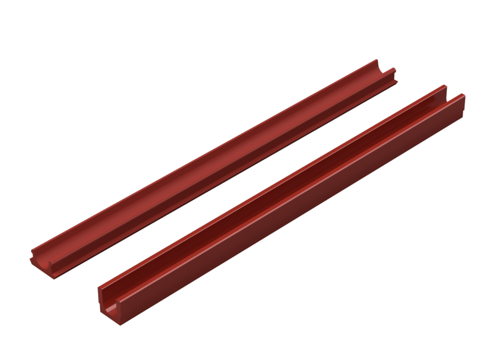  

## <b>Printing</b>

Printing successful with standard VORON settings.

For adjusting the length of the profiles you can scale the *.stl file in your slicer in y-direction after import and before positioning (rotating/placement) on your print bed. Please find the following example on how to do so for SuperSlicer:

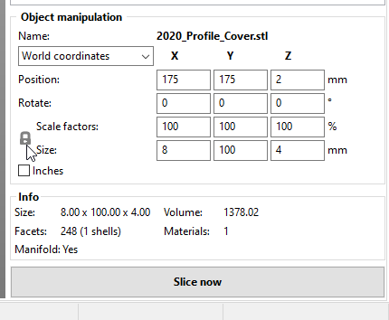</a>
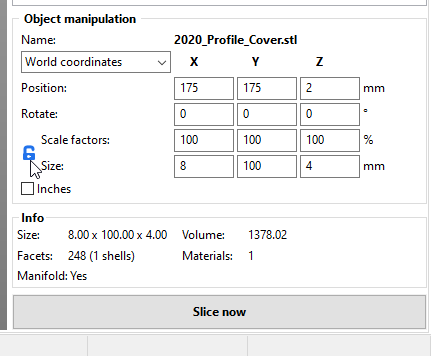</a>
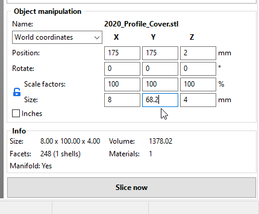</a>

<i>Sequence: Deactivate linked scaling with click on lock symbol, Lock symbol status ("blue, open") when free scaling is active, Defining the exact length of your profile (avoid changing x, z scaling !)</i>

As default 100mm length is provided.

- 2020_Profile_Cover.stl

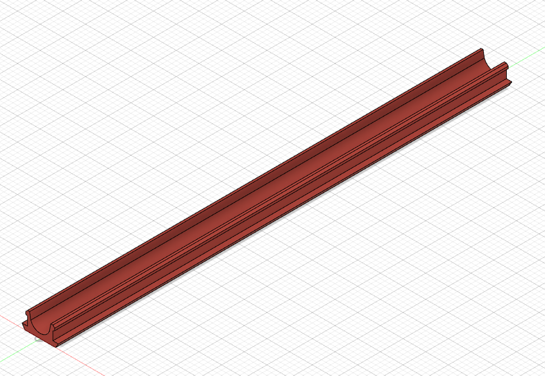</a>
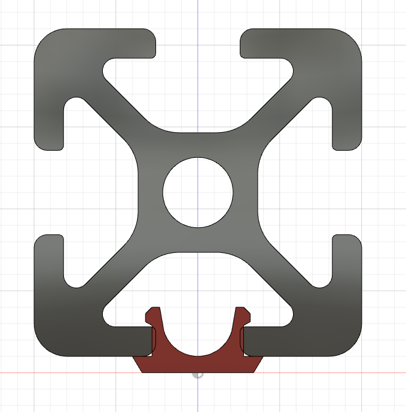</a>

This cover is adding a little 8 x 1mm cap to the slot of your profile and with that does not end flush with the construction profile. This can be helpful when routing cables as it offers wider coverage of the 20x20mm profile. It may help as well with your own designs for future remixes. Simple cross section profile improves printing success.

- 2020_Stealth_Profile_Cover

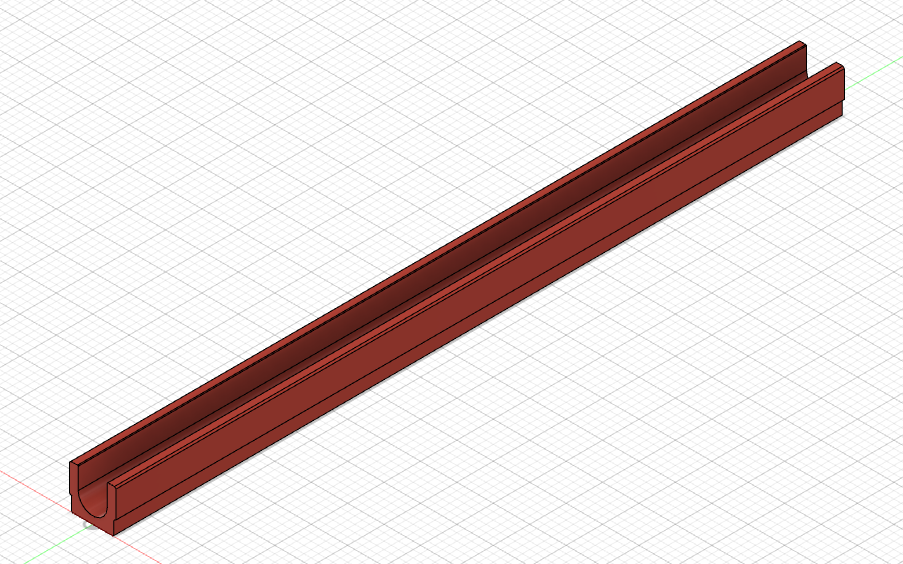</a>
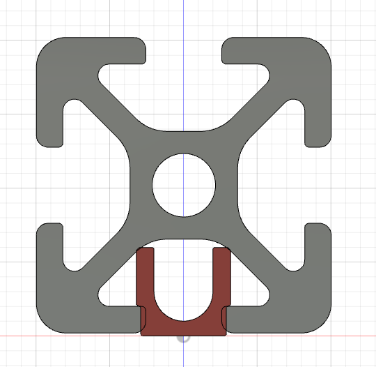</a>

This cover will end flush with the outer surface of your construction profile, which is useful when covering slots facing moving parts of VORON Gantry, e.g. inner slots of VORON 2.4 rack with gantry passing in close distance. When printed in accent color it will provide an even balance of profile and accent color.

## <b>Additional Material</b>

None Required.

## <b>Mounting</b>

Either adjust the length of multiple imported profiles to your needs or make use of the maximum printable length of your printbed ( diagonal position) and print as many of the profiles as needed for later cutting to length. Cutting is recommended to be done with heated blades.

- 2020_Profile_Cover.stl will snug in tight and overlap with covered profile surface

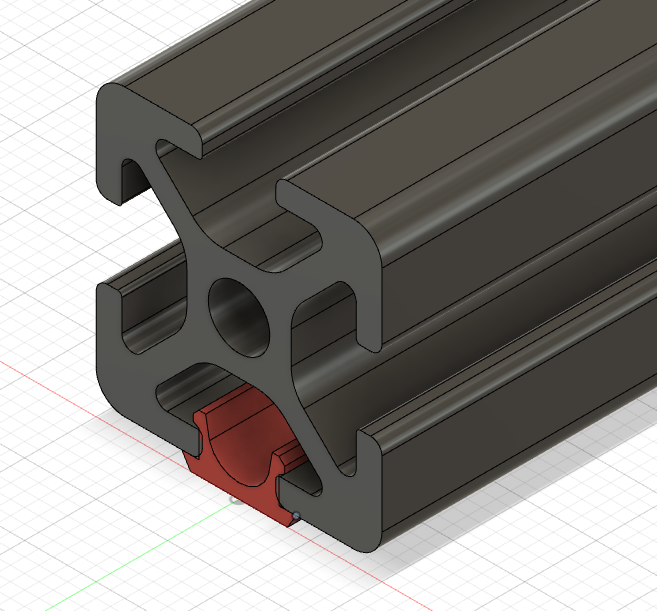</a>

- 2020_Profile_Stealth_Cover.stl will snug in tight and end flush with covered profile surface

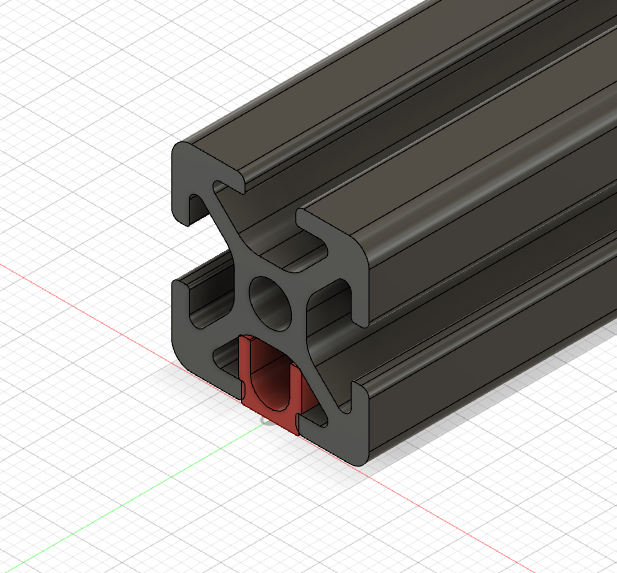</a>

### This is how it could look like in real life

Stealth Cover:

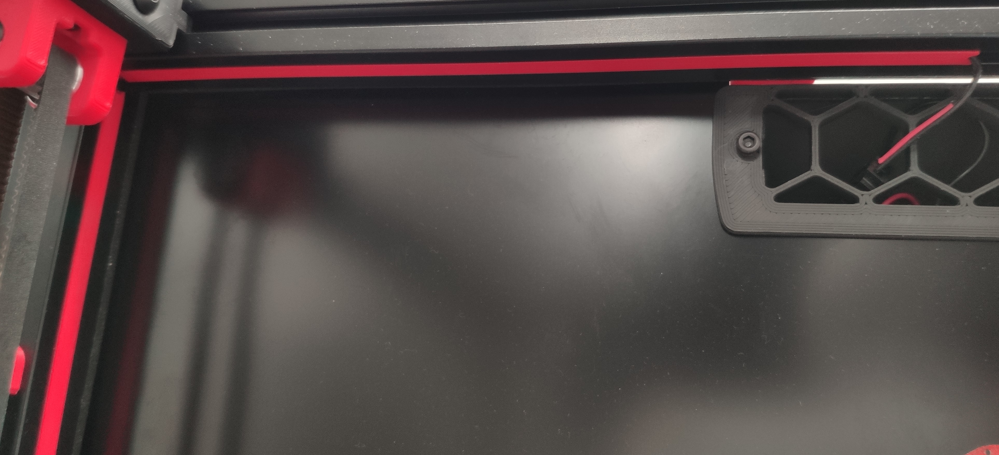</a>

Profile Cover:

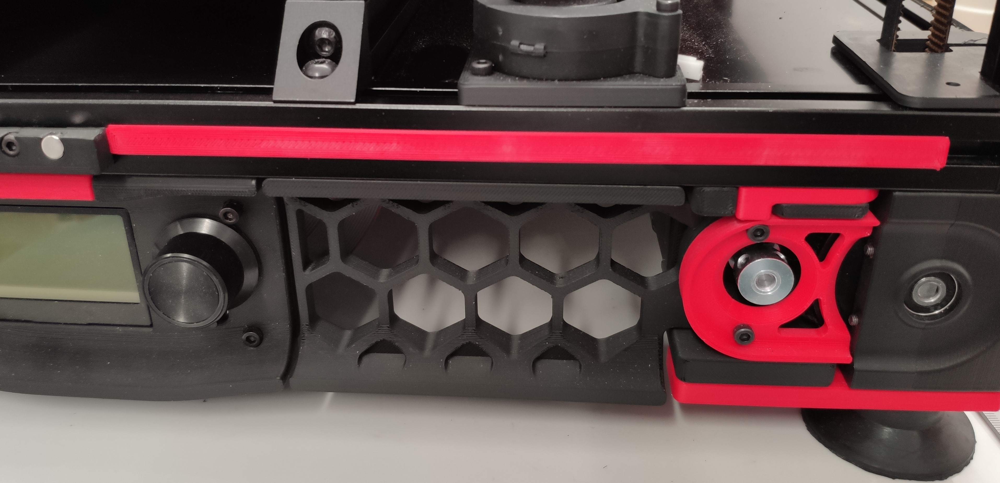</a>

## <b>FAQ</b>

<i> No questions and answers so far.</i>

#### Question ?
* Answer !

## <b>History</b>

### Release V1:

</a>

