# <b> Angry CAM USB</b>

Please find my USB Camera Mod based on Waveshare OV5648 5MP USB Camera Module (A), which allows mounting to rear gantry or other position on a frame profile.

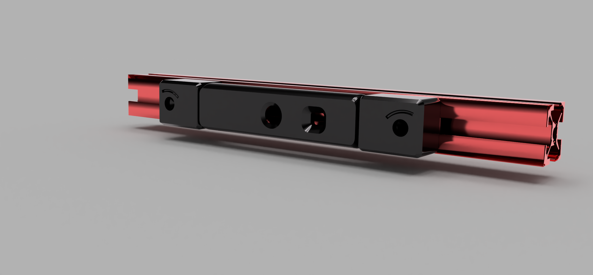  

## <b>Printing</b>

Printing succesful with standard VORON settings. Distance between mounts and camera housing set to 0.3 mm in *.stl file, which allows printing of mounts and housing in one print.

Use the following two *.stl files for realization in one print:
- Camera_Housing+Mounts.stl
- Rear_Cover.stl

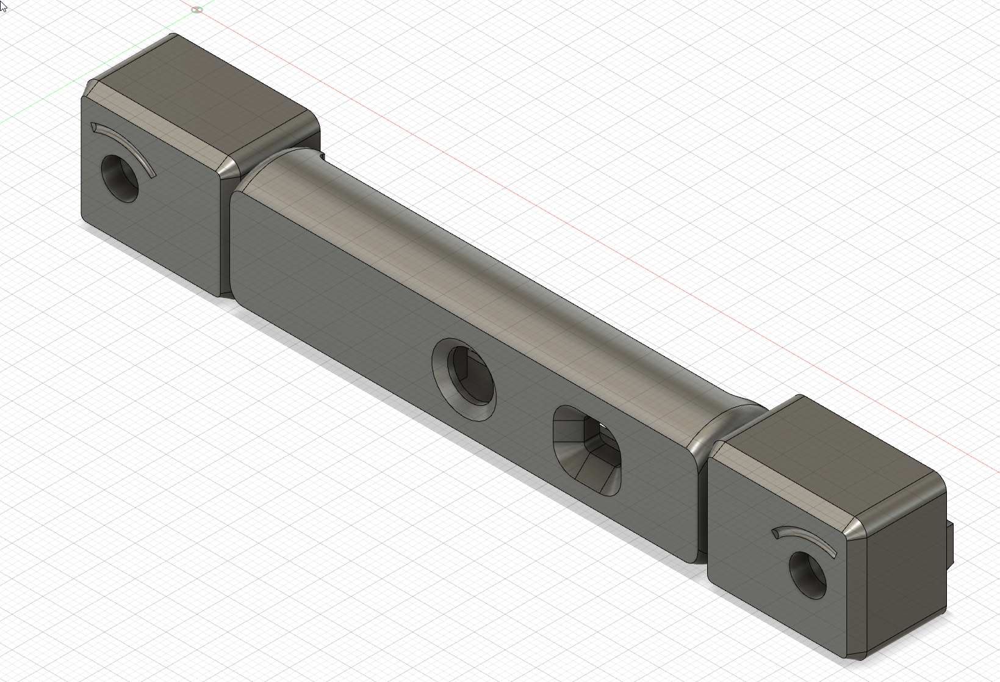  
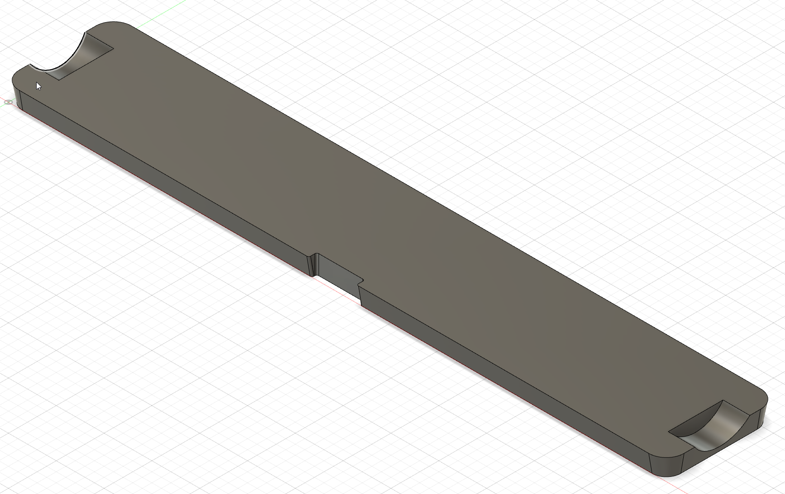  

## <b>Additional Material</b>

Bill of Material:
- 1x Waveshare OV5648 5 MP Camera Module (A), incl. USB-A to JST SH PCB connector cable
- 2x M3x16 SHCS screws
- 2x M3 T-Nut for 2020 frame profile
- 1x Camera Housing + Mounts and Rear Cover from the printing source of your trust.

Optional/Required for frame sizes >300mm:
- 1x DeLock USB-A to 5-pin camera plug V5, 1.5m length ( Art.-Nr. 95985)

or

- 1x 5pol JST SH connector with pre-crimped cables
- 1x USB Cable, 1.5m or 2m, USB-A to microUSB or USB-C
- 1x 4/5pol pair of cable connectors (socket + conector), e.g. Molex Microfit 3.0

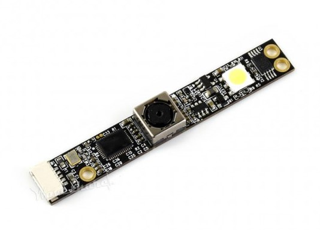 

## <b>Mounting</b>

### Using the original USB Cable or the 1.5m USB cable replacement with pre-crimped JST SH connector

<i>Applicable for usage of direct USB cable connection</i>

Note down the wiring of your USB cable at the JST SH connector. 

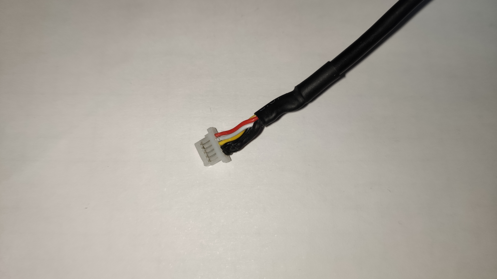

Remove each line from the JST SH connector, by gently lifting the pin locking nose at each pin. Calm hands and an illuminated magnifying glass can help with this task.

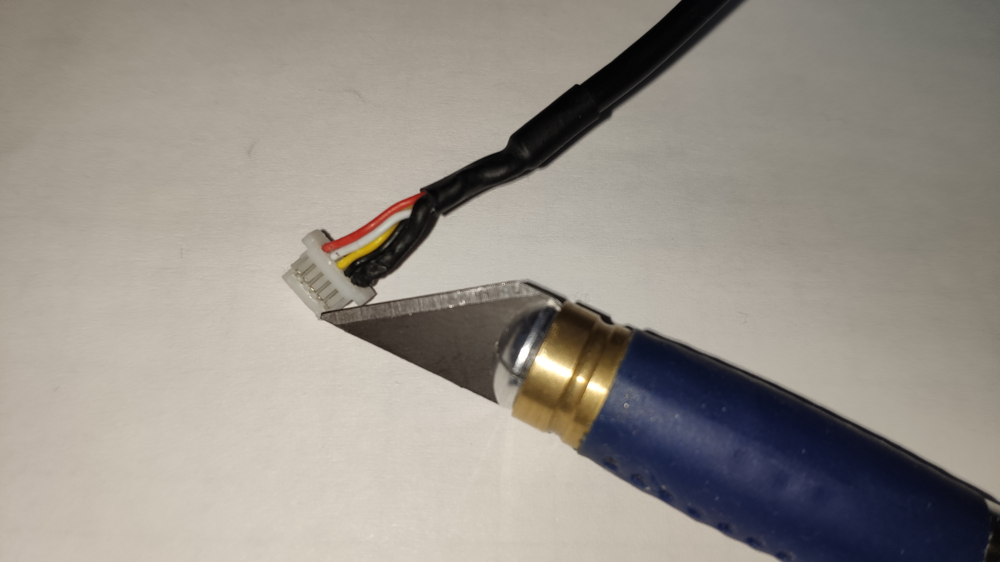

Then push the open ends of the USB cable through the cable guide channel of the starboard mount starting at the rear of the mount and leaving at the mounting bolt. 

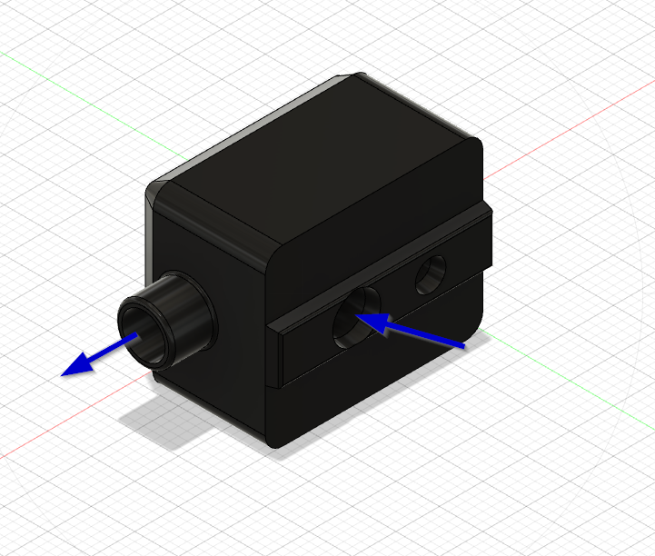

Pass the cable ends through the starboard borehole of the camera housing, outside in. Now re-position each cable line to the appropriate position in the JST SH connector and connect the camera module to the JST SH connector. Check the pinning of the JST SH connector at least twice against your initial notes, to avoid damage of the camera module !

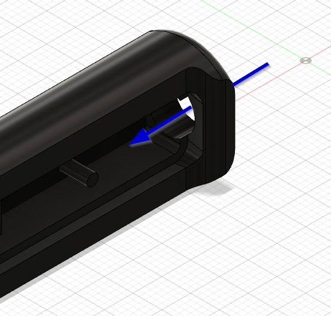

Route the USB cable to your Raspberry Pi. Remember to guide your USB cable via all necessary cable chains, if you mount the camera to moving parts of your printer ( e.g. z-axis cable chain if mounted on rear of gantry).

### Using an adapter cable to allow longer USB cables

<i>Required for frame sizes >300mm and the usage of 24AWG wire harness cables, when mounting to gantry and in case other mounting positions are chosen.</i>

Connect the camera module with the short pre-crimped JST SH cable and guide the open end of the cable through the starboard borehole of the housing, inside out. Then pull the open end of the cable through the guide channel in the mount, starting at the mounting bolt and leaving the mount at the rear side.

At the end your premounted camera module should look similar to the following picture.

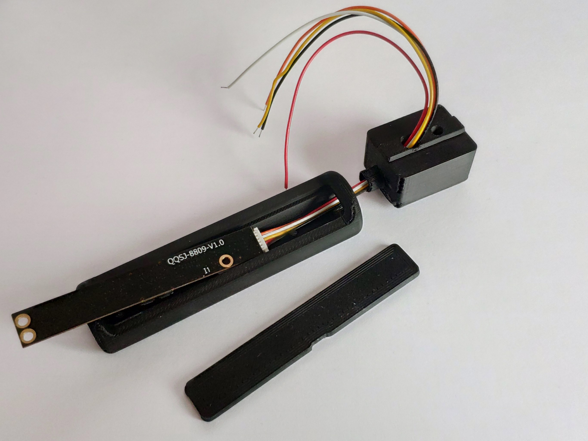

At the open end of the adapter cable, attach the cable connector of your choice ( e.g. Molex Microfit 3.0).  Cut a standard USB cable on the microUSB or USB-C connector side and crimp every line and the shielding to a dedicated pin in your connector of choice (-> 5pol). You can save one pin at your connector when connecting GND line and shielding to one position of the connector (-> 4pol).

Connect the adapter cable with the standard USB cable and route the standard USB cable to your Raspberry PI. Remember to guide your USB cable via all necessary cable chains, if you mount the camera to moving parts of your printer ( e.g. z-axis cable chain if on rear of gantry).

### Module Mounting Procedure

Place the camera module in the Camera Housing. Take care of the mounting frames and domes in the camera housing to ensure proper position and direction. Close the housing with the rear cover.

Make sure you place the wider edge of the rear cover first. This allows carved out areas in the rear cover to match to the mounting bolts and the rear cover will snap to the camera housing without glueing necessary. 
Start at one end of the rear opening and then gently press the cover to its position.

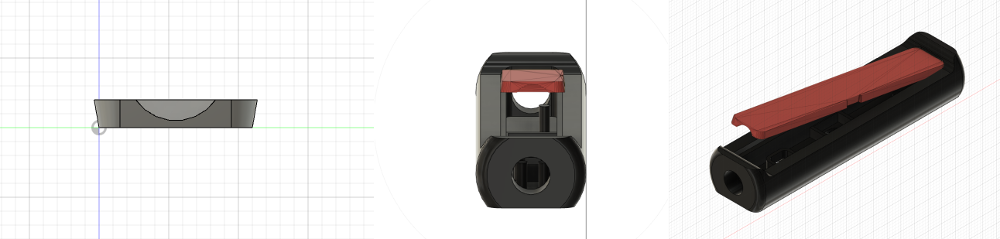

This is how it could look like in real life.

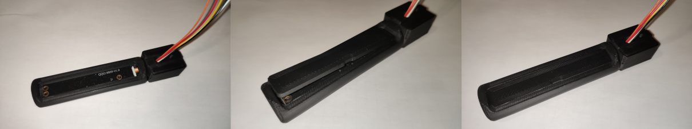

### Mounting to Frame or Gantry

Place the camera module with the mounts to your desired mounting position. Use the M3x20 screws and the T-nuts to fix it to the frame. Take care to not squish the adapter cable or USB cable with the T-nuts, when guiding the cable in the frame profile.

If you mount the module to the gantry, make sure to guide the USB cable through the z-axis cable chain to allow free movement of the gantry in z direction.

### Raspberry Pi and Software Configuration

Connect the USB-A connector to your Raspberry Pi and enable the USB webcam support as described in https://www.waveshare.com/wiki/OV5648_5MP_USB_Camera_(A) with <b>sudo raspi-config</b>. 

If you are using Octopi OS image, no additional application needs to be installed. Finalize you installation with a reboot of your Raspberry Pi.

After reboot activate the webcam support in the Octopi Settings: OctoPi Settings -> Functions -> Webcam & ...

<b>Arrange your camera module to your desired view angle and enjoy !</b>

## <b>FAQ</b>

<i> No Questions and Answers yet. </i>

#### Question ?
* Answer.

## <b>Images</b>

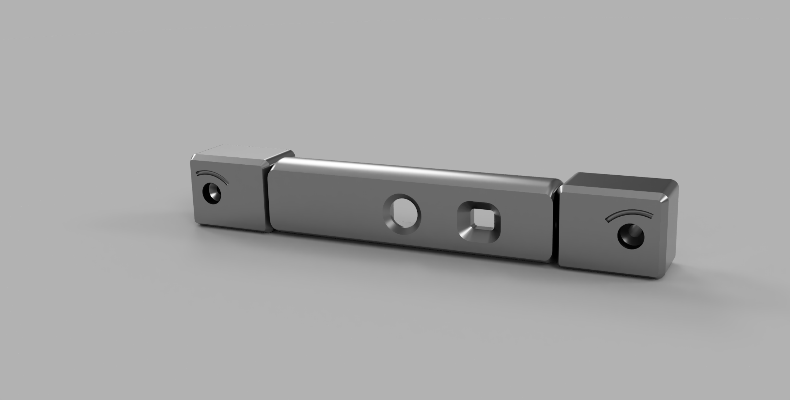
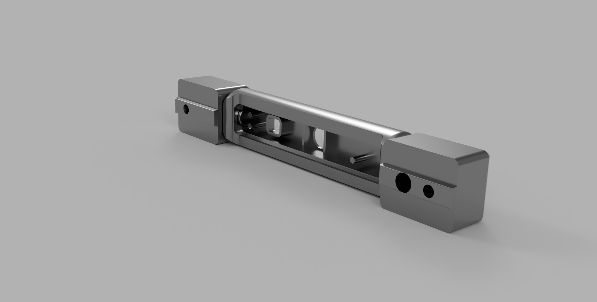
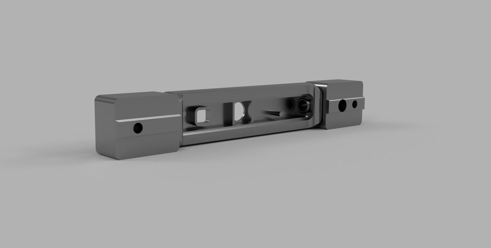   

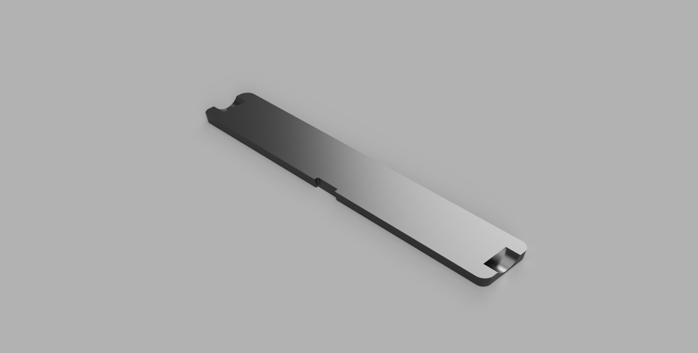
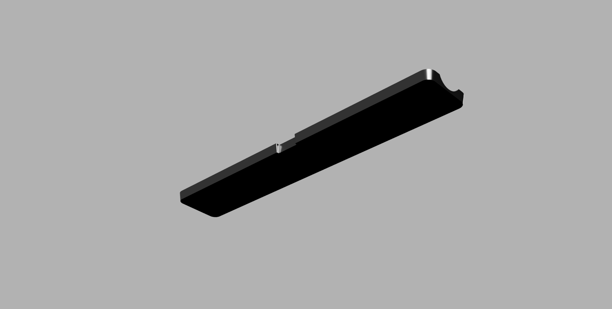