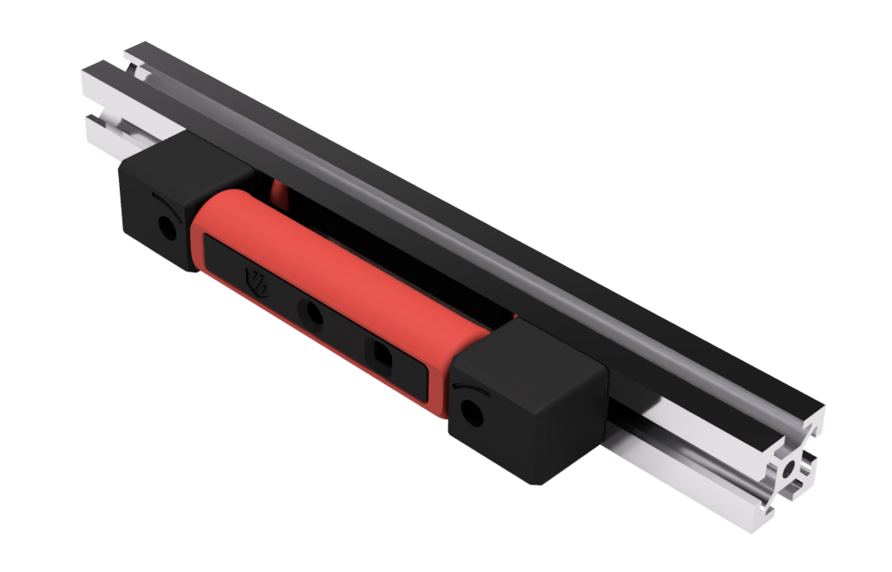
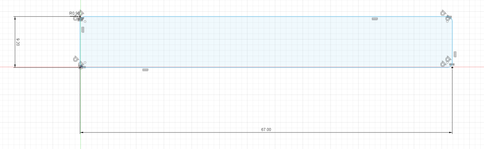

# <b> Angry CAM USB V2.0</b>

Please find the next generation USB Camera Mod based on Waveshare OV5648 5MP USB Camera Modules, which allows mounting to rear gantry or other position on a frame profile.
With this major update i added an enhanced cable tunnel in mounts on both sides, Top & Bottom Mounts and changed the housing to follow a fully modular approach, allowing easy adoption to other upcoming camera modules with similar module outlines and allow printing with accent color for some of the parts.

  

## <b>Printing</b>

Printing successful with standard VORON settings. Distance between mounts and camera housing set to 0.3 mm in *.stl file, which allows printing of mounts and housing in one print.

For a full print you need to combine a shell + mounts *.stl file with your needed front + rear cover *.stls. You can print them together or with different colors (e.g. accent color) to personalize the look of your camera mount.

Files providing the camera housing shell and the respective mounts in one print:

Use the following *.stl files for realization in one print for standard front mounts and the housing shell.
- Angry_CAM_Front_Mount.stl

</a>

Use the following *.stl files for realization in one print for bottom mounts and the housing shell.
- Angry_CAM_Bottom_Mount.stl

</a>

Use the following *.stl files for realization in one print for top mounts and the housing shell.
- Angry_CAM_Top_Mount.stl

</a>

Combine these parts with a front and rear cover of your choice, or develop your own front & rear covers for your respective camera module:

For Waveshare OV5648 5 MP Camera Module (A):
- Front_Cover.stl

</a>
</a>
- Rear_Cover.stl

</a>
</a>

For OV5640 5 MP 120/160° View Angle Camera Modules:
- Front_Cover_120+.stl
- Rear_Cover_120+.stl

Images of those can be found below in section "Other Camera Modules".

  
## <b>Additional Material</b>

Bill of Material:
- 1x Waveshare OV5648 5 MP Camera Module (A), incl. USB-A to JST SH PCB connector cable
- 2x M3x20 SHCS screws
- 2x M3 T-Nut for 2020 frame profile
- 1x Camera Housing Shell, Mounts and Front & Rear Cover from the printing source of your trust.

Optional/Required for frame sizes >300mm:
- 1x DeLock USB-A to 5-pin camera plug V5, 1.5m length (Art.-Nr. 95985), or similar

Alternative off-the-shelf supported Camera Modules:
- 1x 5MP OV5640 USB camera module with fix focus 120° view angle (EAN: 4894822492305; Dimensions: 60 x 8.5 x 12.8 mm)
- 1x 5MP OV5640 USB camera module with fix focus 160° view angle (EAN: 4894847193232; Dimensions: 60 x 8.5 x 12.8 mm)

as available on multiple Chinese sellers.

<i> Remark: As long as the outer dimensions of your camera module stays within 65 x 9 x 10mm (without lenses) you have a fair chance of adopting the housing to your needs. </i>

## <b>Other Camera Modules</b>
To allow adoption to other camera modules with the same form factor, i changed the housing section of AngryCAM USB to a front-/rear cover and shell set up.
With that you can easily adopt front and rear covers to the needs of your particular camera module, fitting in the 67 x 9 x 10 mm form factor of the shell.

</a>

The default front cover for Waveshare OV5648 5 MP Camera Module (A) provides basic measurement details for creation of your own front covers.

This sketch is providing the measures on the inner side of the front cover. If you want to adopt the STEP files, remove any support structure or openings not fitting to your camera module and redraw you needed openings and structures as required.

With adjustment of the position and the length of support columns on the rear cover you can support various module heights to avoid rattling noise and vibrations on your videos when mounting to the gantry.

As an example i realized a front & rear cover for OV5640 camera modules with 120 and 160° view angle available at Chinese sellers in various platforms.

Front Cover:

</a>
</a>

Rear Cover:

</a>
</a>

## <b>Mounting</b>

Mounting of the housing is shown on a Top Mount Derivative.

### Using the original USB Cable or the 1.5m USB cable replacement with pre-crimped JST SH connector.

<i>Note: Using other USB cables as the original one might require re-sorting of the lines in the JST SH connector. Check the needs of your camera module and adjust your replacement cable accordingly !</i>

<b>Note down the wiring of your USB cable at the JST SH connector, before de-pinning it !</b>

Remove each line from the JST SH connector, by gently lifting the pin locking nose at each pin. Calm hands and an illuminated magnifying glass can help with this task.

Then push the open ends of the USB cable through the cable guide channel of one of the mounts starting at the rear of the mount and leaving at the mounting bolt.

<i>Note: In addition to starboard mount cable path, you could as well chose larboard mount cable path instead - this would require a 180° turn of the housing shell with the camera module, due to the fixed position of the USB connector on the module PCB. (Doing so, will require the camera picture as well to be rotated later in your applications ! Check e.g. OctoPi cameras settings on how to achieve this.)</i>

</a>
</a>

Pass the cable ends through the borehole of the camera housing, outside in. Now re-position each cable line to the appropriate position in the JST SH connector and connect the camera module to the JST SH connector. Check the pinning of the JST SH connector at least twice against your initial notes, to avoid damage of the camera module !

</a>
</a>

Test the correct function of the camera module with any computer and application supporting USB cameras before starting any further mounting steps.

Route the USB cable to your Raspberry Pi. Remember to guide your USB cable via all necessary cable chains, if you mount the camera to moving parts of your printer ( e.g. z-axis cable chain if mounted on rear of gantry).

Other cable options as stated in the former releases can no longer be recommended due to possible malfunctioning of the USB camera module. Please use a shielded USB cable with appropriate length for connection to your camera module.

### Module Mounting Procedure

Place the camera module in the Camera Housing. Take care of the mounting frames and domes in the camera housing to ensure proper position and direction. Close the housing with the rear cover.

Make sure you place the wider edge of the rear cover first. This allows carved out areas in the rear cover to match to the mounting bolts and the rear cover will snap to the camera housing without gluing necessary. 

Start at one end of the rear opening and then gently press the cover to its position. <i> (-> Here shown with the older V1 housing but in general still valid for release V2) </i>

### This is how it could look like in real life

<i> REMARK: The following pictures show an OV5640 120° View Angle Camera Module for front mounting fully assembled with original USB cable.</i>

</a>
</a>
</a>

### Mounting to Frame or Gantry

Place the camera module with the mounts to your desired mounting position. Use the M3x20 SHCS screws and the T-nuts to fix it to the frame. Take care to not squish your USB cable with the T-nuts, when guiding the cable in the frame profile.

If you mount the module to the gantry, make sure to guide the USB cable through the z-axis cable chain to allow free movement of the gantry in z direction.

### Raspberry Pi and Software Configuration

Connect the USB-A connector to your Raspberry Pi and enable the USB webcam support as described in https://www.waveshare.com/wiki/OV5648_5MP_USB_Camera_(A) with <b>sudo raspi-config</b>. 

If you are using Octopi OS image, no additional application needs to be installed. Finalize you installation with a reboot of your Raspberry Pi.

After reboot activate the webcam support in the Octopi Settings: OctoPi Settings -> Functions -> Webcam & ...

<b>Arrange your camera module to your desired view angle and enjoy !</b>

## <b>FAQ</b>

#### V1: Why did you place the cable tunnel only in one mount ?
* Answer. It was easier to draw for me at the time i started Angry CAM USB. I recognized soon myself the necessity of providing a more flexible cable routing with cable tunnels in both mounts and a cable exit on the outer side of the mounts to avoid issues when mounting the module to a profile. Therefore i started V2 development activities.

#### V1: Could you please update the cable tunnel in the mount to a provide the cable to the outer side of the camera module ?
* Answer.  Yes, i can follow your need - done with V2 update.

#### V1: I want to use a different camera module with a wider view angle. How to adopt the housing to my specific camera module ?
* Answer.  In the original monolithic design, this was not really possible. With switching to the new modular design, you can easily adopt front & rear cover to match your needs. For this, my original CAD files are attached as well as measurement details for the default front cover and the rear cover. This should allow you to draw your own derivative. When you feel something is missing, give me a hint.

####  How can i achieve a multi color look on mounts + housing shell, when they need to be printed at once ?
* Answer.  Print them twice. Once in your basic printer color and a second time with the parts you plan to have in your accent color ( e.g. front + rear cover). With that you will have the full choice on every desired combination. 

####  Why do you no longer recommend to use an adapter cable ?
* Answer.  I faced issues in my own set up after installing my module with adapter and non shielded cable for testing purposes. It may work, but it can be showing negative side effects during use of the camera. Using a shielded USB cable of the needed length should avoid such temporary issues right from the start. As long as you are only routing the cable through the z-cable chain, i would not expect to high cable wear as z-axis will typically only show smaller movements with lower acceleration. For static mounting at the frame only the routing and hiding of the USB cable remains as a challenge.

## <b>History</b>

### Release V2:

</a>
</a>
</a>
</a>
</a>

### Release V1:

</a>
</a>
</a>

