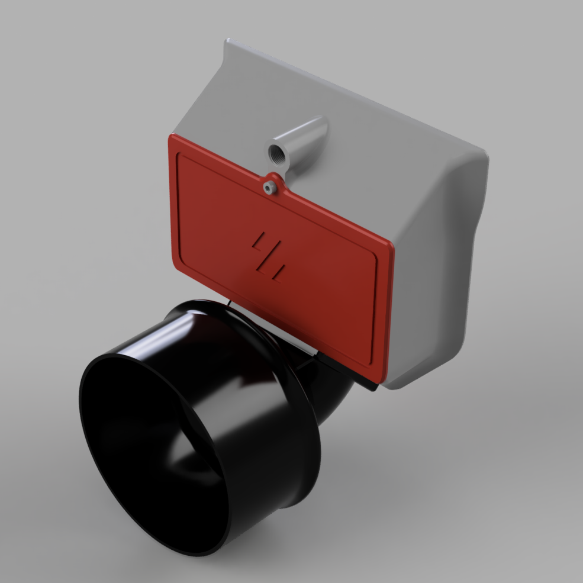
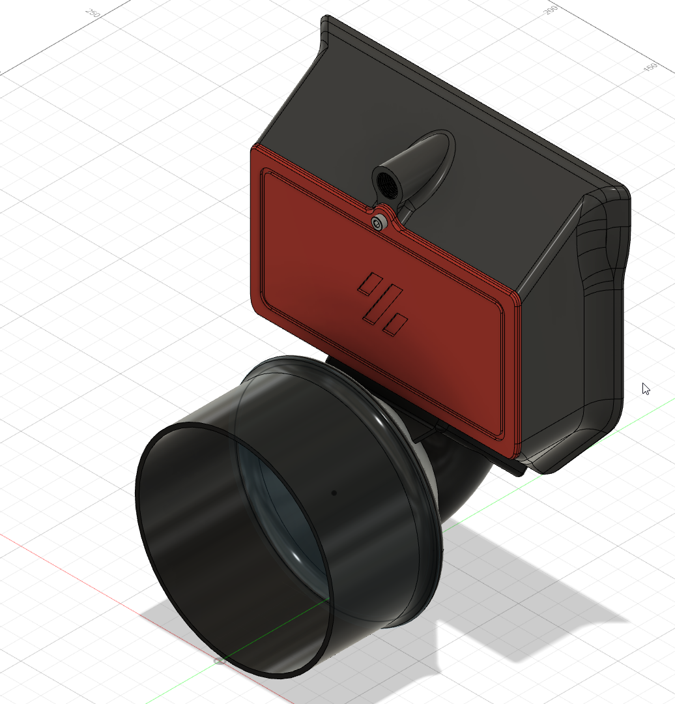
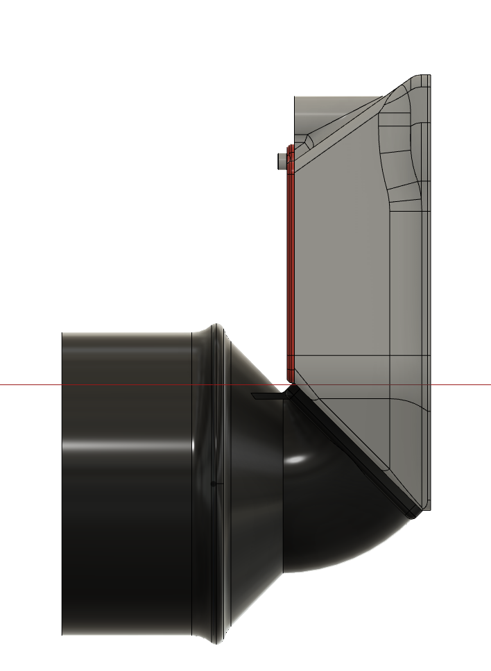

# <b> Exhaust Adapter to 100mm ventilation system</b>

Please find attached my exhaust adapter to a 100 mm ventilation system. The adapter replaces the original 60mm fan on the exhaust housing of Voron 2.4 and comparable 3d printers.

  

## <b>Printing</b>

Printing succesful with standard VORON settings. Support should not be required, as dedicated structure has been added for increased rigidity and to avoid necessary support structures.

Use the following *.stl file for realization in one print:
- [VORON2_v2.4_Exhaust_Adapter_100mm_RC3.stl](STL/VORON2_v2.4_Exhaust_Adapter_100mm_RC3.stl) 

  
  

## <b>Additional Material</b>

Bill of Material:
- 4x M3x8 SHCS bolts
- 2x 90-110mm hose clamps (e.g. local hardware store)

Optional:

- 1x 100mm Ø flexible ventilation hose (e.g. local hardware store)
- 4x M3x10 BHCS bolts for reverse mounting
- 4x M3 hex nut
- 4x M3 washer

## <b>Mounting</b>

### Replacing the original 60mm fan

Losen the screws of your original 60mm fan and detach the fan from the exhaust housing. Pre-load the mounting holes in the exhaust adapter with M3x8 SHCS bolts and align and fix the adapter to your exhaust housing with the 100mm opening facing away from your printer.

Screwing the bolts at the upper side of the adapter requires a hex key with ball ends. Alternatively you can screw M3x10 bolts inverse from the inner side of the exhaust housing and mount the adapter with M3 washers and hex nuts.

The exisiting 24V supply for exhaust fan can be used with an external SSR for the control of an AC ventilation system or as input for any ventilation valve system in central exhaust system set ups. (Mind electrical isolation between printer and exhaust system !)

Slide a 100mm Ø flexible ventilation hose over the 100mm opening and fix it with one or both of the hose clamps.

Alternatively rigid 100 mm PVC ventilation pipes can be directly slided over the adapter and sealed with remains of 3mm sealing tape from your enclosure panels.

## <b>FAQ</b>

<i> No Questions and Answers yet. </i>

#### Question ?
* Answer.

