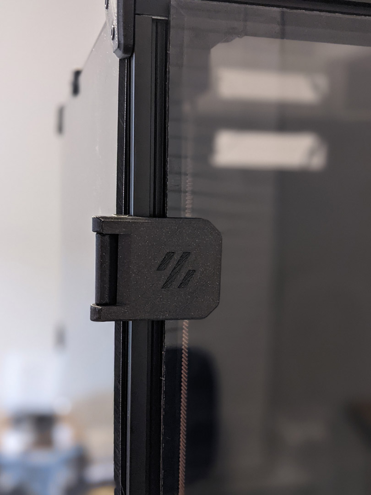
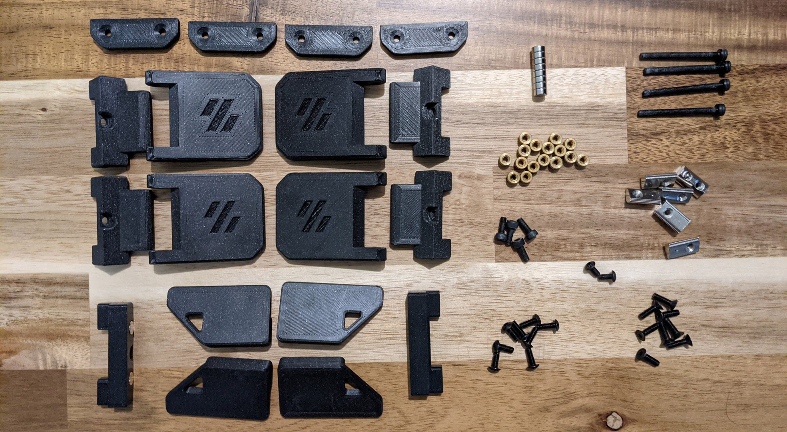

# 270° Hinge - Parametric

These hinges allow for 270 degrees of motion, from closed 0° to 270° full open parallel with the side panels. This was 
developed out of an effort of running into tolerance issues with the spec hinges not allowing much room if the two panel 
doors are used and are slightly cut larger by only 1 mm or so. I ran into issues closing and the doors hitting and needed 
something that allowed more horizontal movement.

So it was decided to figure a way to mount on the side of the printer. After some searching, printing, trial &amp; error, 
I came to what you see below. 270 degrees wasn't the initial intention but figured if they are going to be mounted to the side, 
might as well take advantage of the extra flexibility.

During development and testing of these I struggled with tape being sufficient with my first version of these. So went back
and designed these to use hardware and remove tape from the equation. Hardware mount was heavily influenced by 
[Randell](../../randell/Door_Hinges) other door hinge mod 
that uses hardware. The handles in this mod are a remixed version of 
[Randell's](../../randell/Door_Hinges) to adjust for the 
altered latch developed for this setup. The latch in the mod gives as much room as possible vertically if panels are
slightly too tall.

Note: Un-tested but the holes should line up with [Randell's](../../randell/Door_Hinges)
hardware for the hinges if you are looking to swap for more swivel.

As you can see this setup allows vertical and horizontal freedom if your panels are cut too large.

 | 
--- | ---

## BOM

#### Hinge Hardware
```
M3 x 35 mm SHCS      [x4]
M3 x  8 mm SHCS      [x4]  Side Mount
M3 x  8 mm BHCS      [x8]  Backplate. SHCS can also be used here. And if you want a flush look 8 mm FHCS
M3 Threaded Insert   [x8]
M3 T-nuts            [x4]  hammerhead or spring ball, your choice
```

#### Latch
```
3 mm x 6 mm magnets  [x4]
M3 x  6 mm SHCS      [x2]  BHCS screws work better here if you have them
M3 T-nuts            [x2]  hammerhead or spring ball, your choice
```

#### Handles
```
3 mm x 6 mm magnets  [x4]
M3 x 6 mm BHCS       [x8]
M3 Threaded Insert   [x8]
```

## Printing
Use the default recommended for Voron parts. Can be done in PLA but I have not tested this. If having issues printing side mounts
you may need to add a brim to those and trim before installation

```
Layer Height     : 0.2 mm 
Extrusion Width  : 0.4 mm
Infill           : 40 %
Walls            : 4
Solid Top/Bottom : 5  
```
There is a left (a) and right (b), you will need to print 2 for each side. There are 2 versions of each of the hinge faces
if you don't want a Voron logo or want to mix and match. Multiple depths are also provided. Should you need a specific 
depth and no access to Fusion, feel free to reach out to me on discord [chrisrgonzales#0731](https://discord.com/users/chrisrgonzales#0731) 
The 4 mm is typical 3 mm panel and 1 mm foam , and 6 mm files are for 3 mm panel and 3 mm foam.

You will need to print 4 of the side mounts, they are not side specific.

> There are test stl files that can be printed to verify if your panel plus foam thickness will work with supplied stl
> files. Example 4mm test stl is  `tester_4mm.stl`

## Assembly
These are designed to have a tight tolerance, so the 35 mm screw can be screwed into the lower portion of the face hinge, 
and still have some play without wiggle. You will likely have to thread it all the way down then play with the hinge and 
pivot it a couple of times to work it in before attaching. Do not over tighten the screw as it will bind on the upper portion. 
If you feel it binding, back the screw off just a lil bit.

When installing back plates to hinges to protect panel from cracking be careful not to screw down too much as insert depth 
is shallow as you may risk of pushing through. The backplates have a chamfer for more recessed look, but can be flipped 
if you have longer hardware.

Take it slow when installing heat inserts as it's very easy to push them through and cause deformation on the face of the hinge.
Set temp on iron lower than used on most other heat inserted parts as this gives you more time not to press through. Also 
you may have to use the side of your iron's tip as not to puncture all the way.

For placement of drilling, you can install the hinges in place, and tape or use panel clips from sides temporarily to hold
front doors and tape outline of hinge. Then remove the panel and hinge, place the hinge where the tape outline is, mark the hole and drill.

> TIP: When installing with tape, mount the panels with the same corner clips that are used on the sides and top - you 
> can temporarily take a couple from each panel. Use the corner clips to position the doors where they should be when 
> closed. Install the hinges on the sides at the desired positions and apply the double-sided adhesive tape to the hinges. 
> Then swing the hinges inwards touching the doors and secure them. Once you feel the adhesive is secure, remove the 
> corner clips.

## CAD Files

The CAD files are parametric! When opened in Fusion 360, editing the `thickness` parameter will change the spacing and 
geometry to allow the hinge full 270 articulation. Enter in thickness of your panel and foam, I would recommend 
accounting for the compression in your foam. Example 3 mm panel with 3 mm foam, typical 6 mm would be entered, but possible
that 5.8 mm might be a better choice to give some compression for a seal. If you are unsure, printing a single bracket and
testing fitment and offset would be ideal.

If you would like to use this with tape only you may adjust the `faceThickness` parameter to be thinner but wouldn't 
suggest going smaller than 3 mm. You will also need to remove or extrude flush the holes for the brass inserts. Also the
`faceWidth` parameter may be adjusted to be smaller width. Would not go lower than 27 mm for this parameter.

The logo can be removed if needed. If using Fusion 360 with history, step back two actions and logo will be removed. 
Otherwise removal of chamfer and extrude flush will be needed.

```
thickness       : panel + foam depth in mm (default 4 mm)
faceThickness   : depth of the face portion of hinge not including panel + foam (default 5 mm)
FacePlate_width : width of facing hinge from edge of extrusion to the opposite edge. Not actual width of hinge default (34.9 mm)
                  Taped versions use 27mm. See image below.
```


### Questions / Suggestions
If you have any questions or suggestions feel free to contact me on Discord [chrisrgonzales#0731](https://discord.com/users/chrisrgonzales#0731)

  |   |   | 
 --- | --- | --- | ---
 0° |  180° |  270° | FacePlate_width