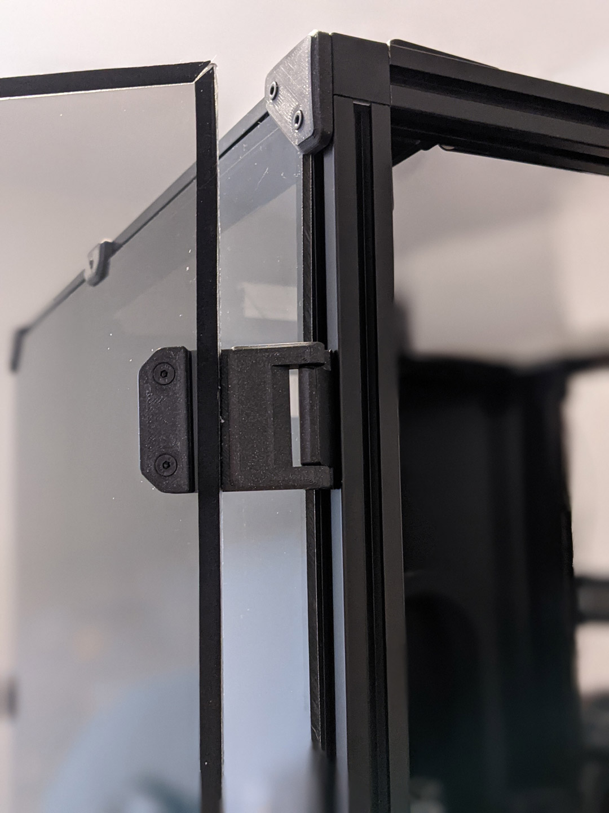

# 270° Hinge

These hinges allow for 270 degrees of motion, from closed 0° to 270° full open parallel with the side panels. This was 
developed out of an effort of running into tolerance issues with the spec hinges not allowing much room if the two panel 
doors are used and are slightly cut larger by only 1 mm or so. I ran into issues closing and the doors hitting and needed 
something that allowed more horizontal movement.

So it was decided to figure a way to mount on the side of the printer. After some searching, printing, trial &amp; error, 
I came to what you see below. 270 degrees wasn't the initial intention but figured if they are going to be mounted to the side, 
might as well take advantage of the extra flexibility.

 | 
--- | ---

## BOM
```
M3 x 40 mm SHCS  [x4]
M3 x  8 mm SHCS  [x4]
M3 T-nuts        [x4]  hammerhead or spring ball, your choice
```

## Printing
Use the default recommend Voron parts. 
```
Layer Height     : 0.2 mm 
Extrusion Width  : 0.4 mm
Infill           : 40 %
Walls            : 4
Solid Top/Bottom : 5  
```
Two sets of files are provided for the "face" hinge. There is a left and right and you will need to print 2 for each side. 
One of the sets has the Voron log on the face, the other does not. This is for any of those that may only want to print
one logo hinge and three blank hinges or mix and match.

You will need to print 4 of the side mounts, they are not side specific.

## Assembly
These are designed to have a tight tolerance, so the 40 mm screw can be screwed into the lower portion of the face hinge. 
And still have some play without wiggle. You will likely have to thread it all the way down then play with the hinge and 
pivot it a couple of times to work it in before attaching. Do not over tighten the screw as it will bind on the upper portion. 
If you feel it binding back the screw off just a lil bit.

## CAD Files

I've attached 2 different files. The `270_hinge_clean` file is just one side mount and left side face hinge. It's 
provided as a base to modify against if need your panel's thickness is different.

The `270_hinge_development` file is what I used to develop the hinge. Being fairly new at fusion it's got of experiments 
from trying to figure out these hinges. It has some sketches and some joints and things that might be useful for messing 
with but be warned it's not by any means meant to be used more as a if you need some info or dimension from the original 
file.

### Questions / Suggestions
If you have any questions or suggestions feel free to contact me on Discord [chrisrgonzales#0731](https://discord.com/users/chrisrgonzales#0731)

  |   |  
 --- | --- | ---
 0° |  180° |  270°