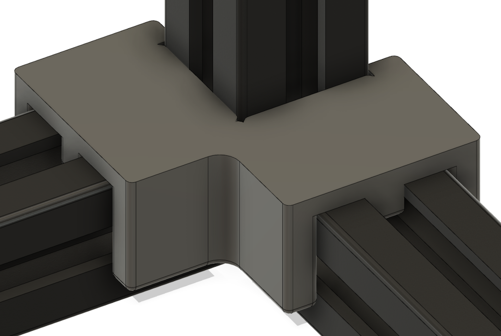

# Voron 2.4 Extrusion Jig

## What is this?
This model is a simple jig to help align the bottom extrusions to each other and the vertical extrusion.  This helps keep everything square when assembling the frame.

## How do I use it?

It's recommended you print four of these, although just printing one is still pretty helpful.  Either way, assemble the frame as described in the manual, but instead of tightening down the screws, leave a little bit of slack so they can still move a little bit.  Once you have done that, clip the jig on to the vertical extrusion and slide it down over the two horizontal extrusions.  Once you've done all four corners, tighten each side, keeping each corner as flat as possible while doing so.

## How should I print this?

Same as any other Voron part.  I printed this in eSUN ABS+, but any ABS will likely work.  I can't speak for PLA or PETG.

### NOTE

How useful this part is will depend a lot on how well calibrated your printer is.  This part should be fairly snug, but not require significant force to put in place or remove.  If you find it's very tight or loose then it will probably not be useful for you.