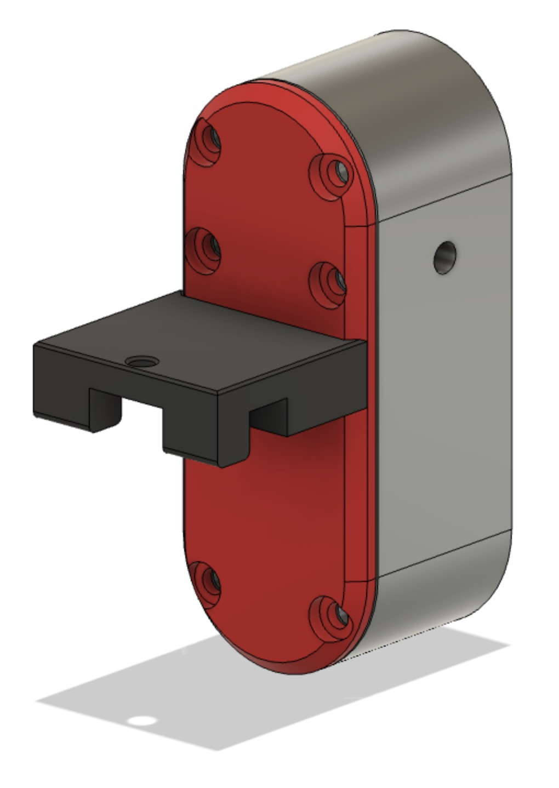

# BigTreeTech Smart Filament Sensor Mount

## What is this?

This is a mount for the Voron 2.4 that allows you to mount the BTT Smart Filament Sensor in place of the stock PTFE tube holder.  It replaces the back panel of the sensor and provides a mount that the new back plate screws into.  This may also work on Tridents and other printers with 2020 extrusions, but I have not tested that.

## What do I need?

- [BTT Smart Filament Sensor](https://biqu.equipment/products/btt-sfs-v1-0-smart-filament-sensor-detection-stuck-blocking-filament-module)
- Two M3 heatset inserts just like the kind you used to build your Voron
- Two M3x8mm button head screws

## How do I install it?

1. Print the `2020_mount.stl` and `[a]_sensor_back.stl` models.  You find the sensor back looks better in your accident color if your primary printer color is black.
2. Install two heatset inserts into the 2020 mount part
3. Screw the new sensor back into the mount using the two M3x8mm button head screws.
4. Remove the back of the sensor and put the screws aside, you'll reuse those.
5. Screw the new sensor back with the mount attached to the sensor.
6. Install the sensor where you want it and wire the sensor to your electronics component.

