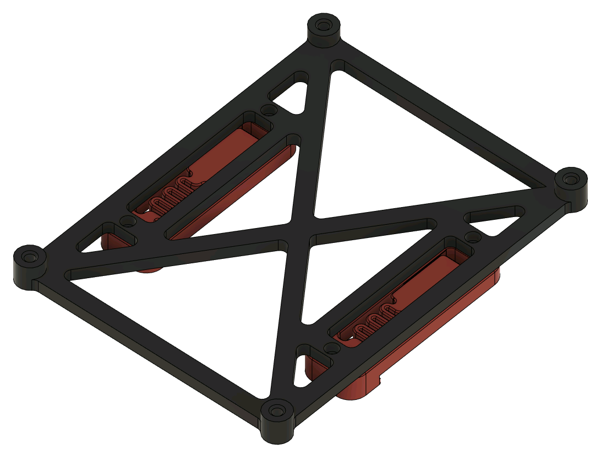

# Fysetc S6 V2 Mount

This is a mount for the Fysetc S6 V2 board that is intended to be used with the V2 PCB DIN mount brackets and should work with any machine with DIN rails.  To use this, print the mount and two of the V2 PCB DIN mounts.  Attach the PCB DIN mounts using M2 self tapping screws.  Attach the Fysetc S6 to the mount using M3 hardware of your choice.  I used 6mm M3 hardware, but 8mm should work fine.  

This mount was designed and tested with the Fysetc S6 V2.0 board, but likely works with the S6 1.2 and F6 boards, since the're documented to have the same footprint.
