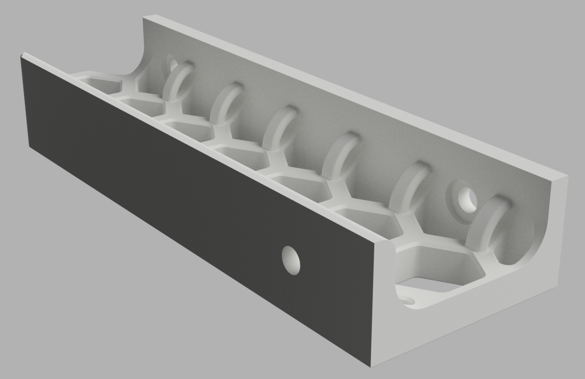

# V0 Skirts with integrated zip-tie points

This is a pretty simple mod that adds a series of small loops along the top of
the V0 skirts that you can use to zip tie cables to.

These skirts also have an access hole added for tightening the middle M3 screw.
