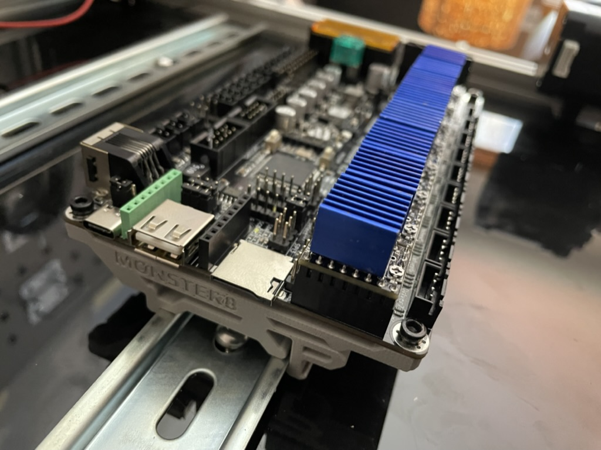
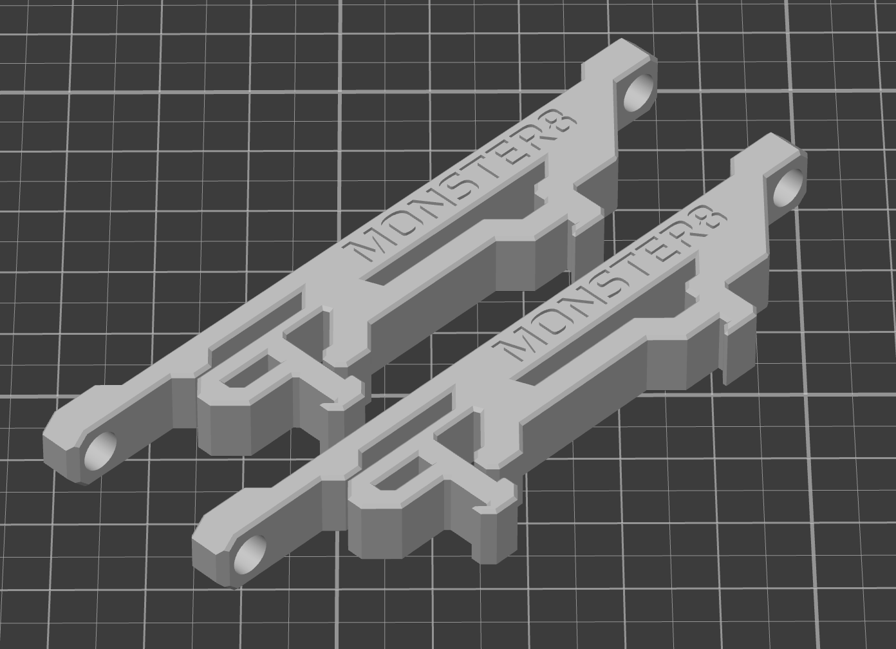

# Monster8 DIN clips (with heatset inserts)

There's a [DIN clip mount from Makerbase](https://github.com/makerbase-mks/MKS-Monster8/tree/main/STL/MKS%20Monster8%20fixed%20bracket) but I don't like it because it's too big to print on the bed of a V0 and I hate threading  small bolts into plastic.

So I made this version. It works!

