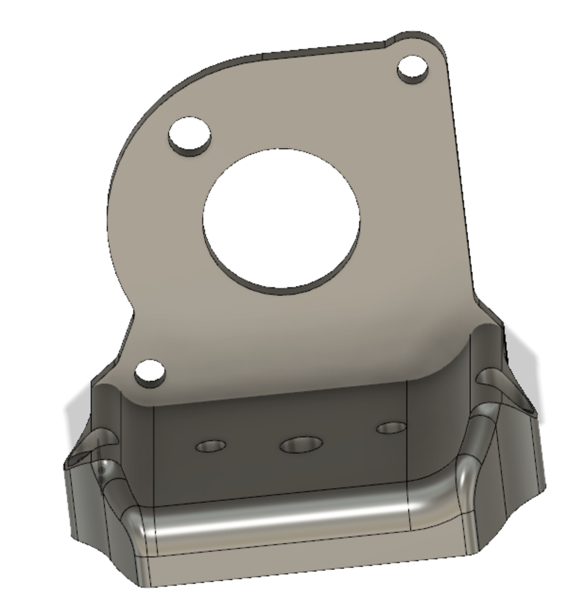
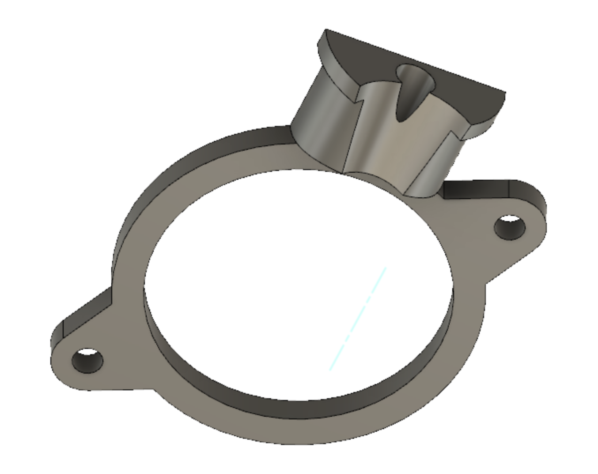
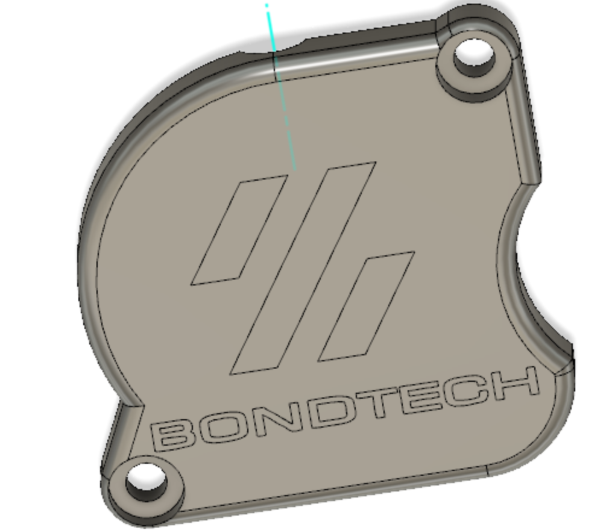
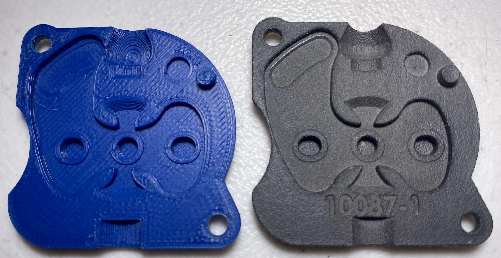
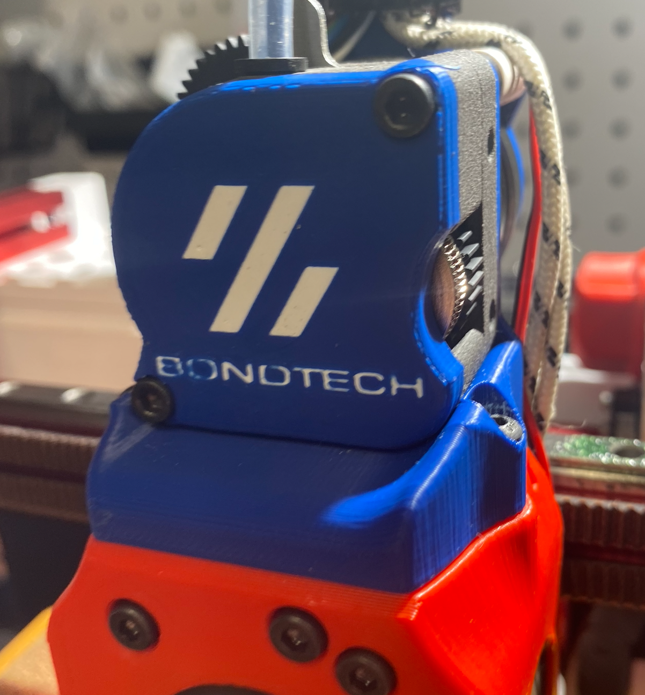
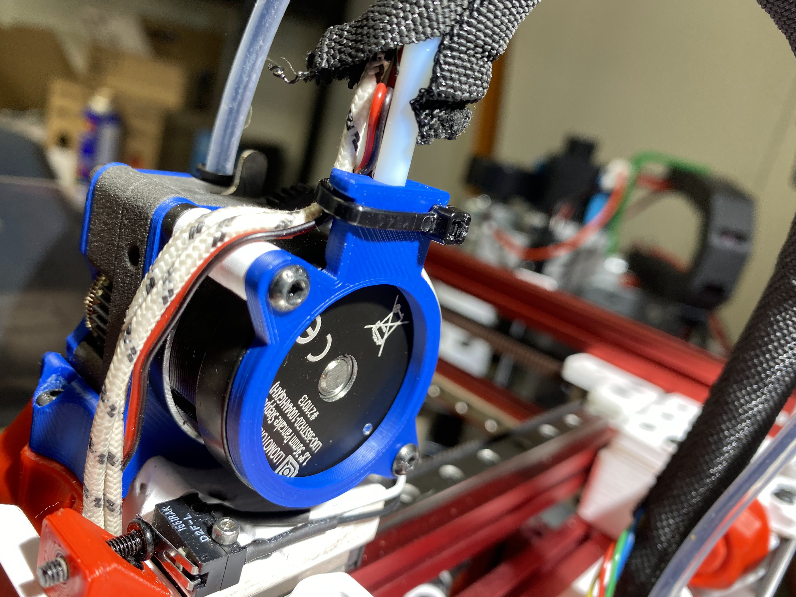
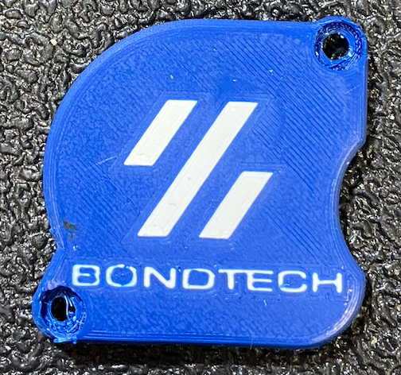

#LGX Lite Mount (beta) for V0.1 MiniAfterSherpa - Replaces MiniSherpa
MiniASLGXerpaLite.stl

Use 2 x M3x8 from bottom up to secure LGX Lite to mount (Let me know if M3x10 would be better)
Use 2 x M3x12 from top down to secure mount to Mini-AfterSherpa https://github.com/KurioHonoo/Mini-AfterSherpa

Use PTFE tube (the include PTFE from LGX Lite is too short)

Strain Relief & Spacers
MiniASLGXerpaLite-StrainRelief.stl
Strain_Relief_Spacers_x2.stl

Use 2 x M3x30 (partially threaded preferred) to replace included M3x25
Optional Use Short piece of PTFE for added relief

LGX Lite Cover* - Bondtech requests that the logo be on the cover
MiniASLGXerpaLite-Cover.stl

*Tolerances are NOT exactly like the original cover.  Use at your own risk :D

