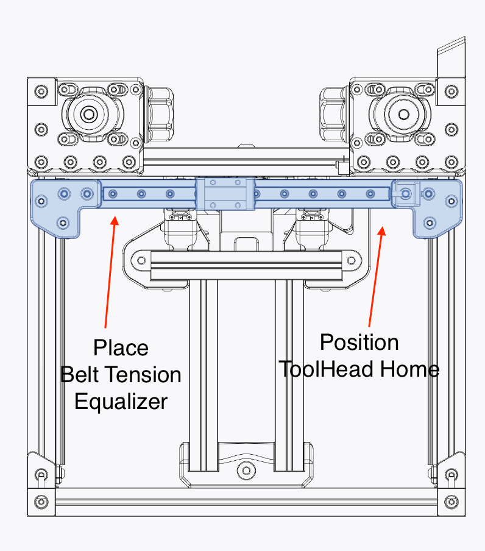
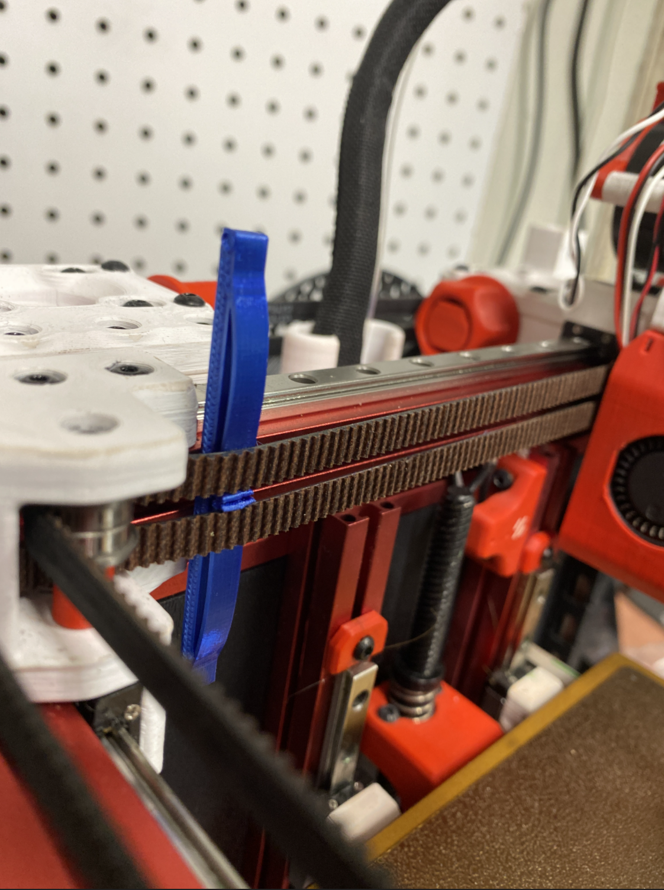

# Belt Tension Equalizer V0.1

Used to help make both belt have approximately the same tension.
This should not be use as an indicator for the right tension, you should tension one belt then use this to equalize them.

Print using any filament.  :D

