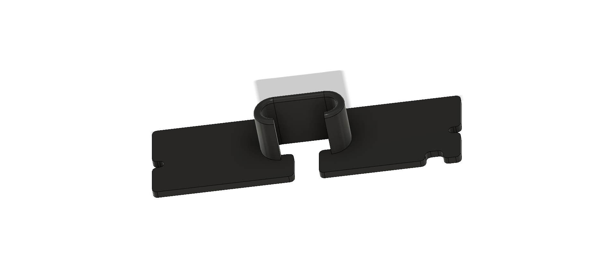
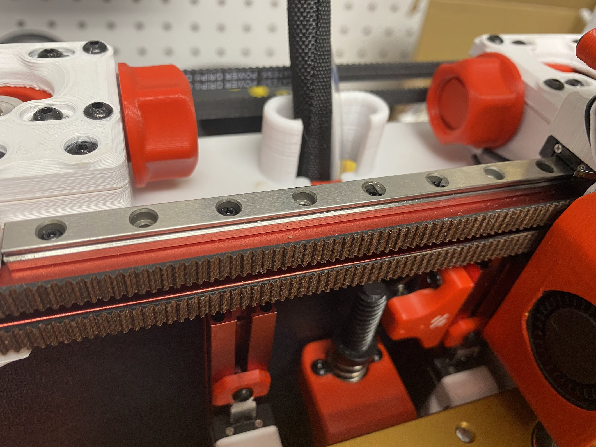

# Voron v0.1

## What is this?
This modification keeps the umbilical and reverse bowden tube from rubbing against the motor belts.

## How do I use it?

Replaces the Motor Panel and reuse the same M3x8 screws

## How should I print this?

Same as any other Voron part.  Printed with Polylite ASA

### NOTE

 
