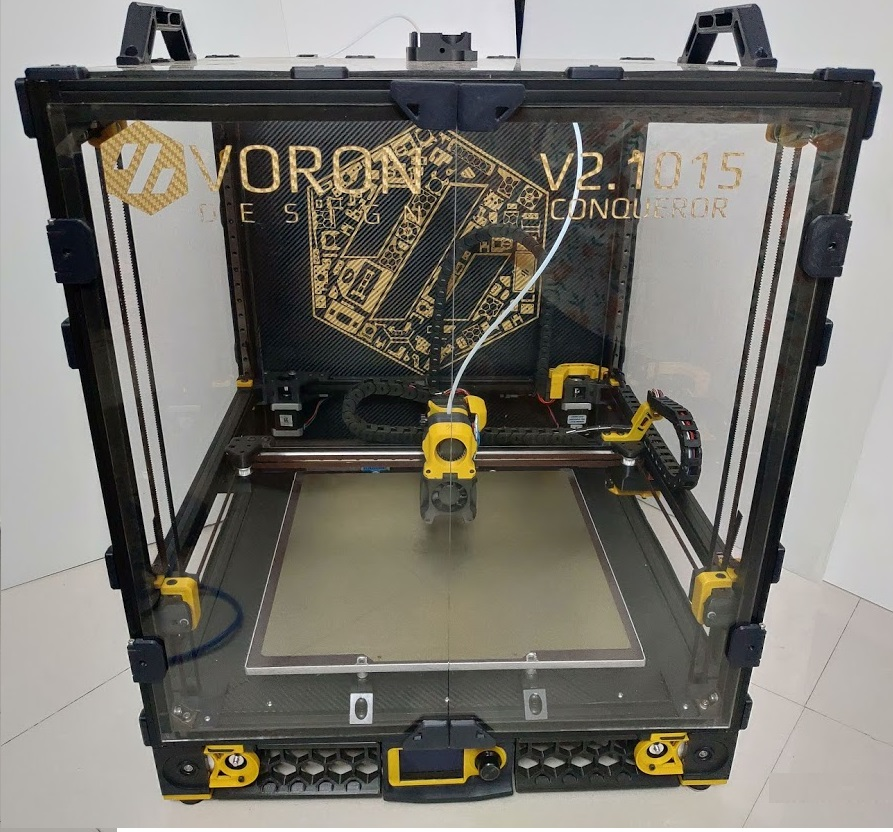
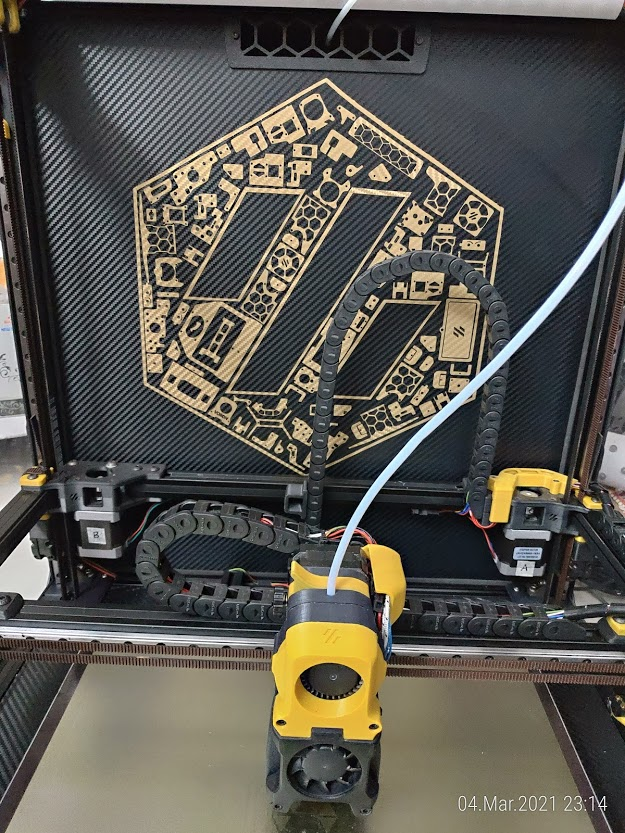
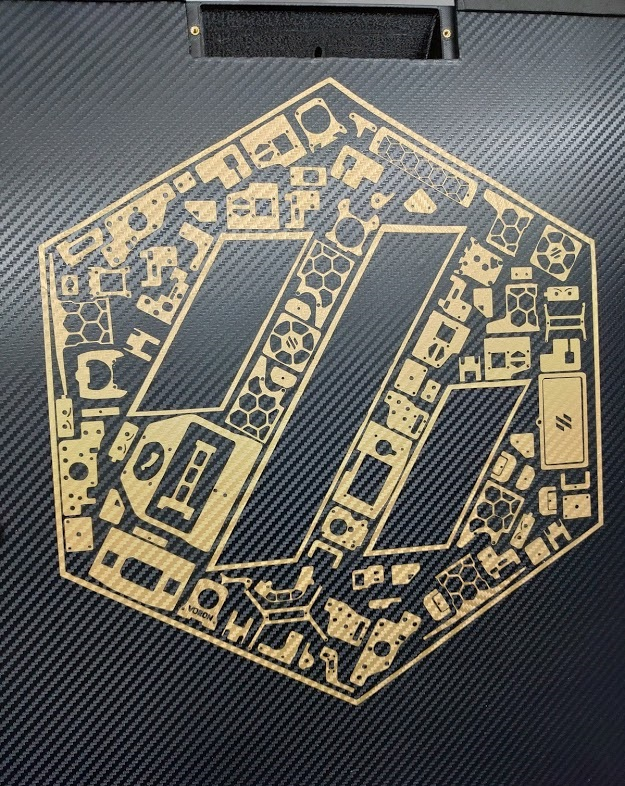
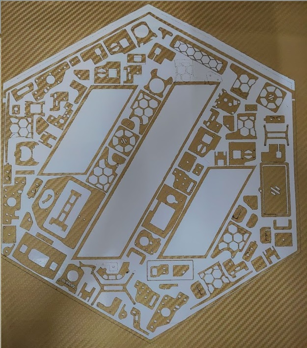
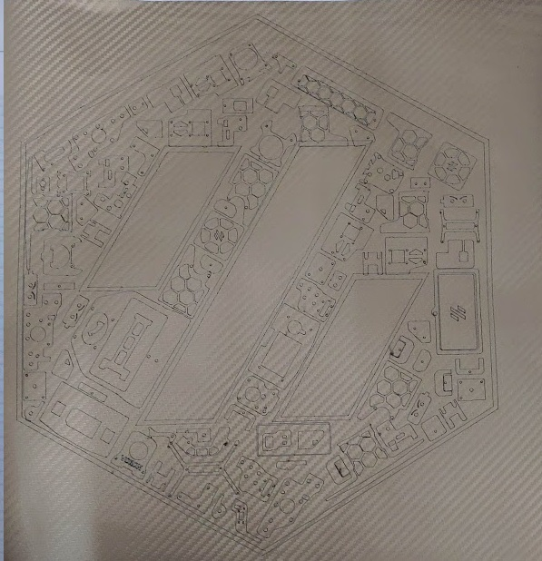
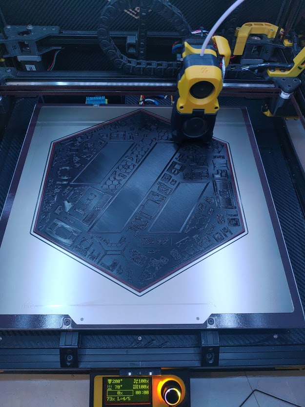
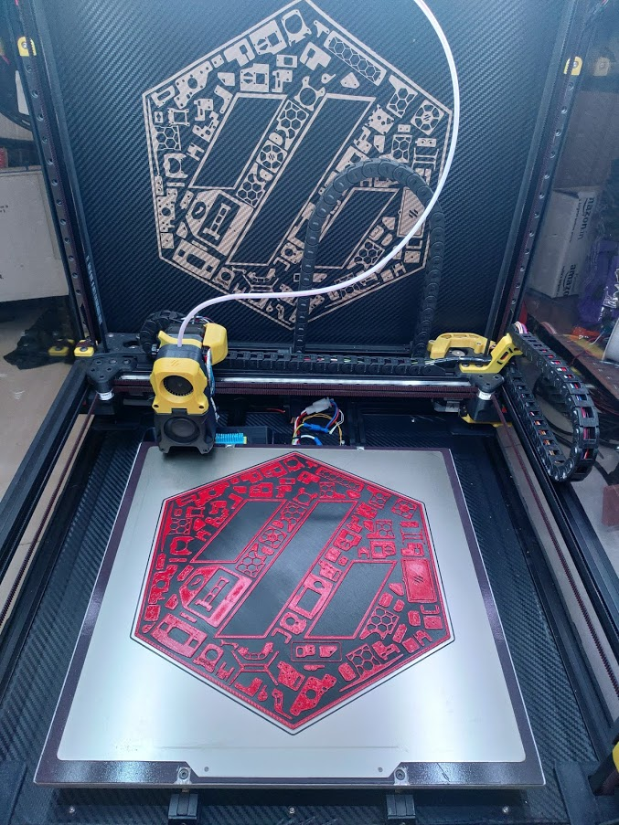
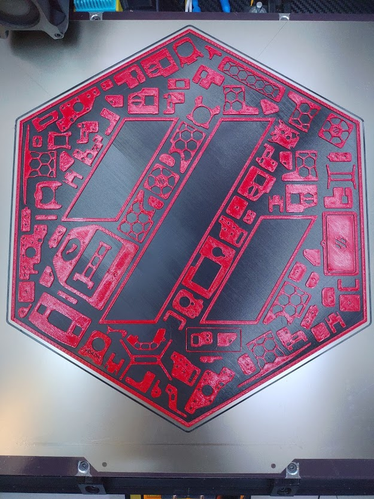

# Voron Parts Logo for your VORON Printer

## STL File
You can print this logo on your 3D printer. I have included base (0.64mm thick) in this stl file which you can print in base color (at 0.24 first layer + two 0.2mm layers) & change filament after 3 or 4 layers to your accent color. I changed filament after 4 layers. Use monotonic top layer infill to have uniform top layer of Black base.

## Image Files
Image files are included in high quality JPG & PNG format if anyone wants to print them on paper with traditional ink printer.

## DXF File
DXF file is included if anyone wants to cut this on laser cutter out of Vinyl wrap. (Like I did, Shown in Images below)

