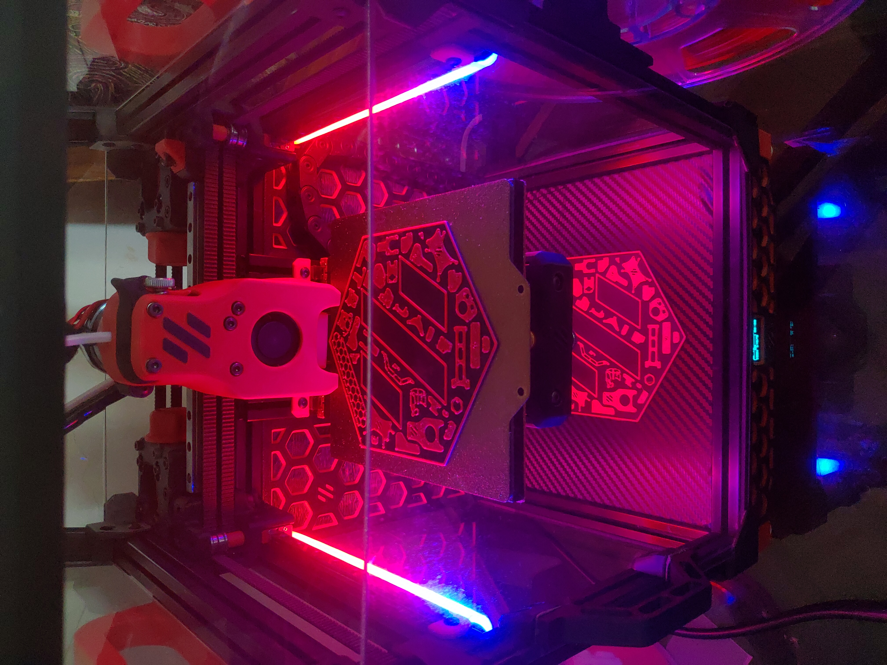
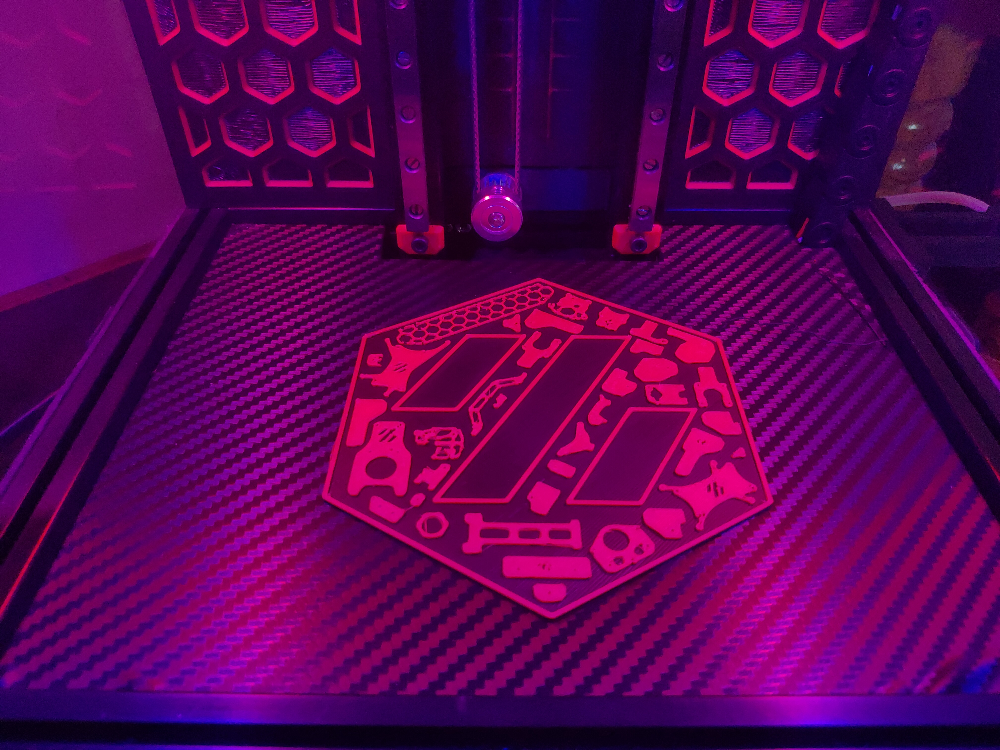

# Voron Parts Logo for your VORON V0.1

## STL File
You can print this logo on your 3D printer. I have included base (0.6mm thick) in this stl file which you can print in base color (three 0.2mm layers) & change filament after 3 or 4 layers to your accent color. I changed filament after 4 layers. Use monotonic top layer infill to have uniform top layer of Black base. Check images below. Use VHB tape to stick it to deck panel.

As this is very small logo (height is 115mm), printing with smaller nozzle will add more details. I have printed this with 0.4mm nozzle as shown in below images.

## Image Files
Image files are included in high quality JPG & PNG format if anyone wants to print them on paper with traditional ink printer.

