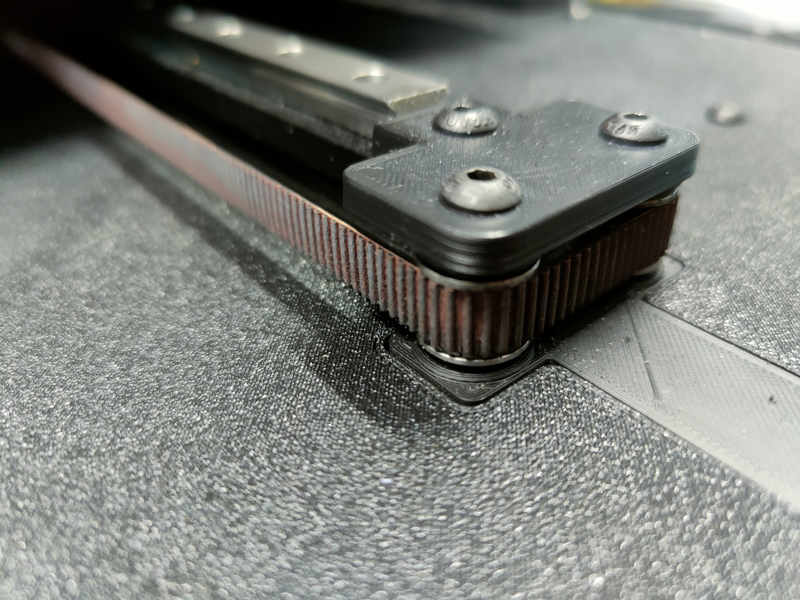

# Overview

This is a simple mod for the SW. It converts the existing 6mm beltpath of the Y axis to a 9mm belt.

## BOM:
* 2x M5x25 BHCS
* 2x M5x30 BHCS
* 1x M3x25 SHCS
* 8x M5x1 Spacer
* 8x F695 Bearing with flange (from the SW BOM)
* 4x 695 2RS 5x13x4 Bearing without flange
* 1x GT2 20T Pulley (5mm B, 9mm W)
* 1x 1m GT2 Belt (9mm W)
* 3x M3 Heat inserts (from the SW BOM)

## Slicer settins:
* Mainlyy this should be printed with the Voron PIF settings (4P,40% Infill etc.)
* But i recommend to print the panels and motor top mount with 100% infill. The panels will bent less and the section of the motor mount where you screw it to the 2020 extrusion is more stable.

## Notes regarding the Deckpanels:
* For the "Bottom Y Idler" you will need 2 small cutouts on your panels (see pictures). You can drill it out, or print the panels.
* The files for the panels are orientated like the name of the files.
* If you want a nice finish i recommend to flip them upside down in slicer and print on a textured pei sheet.
* If you want a smooth finish you can try "ironing" the toplayer, then leave the files at the current orientation.
* You can glue the panels together where the front and back snaps together if you want. I just pushed them together and didnt glue them, works great and sits tight. Lay both on a flat surface, snap them together and press with something heavy at the connection points.
* The panels also tend to bent at cooldown after printing, a good tip is to remove the panel with the pei sheet from the printbed immediately(!) after printing and quickly place it on a flat surface (for example on the floor), then quickly place a thick book on top and weigh it down properly. 
I just stood on it for 10 minutes, worked great. This step is important, otherwise the panel will bent and the belt anchor will hit the panel when traveling.