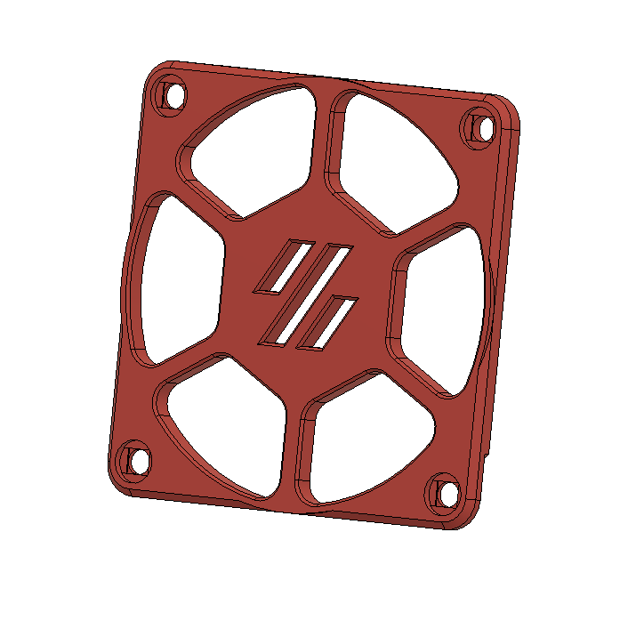
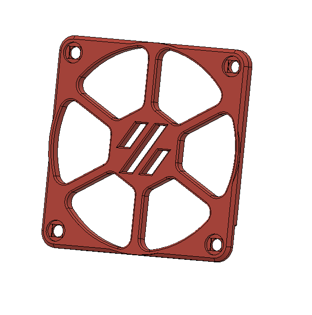
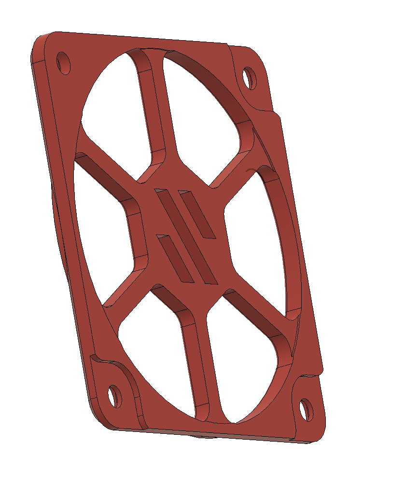

# Voron Skirt Fan Low Noise Modification

## Reason:

- The Original Skirt Fan covers make whistle if the airflow is over a certain level

- Normally the solution was to use Noctua, that are for sure quite but dont solve the problem at the root, the whistle is coming from turbulence with the airflow and the fan cover

## Original fan cover: 

## Modified fan cover:

###As you can see the back of the cover is now a little bit (.3 mm) away from the fan, so it can reduce the turbulence with the fan

 

