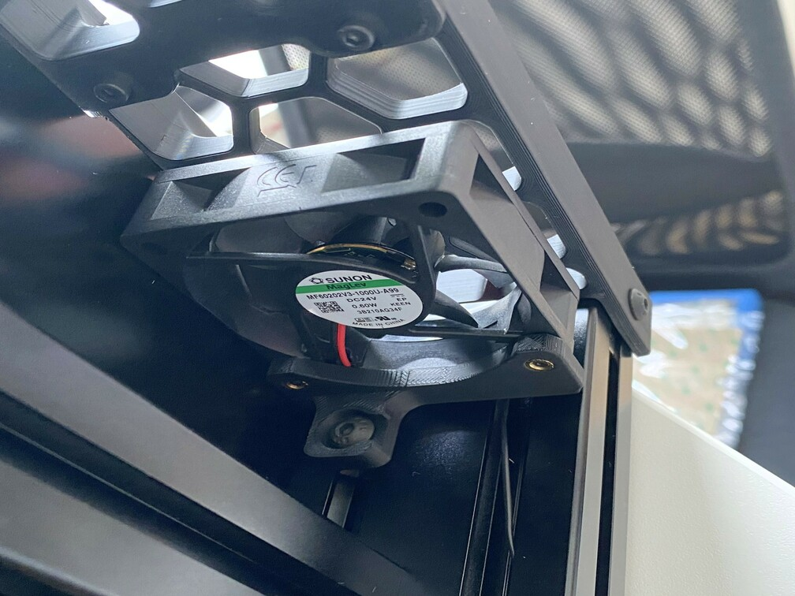
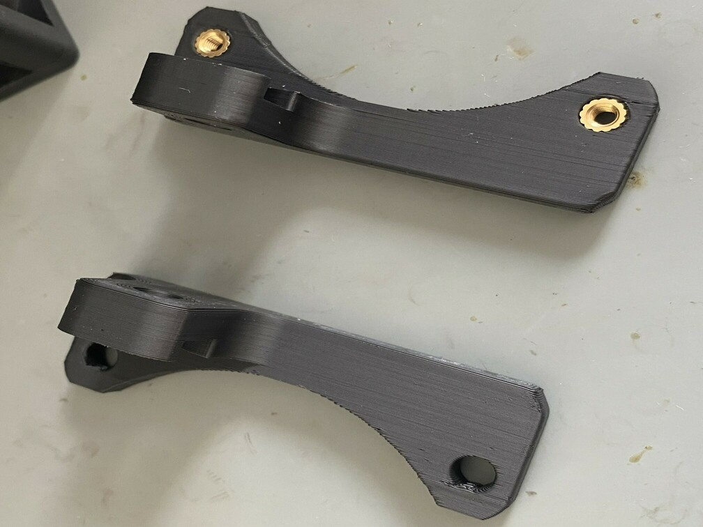

Switchwire Fan Mount without using Tape
---------------------------------------

No change to any required file is required. I just wanted an easy way to mount the 60x20 fan without using tape like suggested in the manual.

Required hardware
-----------------

- 1x M5x10 BHCS
- 2x M3x25 SHCS
- 2x Heat Set Insert

