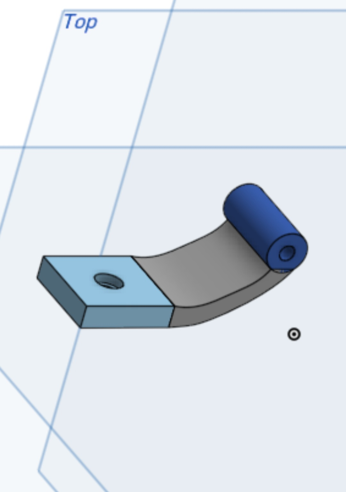
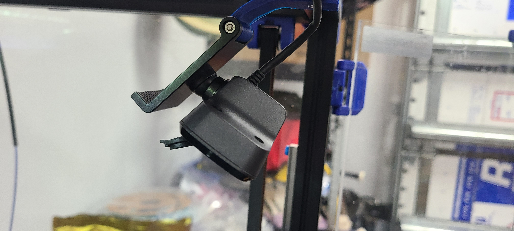
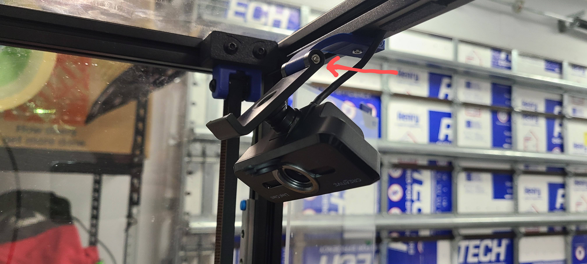

# Creative Live! Camera Mount
STL and files supporting mounting Creative Live! Camera on 20x20 Aluminum frame

Very simple to print and simply fits inside the camera mount.

BOM:

1 x M3x12

1 x tnut 

Creative Live! Camera - Amazon(https://www.amazon.com/Creative-Wide-Angle-Cancellation-Improved-Universal/dp/B0919XGLXH)

Instructions:

printed from ABS 30% infill on its side, supports optional.

Unscrew the one screw that the camera mount hinges on and slide the printed part into its place. 

mount the printed part to the printer frame wherever convenient with the M3 screw and M3 tnut.
