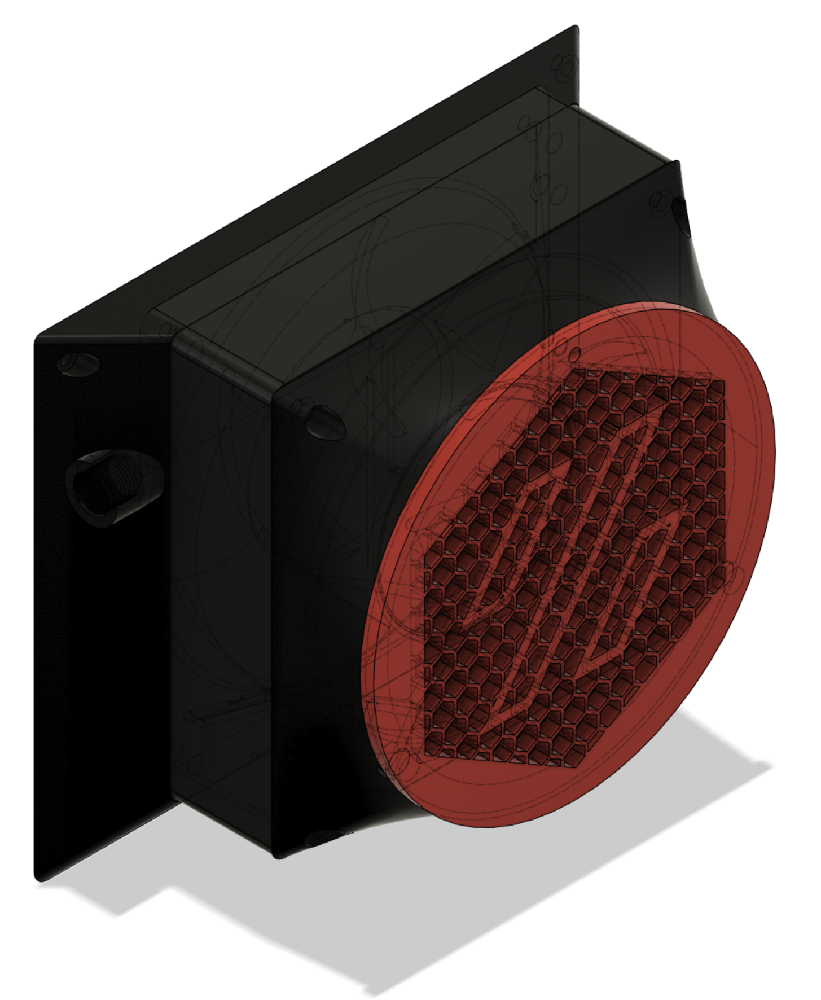

# <B>HEPA Filter Exhaust for Voron 1.x/2.x</B>

I've designed a new exhaust which uses a 120x120x25 mm fan and HEPA filters (compatible with MELEDEN, RIGOGLIOSO, JINPUS and LTLKY air purifiers). This is a direct replacement for the stock air exhaust system.

Configured in Klipper to power the fan at 50%, and coupled with the nevermore micro, this seems to add to negative air pressure in the chamber and have a noticeable impact on reducing fumes, while only reducing chamber temperature by a couple of degrees C at the exhaust port.

## <B>Bill of Materials</B>

### <B>New Parts</B>

- 1x 120x120x25mm fan such as [Noctua NF-F12 iPPC-2000](https://www.amazon.com/gp/product/B00KFCQT6M/). (note that I have an adjustable voltage on my control board, but make sure your fan matches the voltage for your system.)
- HEPA Filter such as [Nispira True HEPA Filter Replacement with Activated Carbon](https://www.amazon.com/gp/product/B0921DZLPK/)

### <B>Parts from Voron BOM</B>

Parts here are already listed in the Voron 1.x (Trident) & 2.x BOM:

- 7x M3 heat set inserts.
- 4x M3x30mm socket cap bolts.
- 3x M3x8mm socket cap bolt.
- 2x M3 roll in spring loaded T-nuts.
- 4x 6x3mm neodymium magnets.
- 1x 4mm bowden coupler.
- 1x 2 pin JST terminal.
- 2x 2 pin JST connector.
- 4x Female JST Pin Header
- AWG 22 hook-up wire.

### <B>Printed Parts</B>

These can be found in the STL subdirectory.

- 1x exhaust-chamber-mount.stl (mirror the part to match the cable management to which side of your 120mm fan the cable comes out of for neatest appearance).
- 1x exhaust-hepa-filter-housing.stl
- 1x exhaust-lid.stl

Print the parts with 4 perimeters, and at least 22% infill.

## <B>Assembly Instructions</B>

1. Insert threaded heat set inserts into exhaust chamber mount (2 in back, 4 in front.)
2. Insert threaded heat set insert into exhaust HEPA filter housing.
3. Route fan cable through the hole and through the cable management groove at the back of the exhaust chamber mount. Cut the fan cables so that you have just enough length to solder them to the JST terminal. Slide some heat shrink tubing on to each of the wires, if you have it.
4. Solder on the 2 pin JST terminal to the end of the fan wiring. Be sure you have the correct orientation for the voltage and ground pins. Slide the heat shrink tubing down over the pins on the back of the JST terminal, and shrink.
5. Super glue the JST terminal to the bottom of the exhaust chamber mount. Make sure the slot is nice and cleaned up so that the terminal will sit flush with the back. 
6. Super glue neodymium magnets to the HEPA filter housing and the lid- be careful to insure the polarity is correct.
7. Slide the M3x30mm bolts through the HEPA filter housing, through the fan, and into the 4 heat set inserts at the front of the exhaust chamber mount. 
8. Screw the M3x8mm bolt through the exhaust lid, and into the heat set insert on the HEPA filter housing. 
9. Screw in the 4mm bowden coupler into the side of the exhaust-chamber-mount.
10. Remove the fins from the HEPA filter cartridge. I use a rotary tool (Dremel) to do this, but you can also use a box cutter or similar.
11. Insert the HEPA filter cartridge into the HEPA filter housing, and pivot the lid so that it orients with the magnets and locks closed.
12. Attach the exhaust assembly to the printer chamber with two screws into the frame. I have also used some VBH tape against the bottom of the filter for better contact.
13. Attach the stock grill to the back of the exhaust-chamber-mount with 2x M3x8mm.
14. Route PTFE tube through the bowden coupler, and through the chamber grille as per normal. The angle will be different than the stock exhaust, but I have found no issues, even at higher Z-heights. 
15. Connect the controller fan port to the JST terminal. Check once again that the voltage is correct.