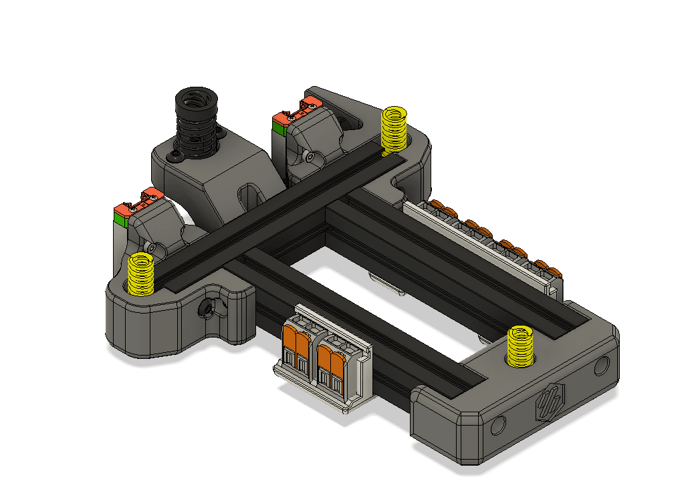
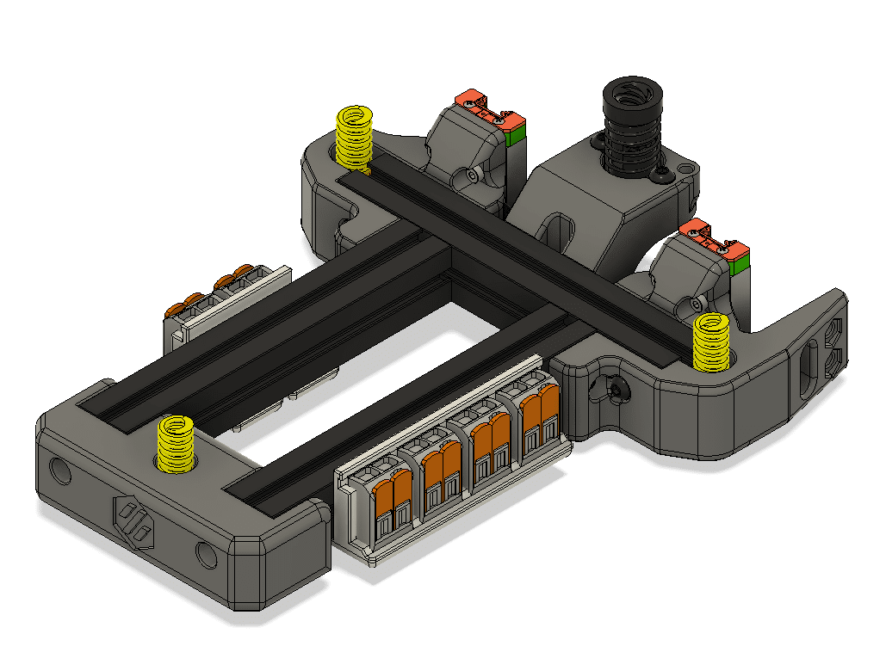
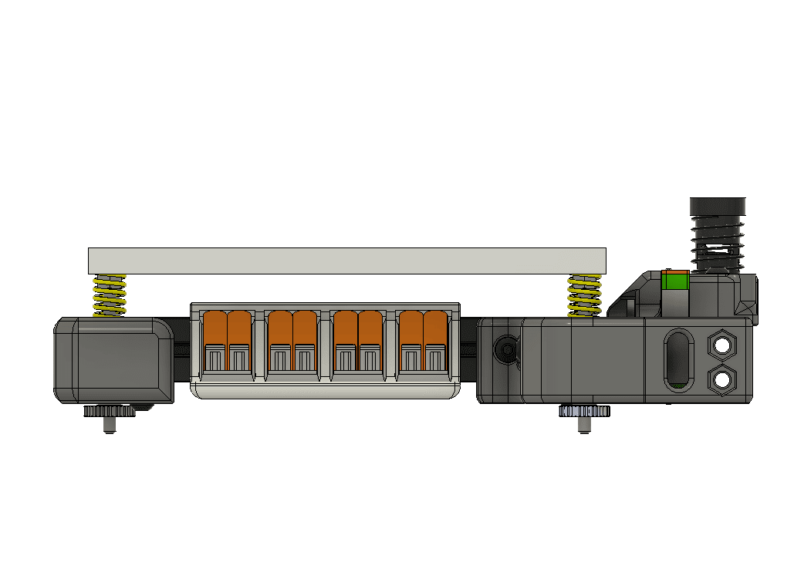
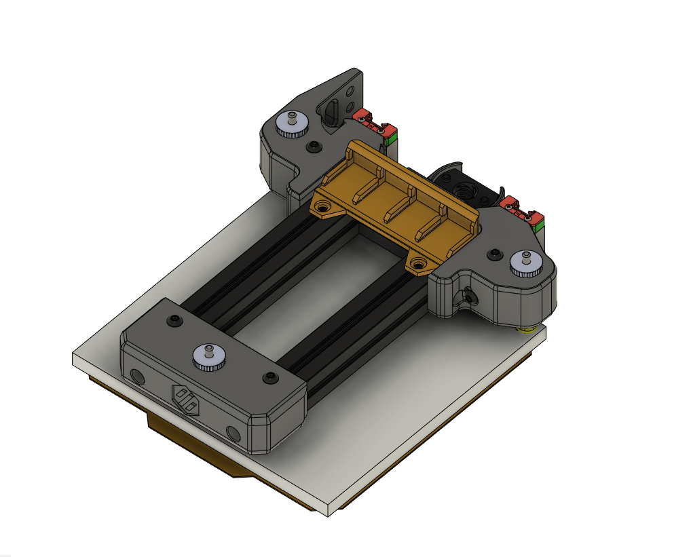
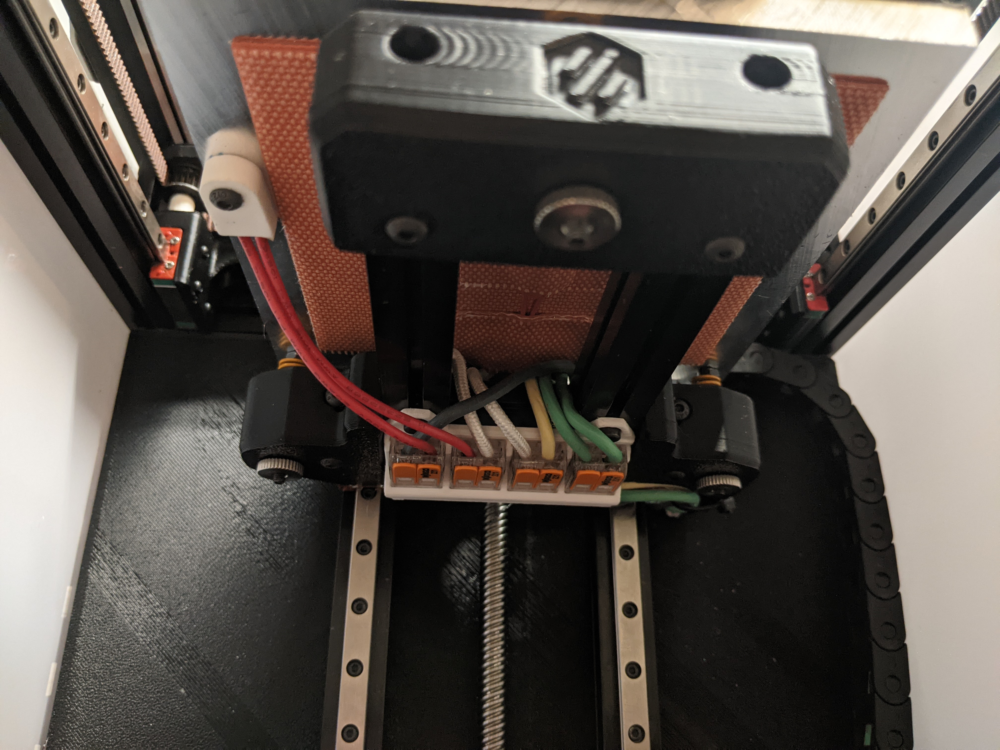

# Two Versions of V0 Bed Wagos

## Side Rails - Dual and Quad
Attach Wago 221-412 to your v0 bed.

I wanted a way to bridge the bed fuse, without using a semi-permanent connector.

Easy to install. Just pop [Front_Bed_Mount_x1.STL](https://github.com/VoronDesign/Voron-0/blob/master/VORON-0/STLs/Front_Bed_Mount_x1.STL) off the front of your bed, slide in some nuts, slip on the wago mount and you're all done.

Prints fine, I'm sure the design could be improved upon. Especially, the 2x. I got lazy there.

## Under Bed - Quad WAGO 221-412 Mount

### Overview
Holds 4 221-412 WAGO Mounts for cleaner AC wiring of the heated bed on the VO. It fits nicely into the recess between the two Rear Bed Mounts. It allows for quick replacing of the fuse should it ever need to be replaced or removing the bed. The bed thermistor wiring isn't included, so I used a MOLEX connector for that.
### Installation
Remove the front bed mount part, slide in two M3 nuts, replace the bed mount, push quad holder against the Rear Bed Mounts and secure with two M3x6 BHCS or SHCS

### Required Hardware

1x Printed Part

2x M3 Nuts

2x M3x6 BHCS or SHCS
