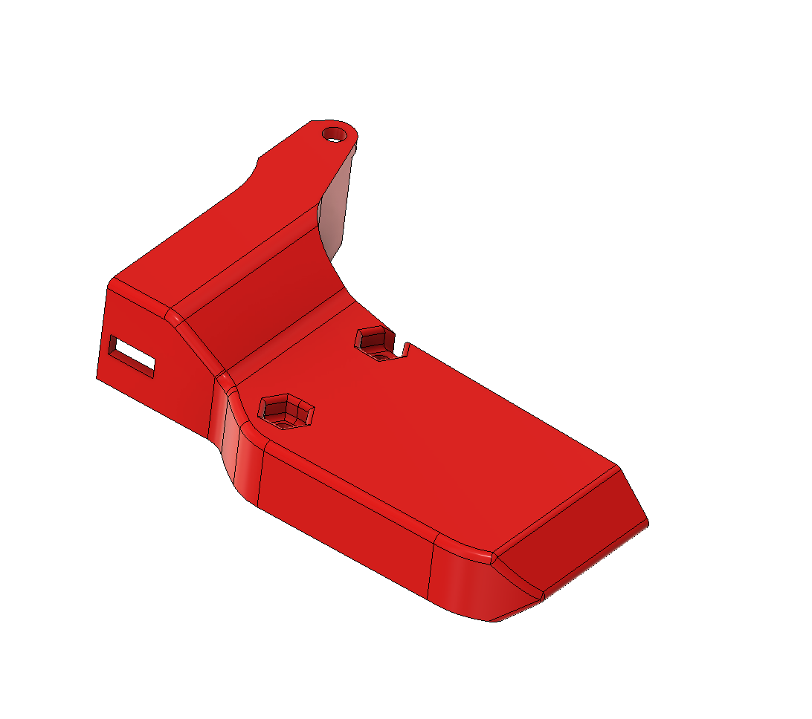
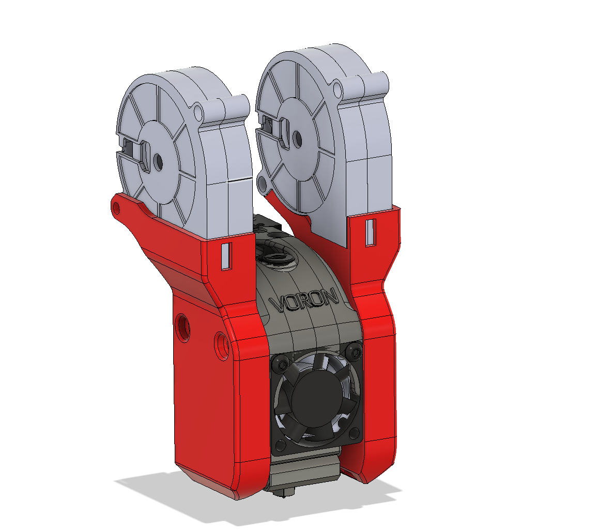
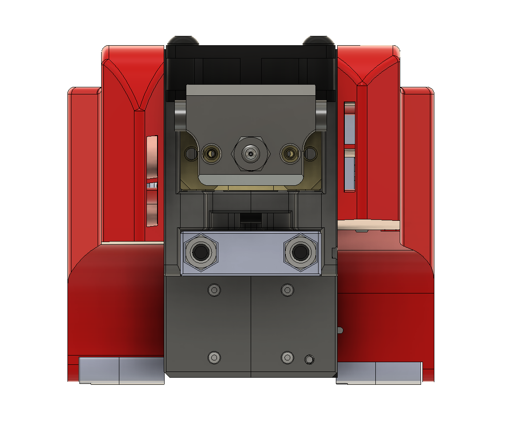
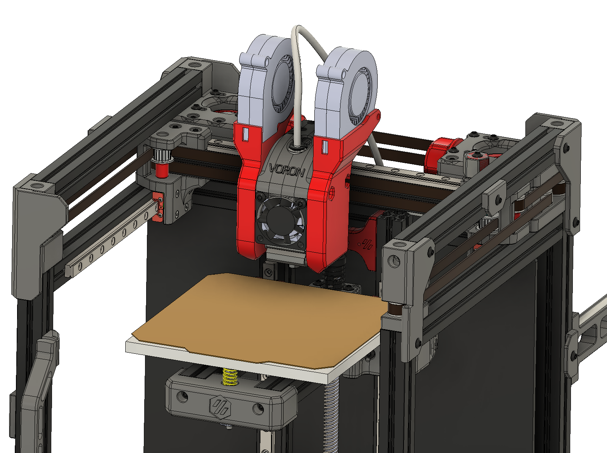

# Overview

Left and Right side ducts/mounts for 5015 blower part cooling fans for Voron V0. 

# BOM

2x M3x20mm BHCS
2x M3x50mm BHCS or SHCS
4x M3 nuts

# Instructions

- Attach 5015 fans to ducts via M3x20mm screws and nuts
- Might need to cut away some material from the front of the duct to allow for access for the fan casing side connectors
- Might want to apply tape to seal the edges of the fan to the duct
- Install ducts to the toolhead via M3x50mm and nuts 

