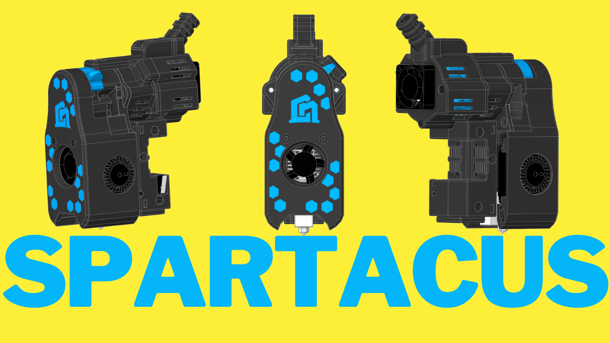

 

### Here you can see how to build this Awesome Toolead

### If you want to see it in action you can see it here

#### Later edit : 
#### added Rapido UHF as an option for the hotend

## Spartacus: The Toolhead stands as a testament to lightweight engineering mastery, boasting a total weight of under 320 grams, with the potential to further reduce weight by implementing titanium screws. Every component, from the stepper motor to the thermistor, board cables, heater, LEDs, fans, heatsink, nozzle, and screws, has been meticulously crafted to maintain this featherlight profile without compromising on performance or durability. Spartacus redefines the possibilities of 3D printing toolheads, offering a combination of high performance and portability that is unmatched in its class. Dominate your printing projects with Spartacus: where innovation meets lightweight precision.

## Engineered with precision, Spartacus integrates a multitude of features including dual RGBW LEDs, direct drive capabilities, and an appealing aesthetic with concealed cables and motor covers. Compatible with both EBB36 and Piggyback 36 toolboards, Spartacus offers versatility without compromise. Weighing under 320 grams, its agile form minimizes inertia, enabling rapid accelerations and pristine print quality, free from artifacts. Unleash the power of Spartacus: where innovation meets agility.

## Key Features:

- Powerful direct drive extruder for rapid printing (Flow tested up to 55mm³/s)
- Utilizes the T-Volcano hotend for increased flow and faster prints
- Enhanced cooling with 3010 and dual 4010 GDS Time 12000 rpm fans
- Lightweight and compact design inspired by Voron Design (Mini Stealth Burner)
- Cost-efficient, with a total build cost under $75
- Versatile design allows for customization and adaptation to different setups
- 2 Neopixel LED lights for improved visibility and real-time print status updates

## Bill of Materials (BOM):

### Fans:

- 1 x 3010 GDS Time 12000 rpm Fan
- 2 x 4010 GDS Time Blower Fan (12000 rpm dual ball bearing recommended for optimal cooling)
- 2 x Neopixel LED lights (Addressable LEDs)

### Hotend Components:

- 1 x V6 Heat Sink
- 1 x BiMetal Heat Break
- 1 x T-Volcano Heat Block 
- 1 x Volcano Cht Nozzle
- 1 x 65W Heater Cartridge (or higher)
- 1 x Thermistor Cartridge for V6 Volcano Heater Block 3x15 (PT100 style)
- 1 x Nema 14 Pancake Stepper Motor
- 1 x BMG Dual Driver Gear Kit
- 1 x 30mm PTFE Tube 1.9mm ID 4mm OD
- 2 x Round PCB LED (WRGB, RGB, RGBW, WWRGB, etc.)

### Optional Add-ons:

- Piggyback/Breakout Board ($9) or Can Board ($20) for additional functionality
- End caps for cable management based on your setup and chosen board

### Nozzle Options (Optional, depending on preference):

- T Volcano or NF Crazy Volcano Heat Block for easier nozzle changes and protect the heatbrake when printing at speeds.
- Ceramic Heater or Revo High Flow for enhanced performance (cost considerations apply)
- Rapido UHF added 
## Hardware:

### Heatset Inserts:

- 1 x M3 x 5.7 x 4.5/4.6 Heatset Insert
- 8 x M3 x 3 x 4.5 Heatset Insert

### M3 Screws:

- 3 x M3 x 6
- 5 x M3 x 10
- 3 x M3 x 25
- 1 x M3 Hex Nut

#### This versatile and feature-packed 3D printer tool head provides an affordable solution for high-quality, high-speed printing, enhanced by Neopixel LED lights for improved visibility and dynamic print status updates.

#### Assembly of Spartacus requires minimal tools, including an 1.5mm drill bit, a drill, an angle grinder or hacksaw, and 1.5, 2 and 2.5mm Allen keys. With these tools, users can effortlessly assemble Spartacus and unleash its full potential.
### Working on assembley manual. 

If you want to see it in action you will find videos on Tiktok  and Youtube
#### You can follow us on

### Tiktok https://www.tiktok.com/@3dprinttutorials

### Youtube https://www.youtube.com/@nadir3D 

### Facebook https://www.facebook.com/CN3DP/

### Printables https://www.printables.com/@Nadir