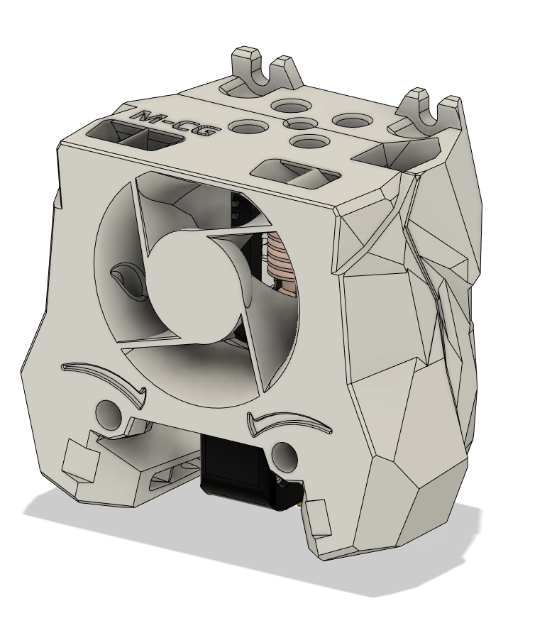

Stealthburner (RC1) Crazy Dragon Fan Duct
===
With special thanks to @chestwood96, sponsored by @3dmellow for the Crazy heatblock, as well as the awesome base design from the VoronDesign team, I'm able to create the Stealthburner Crazy Dragon fan duct. 

The fan duct is designed based on the Rapido toolhead mount (RC1), retro-fitted with Dragon styled duct allowing wind to blow towards the throat only.

The duct is designed to be able to mount the Phaetus/Triangle Lab dragon heatsink with
 - Mellow Crazy Heatblock (verified by myself and @chestwood96)
 - Phaetus Dragon UHF mini (standard UHF version without the melt zone extender)
 - TriangleLab T Volcano (to be verified)

Print Parameters
---
Print in standard Voron settings. 

Previews
---

