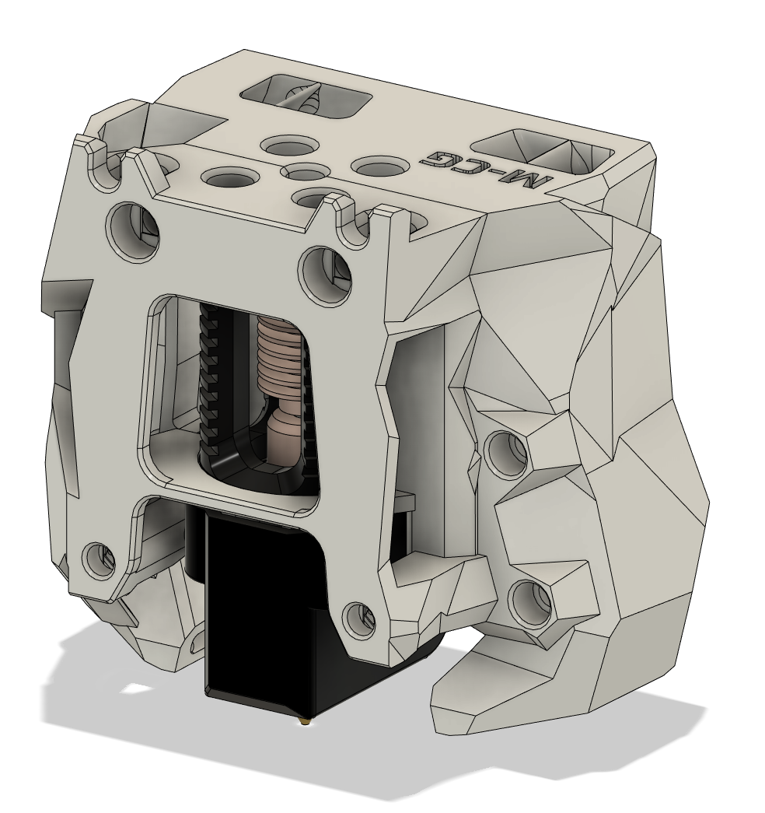
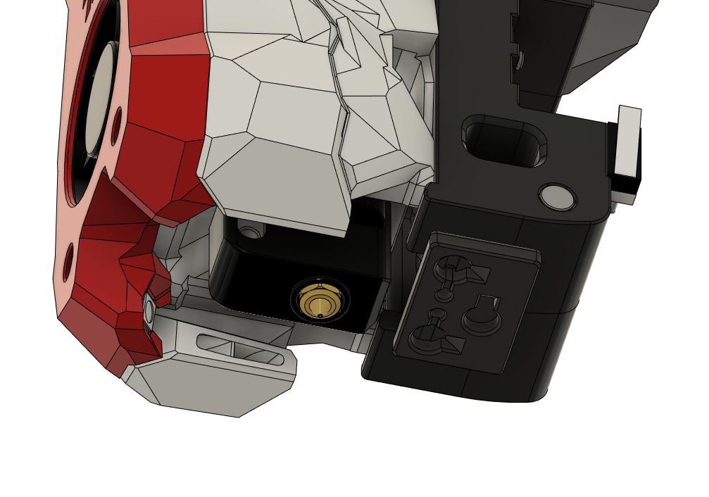

Stealthburner Crazy Dragon (Mellow Volcano for Dragon) Fan Duct
===
With special thanks to @chestwood96, sponsored by @3dmellow for the Crazy Volcano heatblock, as well as the awesome base design from the VoronDesign team, I'm able to create the Stealthburner Crazy Dragon fan duct. 

The fan duct is designed based on the Rapido toolhead mount (RC1), retro-fitted with Dragon styled restrained duct allowing wind to blow towards the throat only.

Print Parameters
---
Print in standard Voron settings. 

Previews
---

