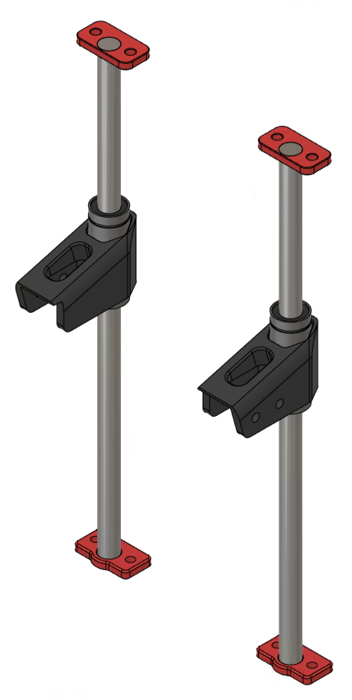
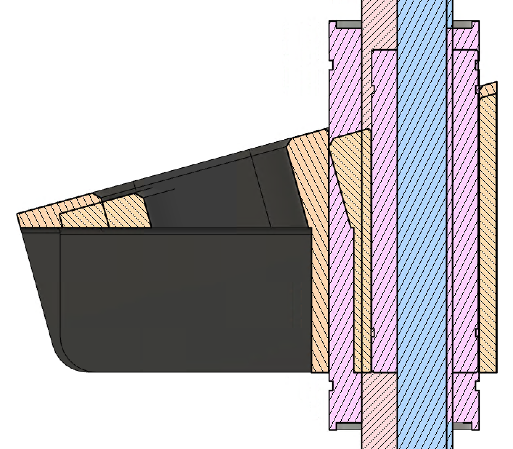
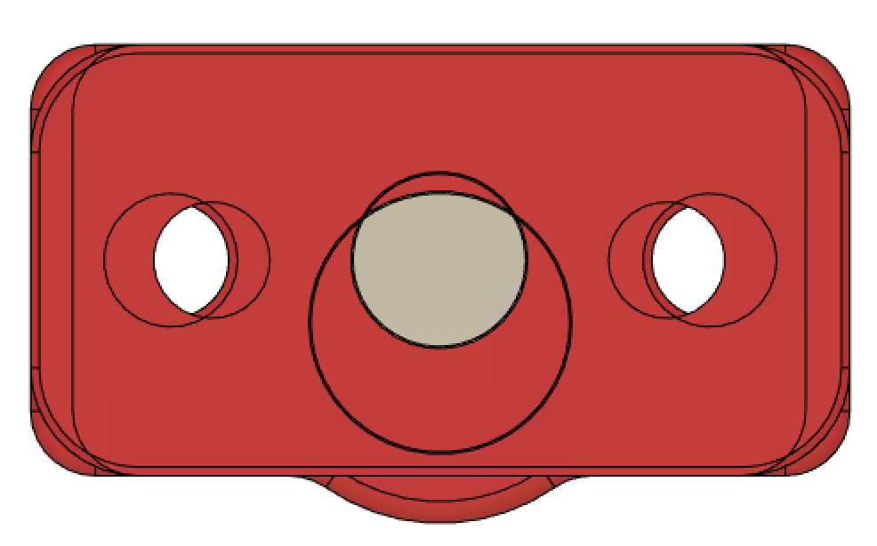

<B>Voron 1.8 Z Mod - 12mm</B>

This replaces the 4x 8mm rods and 4x LM8LUU bearings with 12mm rods and LM12LUU bearings. I did this modification to a printer to see if I could tell the difference, but I couldn't see any clear difference. However, if you do, let me know!

Note that the top and bottom retainers shaft retainers are different--the top ones are slim (with a thin wall) as they need to clear the XY joints. The lower retainers have a bit more material on them.

Finally, as the 12mm rods are thicker and are shifted towards the center of the printer (to clear the side panels), the sideways bed extrusions that attach to the Z bearing blocks must be shorter by at least 6mm per side. If you are hand cutting the extrusions, consider cutting an extra 1-2mm off to allow clearance.

