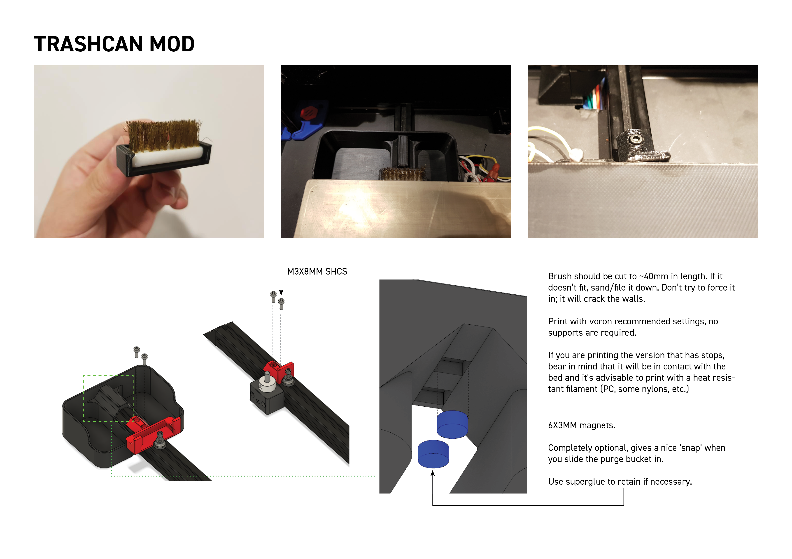

This is a removeable purge bucket with a brush scrubber. I noticed that the current brush scruber design of the Voron was not very effective at containing filament debris and bits.

It was also not removeable, making it a pain to reach behind and clean it out with a vacuum. So, this design aims to solve all that by:

1) Making a larger and deeper purge bucket to hold more filament gunk.
2) Purge bucket is removeable to and clips onto the brush scrubber with its geometry. Magnets are optional and help secure it further with the added benefit of a satisfying 'clip' sound when attached.

The geometry of the brush_holder is such that it clips and holds the brush in place through friction fit. As noted in the installation guide, do not try to force the brush in if it's the wrong size; it will break quite easily.

You will need the following:

- 1x brass brush or whatever you prefer (I got the TriangleLabs brass/copper brush and cut it down to length).
- 2x M3X8mm SHCS (4x if you use the additional stop option)
- 2x 6x3mm round magnets (optional)

STLs are included here and CAD files as well if you wish to change the dimensions.

**UPDATED VERSION TO V2: Geometries have been adjusted to fit V2.4 bed (mainly around the M4 knurled nut). There is now a 250, 300 and 350mm purge bucket size so that the edge is flush with the bed for the OCDs. Slightly adjusted bolt hole to reduce gap between magnets and bolt heads.

Now there's an option where a sheet stop is designed in the brush holder and an individual one for the other extrusion. This will help to locate the spring steel sheet. The height of the stop is based of the V2.4 CAD; if it is too low or too high for you, feel free to reach out to me on Discord to let me know.

NOTE: If you are using the z endstop from V2.2, there is a version of the stop that takes into account the locating bolt heads of the endstop. You can simply mirror the stop in your slicer if your endstop is on the other side of the extrusion. 

Below is an installation guide:

