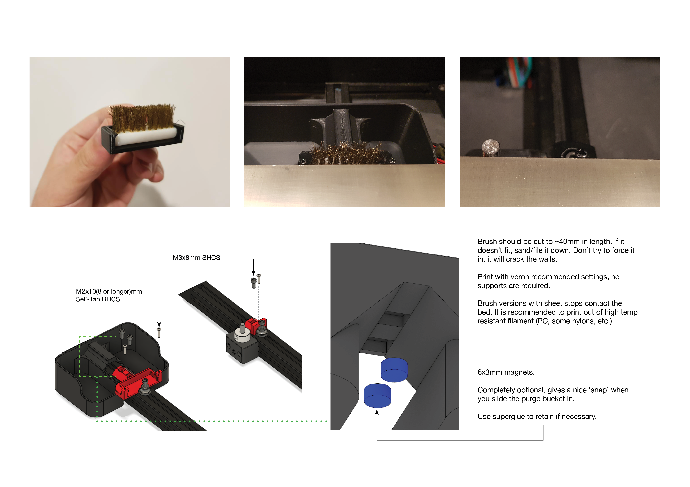

A Team Dropbear Production

# Decontaminator Purge Bucket

This is a removeable purge bucket with a brush scrubber. It is intended to work only with the Voron 2 printer (v2.4, v2.2 and v2.1). I noticed that the current brush scrubber design of the Voron was not very effective at containing filament debris and bits.

It was also not removeable, making it a pain to reach behind and clean it out with a vacuum. So, this design aims to solve all that by:

1) Making a larger and deeper purge bucket to hold more filament gunk.
2) Purge bucket is removeable to and clips onto the brush scrubber with its geometry. Magnets are optional and help secure it further with the added benefit of a satisfying 'clip' sound when attached.

## Installation & Parts Required

The geometry of the brush_holder is such that it clips and holds the brush in place through friction fit. As noted in the installation guide, do not try to force the brush in if it's the wrong size; it will break quite easily.

You will need the following:

- 1x brass brush or whatever you prefer (I got the [TriangleLabs brass/copper brush](https://www.aliexpress.com/item/33053117369.html?spm=2114.12010615.8148356.2.315e106dfzI86U) and cut it down to length).
- 2x M3X8mm SHCS (3x if you use the sheet stop option)
- 2~3x M2x10(or 8, or longer)mm self tapping BHCS/SHCS (**optional** with the sheet stop option).
- 2x 6x3mm round magnets (optional)

STLs are included here and CAD files as well if you wish to change the dimensions.

## UPDATED VERSION TO REV3

Sheet stops have been updated to use M2x10mm self tapping BHCS screws. The advantage of this is:

- You get to adjust the height of the screws to be flush with print surface.
- Reuse those M2x10 self-tapping screws that we all have a large surplus off thanks to huge MOQ off Ali.

You may choose to modify the bolts to M3 with the CAD files, but bear in mind that at the nozzle brush, M3 bolts may be too fat and can interfere with your nozzle. Compared to Rev2, one less bolt is needed and the individual sheet stop uses less plastic.

**NOTE**: If you are using the z endstop from V2.2, there is a version of the stop that takes into account the locating bolt heads of the endstop. You can simply mirror the stop in your slicer if your endstop is on the other side of the extrusion.

Previous Rev2 files have been moved to legacy. If you are looking for a sheet stop that is printed without using M2 self-tapping screws, check there. Rev 2 and Rev 3 purge buckets are compatible across all revisions (the minor difference is simply cleaning up some chamfers and fillets).

Future revisions may include the use of a silicone brush that is gentler on plated nozzles. Come back for updates!

-edwardyeeks (edwardyeeks#6042)