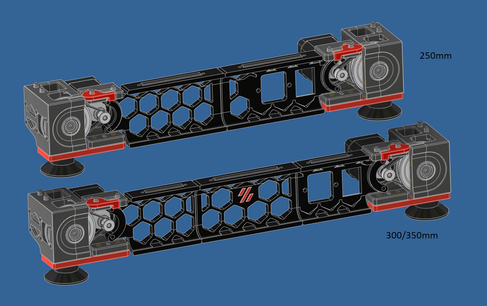

A Team Dropbear Production

## Tridentified V2.4 Power Inlet - by [@Amarpal89](https://github.com/Amarpal89)
### Trident style side plug skirts for V2.4 to suit Edwardyeeks z-drive tensioner mod

**These skirts are only compatible with Edwardyeeks V2.4 z-drive Tensioner Mod [Found Here](../../../orphaned_mods/printer_mods/edwardyeeks/V2.4_z_drive_motor_tensioner_mod)**

### **250:**

``RightSkirt_250.stl`` + ``PlugSkirt_250_*.stl`` Replace the plug panel and both stock rear skirts.

### **300 & 350:**

``PlugSkirt_3x0.stl`` + ``FillSkirt.stl`` + [right side skirt from Eddie's mod]

``*_Filtered.stl`` is for filtered inlet with separate switch.  
``*_adamstech.stl`` is for single piece combination switch and inlet as per trident plug panel.  
``*_single.stl`` is for single piece combination switch and inlet as per original V2.4 plug panel.

Use the accent logo insert from trident stl's if you want a coloured logo on the rear fillskirt of 300/350 builds.  
Want the inlet on the right instead of left? Then mirror the plug skirt.
