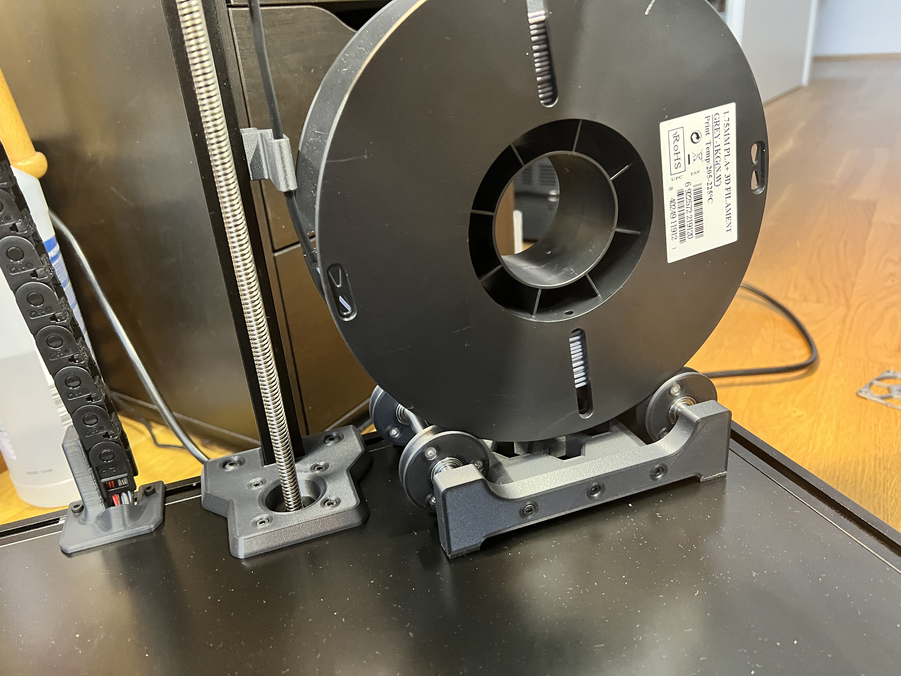

## Important Note:
**This mod works on Trident 300 and 350 builds ONLY**. 250 build simply has no space needed to accomodate the holder and the spool.
Sliding 8mm linear guides allows for adjustable spool width. Supported spool size is 200mm in diameter and up to max 75mm wide, typical for spools up to 1kg - 1.2kg.

## Changelog
08.05.2022.
Initial Release

20.05.2022.
Added new PTFE guide with tilted opening that guides the PTFE slightly to the left to prevent sharp bends. Just one lower guide is recommended now with this new top guide.

## Why?

Over the years i've been getting nicer prints and almost 100% eliminated wet filament ooze by placing the filament spool inside of enclosed chamber. Since my printers work almost 24/7, chambers are always hot enough to keep the filament dry and produce perfect prints.

## Print Setup

All parts are printed without supports. Recommended material is ABS/ASA. Recommended perimeter count is 4 and 5 top/bottom layers with infil from 30%+. All parts in STL already have correct orientation, just import and print.

STL File naming:
- ..._x2_.stl simply means you need to print 2 parts

## BOM

- 8x F688zz Flange Radial Ball Bearing 8 x 16mm
- 2x 8x100mm linear guide
- 12x M3x4mm countersunk screws (M3x6 BHCS or SHCS screws can be used as well)
- 18x M3x4x5 Brass Heat Inserts
- 2x M5x16mm
- 2x M5x10mm
- 4x M5 T-Nut (Regular or Hammerhead)
- 6x M3x8mm

## Images

