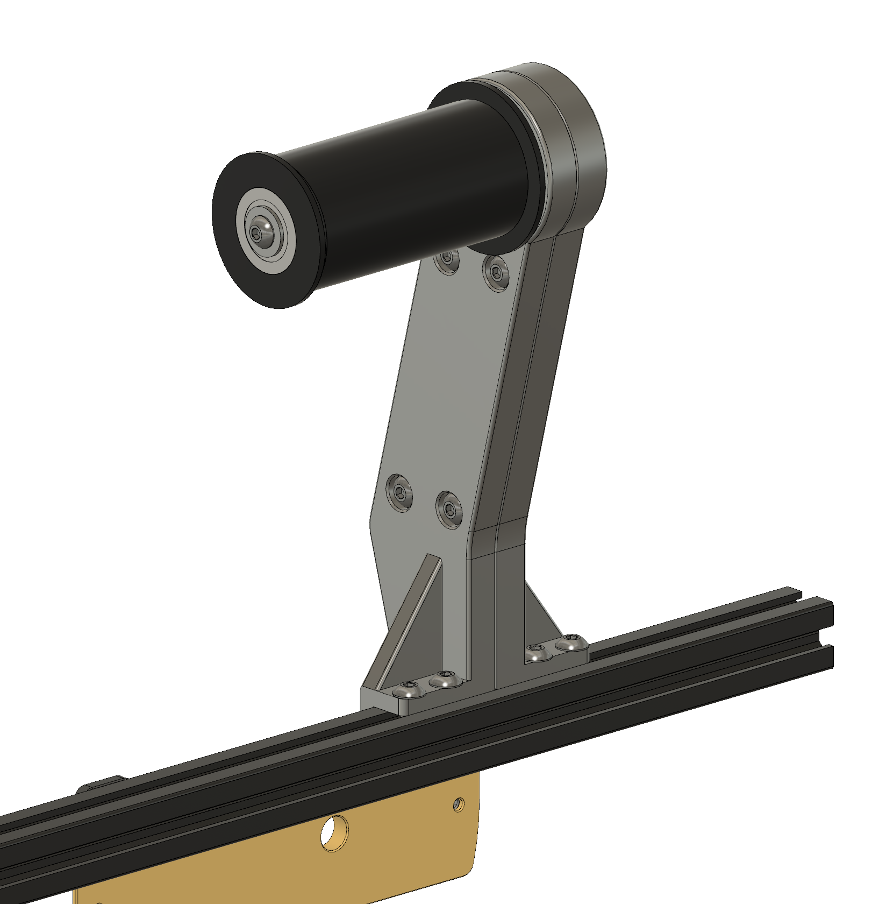
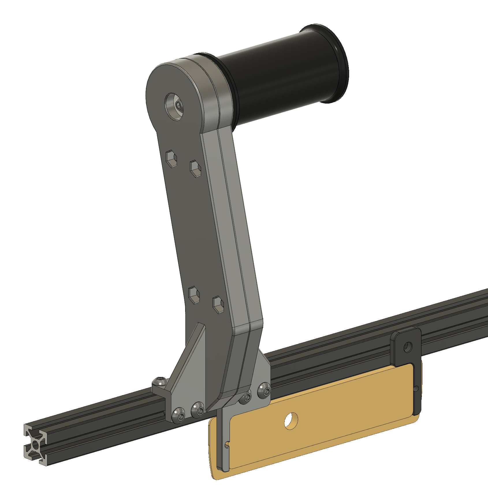
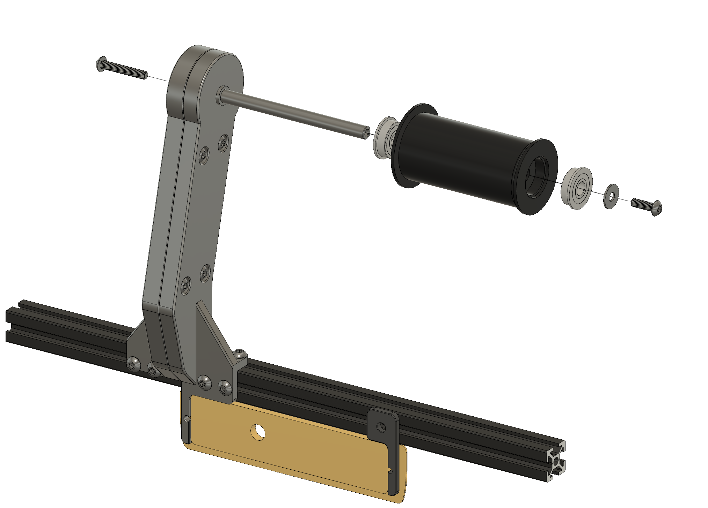
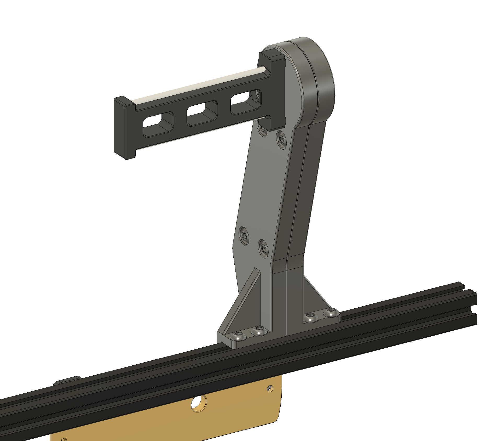
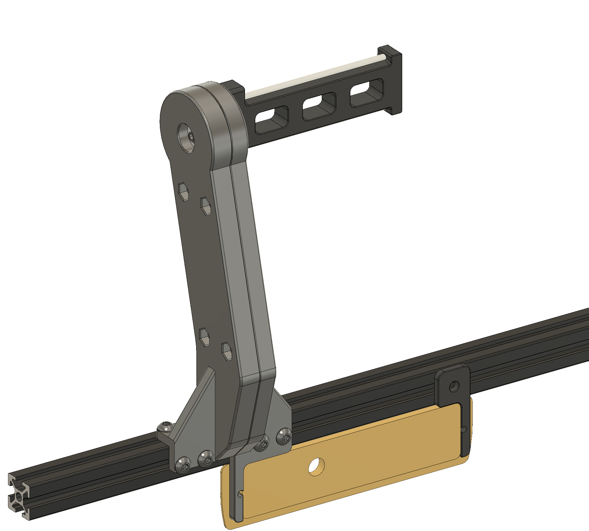
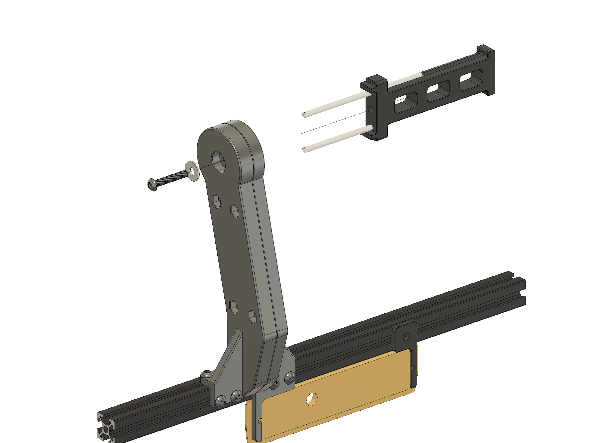

## Changelog
16.04.2022.
Added modified holder arms without panel pins so the holder can be mounted anywhere on the frame. Added files:
BB__spool_arm_left__without_panel_pin.stl
Classic__spool_arm_left__without_panel_pin.stl

## Why?

If you are building Voron 300mm2 or 350mm2, V2.4 or Trident, you will soon discover you need a larger/deeper desk to accomodate your new machine, also if you have 5.5  or larger display mod you will end up with the printer being backed up against the wall and not enough space for the spool holder. After encountering the problem i've started messing with different designns that would provide stable, easily accessible place for the filament spool while keeping the filament path as short as possible.

## Print

All parts are printed without supports. Recommended material is ABS/ASA but PETG or even PLA can be used as well. Frame extrusions get hot during long prints under enclosure so be carefull with PLA. Recommended perimeter count is 4 and 5 top/bottom layers with infil from 20%+. All parts in STL already have correct orientation, just import and print.

STL File naming:
- Classic__part_name.stl - Parts for Classic Voron spool holder design
- BB__part_name.stl - Ball Bearing Version parts

### Versions:

#### 1. Ball Bearing Version
#### 2. Classic Voron type spool holder

### Ball Bearing Version

This version uses 100mm x 8mm rod for spool core mounting. Provides very smooth motion and virtually no resitatnce to the spool motion. The downside of this design is that the spool can free sping and cause the filament to jump off the spool and entangle.Since my printer is very close to the wall the wall itself servers as a resistance to the filament and prevents any free spinning and filament slipping off the spool. 

##### Ball Bearing version - BOM

- S-F-608-ZZ Bearings
- 1x 10mm x 8mm steel rod with cut internal M4 threads on both ends (easy to find on any mechatronics shop and easy to DIY)
- 10 M5x10 BHCS
- 4x M5x16 BHCS
- 4x M5 Hex Nut

### Classic Voron type spool holder

This version uses classic Voron spool holder design adopted to fit the spool holder arm. This design is recommended as it greatly reduces/eliminates the risk of free spinning of the spool and filament slipping over the spool. This version is also simpler/easier and cheaper to make.

##### Ball Bearing version - BOM

- 8 M5x10 BHCS
- 4x M5x16 BHCS
- 5x M5 Hex Nut
- 1x M5x30 BHCS
- 2x 105mm PTFE (4mm OD)

