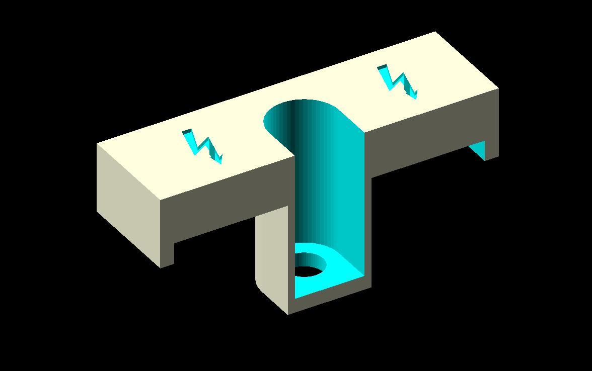
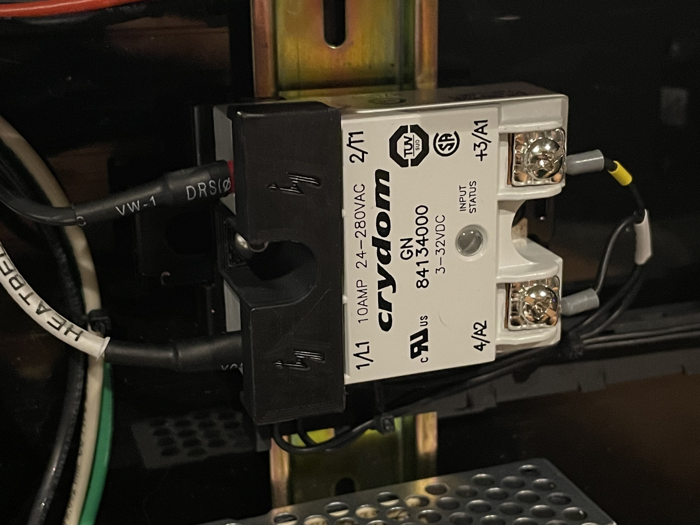

# Crydom GN series terminal guard

I replaced the SSR on my build with a Crydom GN series SSR. The model i received didn't have the terminal cover, so I create a simple cover that is secured with the mounting screw on the SSR, and helps prevent accidental touching of the high voltage terminals.

Installed it looks like this:

Printed in eSun ABS+ with standard Voron print settings.
