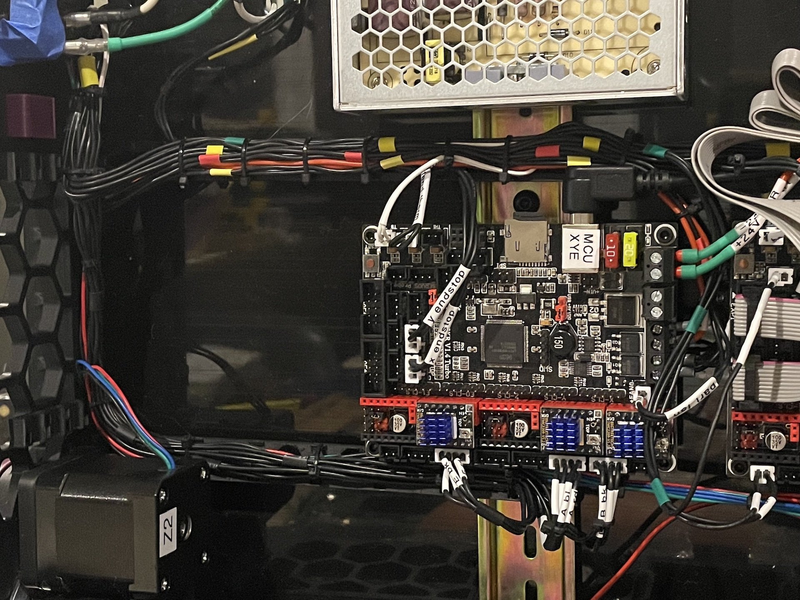

# Cable clamps

I used this set of clamps to route and secure the wiring in my Voron 2.4 350mm.

There are three types, each requiring an m3 bolt and t-nut in order to secure them to the inside perimeter of the upper (meaning closest to the deck) 2020 extrusion. The deck should rest on top of the clamps.

Each type of clamp has an internal channel for multiple small zipties, and the DIN rail clamps also provide secondary holes along the rails.

openscad files are provided for your own tinkering needs.

## Clamp types

The first type only secures along the perimeter. I used this to secure high voltage wiring from the power inlet to the power supplies. Multi "tiers" of zip ties can be used to keep different types of wiring separated.

The second type provides a horizontal bar that secures to the inside to the 2020 extrusion, and can be used to lash wiring to and keep it secure and organized. I used one of those to guide the high voltage wiring.

The third type combines these two, and is used to route wiring along the perimeter, as well as guide and secure wiring to various devices. I used several of these to provide wire tracks towards the Raspberry Pi, SKR boards, and SSR.

An example showing the wiring on my Voron build:

Closeup of how I wiring is routed and secured alongside the SKR controller boards:

## Printing

Parts are intended to be printed in the provided orientation (on the side). I Used ABS, standard Voron print settings.

