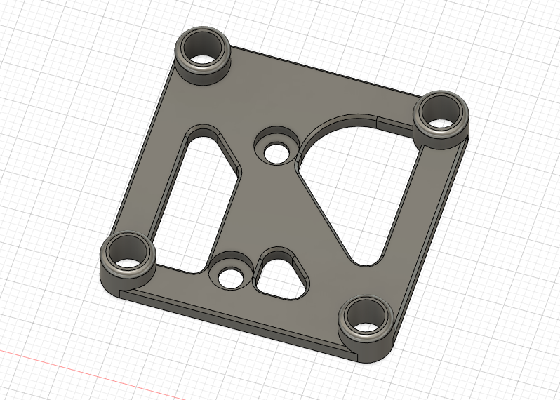

# LGX Lite CAN Side Mount (Huvud/SHT42)

Side mount for CAN toolhead boards with NEMA 17 sizes such as [Huvud](https://github.com/bondus/KlipperToolboard) and [FLY-SHT42](https://mellow.klipper.cn/#/board/fly_sht36_42/).

You will need two M3 square nuts that should have come with the LGX Lite to put into the side holes for mounting.

I am using this on my Voron 2.4 with Mrgl-Mrgl's [LGX Lite Mount](../../Mrgl-Mrgl/LGX_Lite_Mount/) for the extruder.

## BOM
- 4x M3 Square Nuts (Included with LGX Lite)
- 4x M3 Heat Sets (Standard Voron Spec)
- 2x M3x6 BHCS to mount through to LGX Lite holes
- 4x M3x6 SHCS for board mounting (or whatever is suitable for your board)
