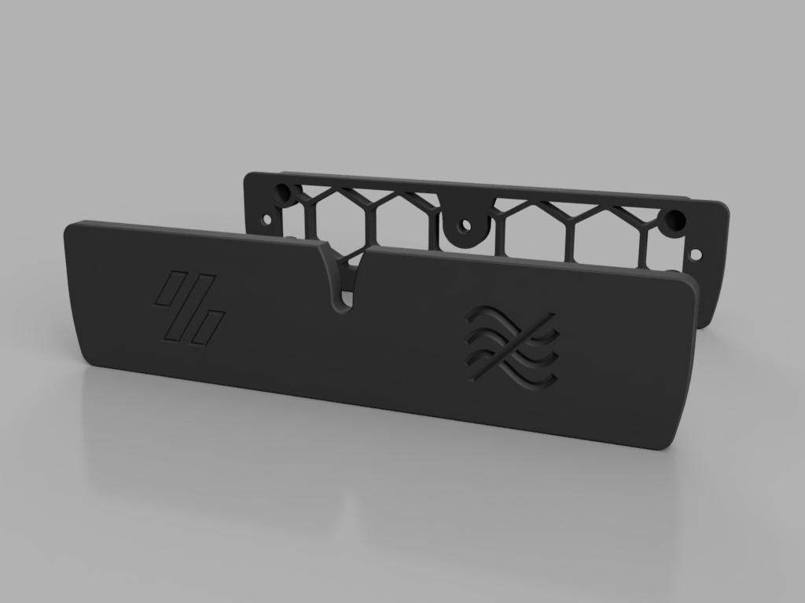
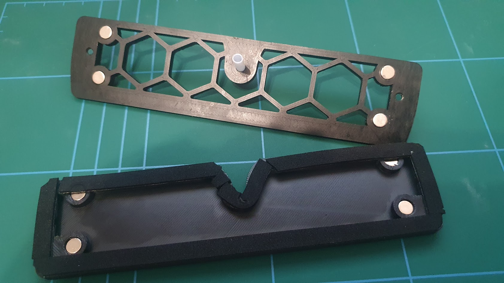

# Magnetic Exhaust Grill Cover

Depending on my printer location and / or cooling needs, I sometimes want the exhaust vent shut off to just rely on recirculated filtering with a nevermore or similar.  This mod replaces the default exhaust grill with one featuring magnets and a captive path for the bowden tube.  There is then a magnetic cover that will fit around the bowden and seal the grill.  It's intended to be installed with the exhaust as normal, but should also be able to attach without by using a couple of M3 nuts and the default [a]_exhaust_filter_mount_x2.stl mounts.

## BOM
- 8x 6x3mm round magnets (Voron BOM spec)
- 50cm foam tape 1mm thick, 5mm wide.  It was designed for [this tape](https://www.amazon.co.uk/sourcing-map-Thick-Adhesive-Weather/dp/B07L6L2F1T) but you can probaby get away with varying both thickness and width depending on magnet strength, or even leaving it out if your print is flat enough to seal and you don't mind magnets going clack against each other.
- 2x M3 Nuts (optional)

## Installation
1. Insert magnets into outer four pockets on each piece.  They should be push fit, but a dab of superglue wouldn't hurt.
2. Test fit the bowden tube on the middle grill hole.  The part is designed to be particularly tight around the tube, and ideally you'd clear the hole with a 4mm bit to get it nice and snug to the tube.
3. Stick the foam tape around the outside rim of the cover.  It doesn't matter if you do this in multiple pieces (as there are some awkward turns).  Just try to get it flat and continuous to aid the seal.
4. Install exhaust grill as normal / using M3 nuts
5. Feed the bowden tube through the centre hole

## Notes
- As previously mentioned, the bowden hole is intended to be tight to the tube.  You can either drill it for perfection, or adjust the size in the CAD using parameters in Fusion.
- If you have other magnets then you can also tweak the parameters in Fusion for these (to an extent).
- If you don't want to lose the cover, you can hang it from the bottom pair of magnets.  You lose a bit of ventilation doing so, but it's one less bit of clutter.

## Thanks
Many thanks to Lanman1 for being a guinea pig for this and giving feedback!