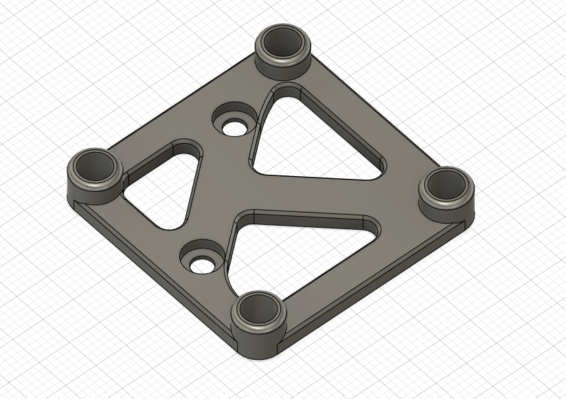

# Toolhead PCB To CAN Mounting Adaptor

Simple mount to convert [Afterburner Toolhead Board](https://github.com/VoronDesign/Voron-Hardware/tree/master/Afterburner_Toolhead_PCB) mount spacing to the spacing for popular CAN toolhead boards like [Huvud](https://github.com/bondus/KlipperToolboard) and [FLY-SHT42](https://mellow.klipper.cn/#/board/fly_sht36_42/).

The assumption is that you have created an evenly spaced pair of holes to mount to with spacing for the afterburner toolhead PCB (version 4.0 and below).  For example, on my 2.4 with a Galileo + Stealthburner I am using hartk's [Galileo Body](https://github.com/hartk1213/MISC/tree/main/Voron%20Mods/Extruders/Galileo).  If you need spacers, they should be easy enough to create in Tinkercad or just by overlaying cylinders in your slicer.

## BOM
- 4x M3 Heat Sets (Standard Voron Spec)
- 2x M3x6 BHCS to mount through to PCB holes
- 4x M3x6 SHCS for board mounting (or whatever is suitable for your board)
