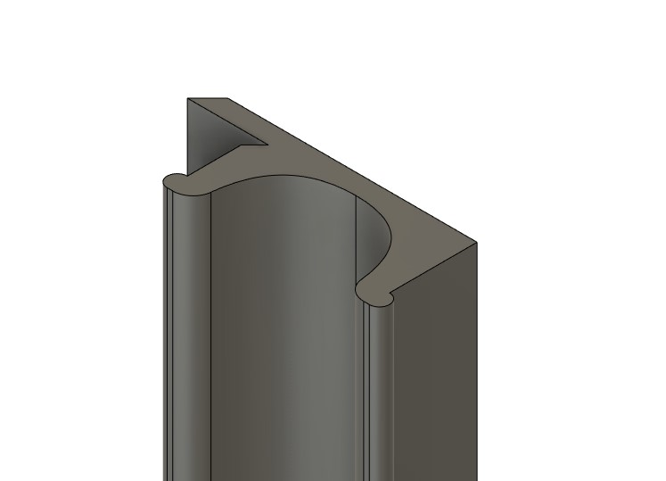

# Cover for extrusion with 6mm slot width

Two simple files.
One is symmetric and can be used for slots that are inside the printer.
One isn't symmetric and can be used on external frames, where there are clear panels.

