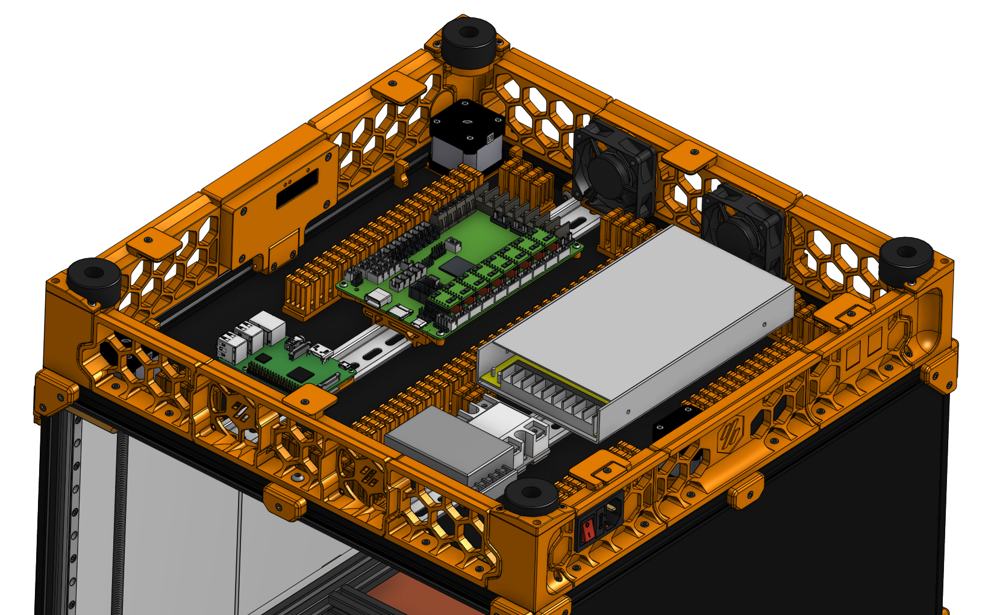
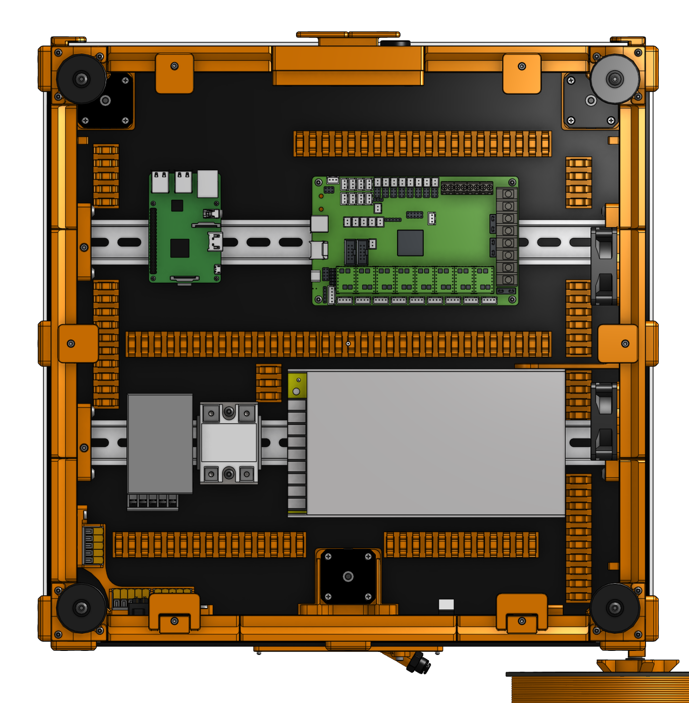
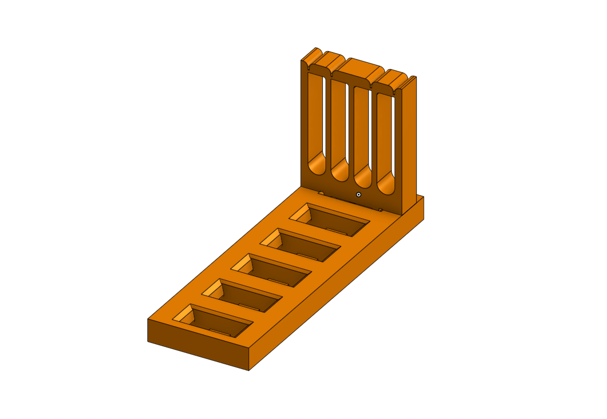

# Comb Cablecanal

A cablecanal I designed to neaten up the spaghet.

I need to credit [blairq](https://www.thingiverse.com/thing:3062013) as I took heavy inspiration. But his parts would simply fall apart.

## instructions / assembly info

Your electronics panel might look very different from mine. So there are a set of STLs for you to print.

you will need (BOM):
 * VHB tape

Print a few small testpices to check the fit. You want to be able to insert the comb part with force. It should stay in there really good. Ideally it does not come out without breaking the hooks. The comb part has very small tabs, they should be on the build plate.

**Do *not* print this in PLA**. PLA has the tendency to creep. So the spring tension in the hook will give over time. PLA also does not like to be near the warmth of your electronics or the heated chamber. Print in ABS or ASA.