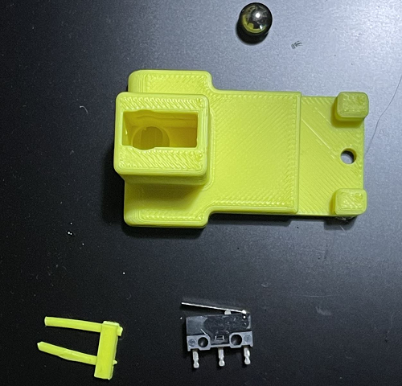
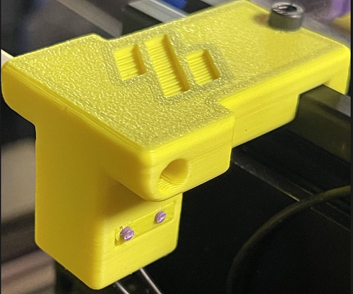
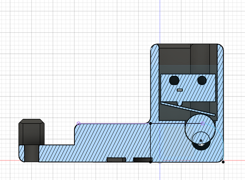

# Filament-Runout-Sensor
This is DIY filament runout sensor for Voron 2.4 and Trident





Works on Klipper and RRF.
Wiring is the same of Voron endstops. Connect the two outer pin of the switch to an input pin on your board.

Hardware required:

- 1x 7mm metal ball
- 1 x Omron microswitch with lever
- 2 x M2x10 Self tapping screw or 2 pieces of filament

For mounting on 2020 extrusion:

- M2x8mm screw
- M2 t-nut slot insert

Printed in ABS o ASA with Voron settings

## RRF 

Standard configuration is:

With command [M591](https://docs.duet3d.com/User_manual/Reference/Gcodes#m591-configure-filament-sensing)

If you are using the tool board 1LC and connect the filament sensor to the main board
```
;Filament sensor
M950 J1 C"io3.in"
M581 T1 P1 R0 S0
```
## Klipper
```
[filament_switch_sensor runout_sensor]
switch_pin: gpio16
pause_on_runout: True
```

This is a remix of this [head filament sensor](https://github.com/EtteGit/EnragedRabbitProject/tree/main/usermods/LGX_Toolhead_Sensor) from Th3FalleN#9999 and the original Voron filament guide.


