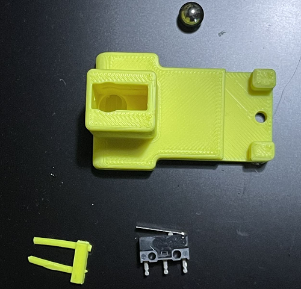
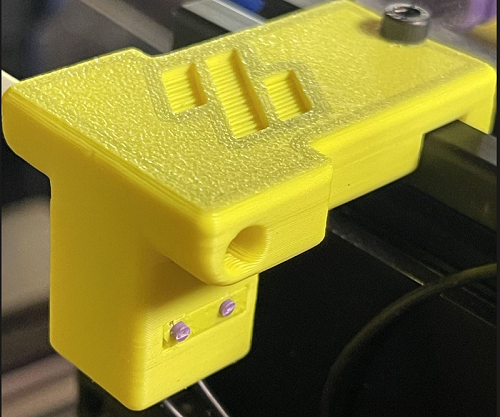
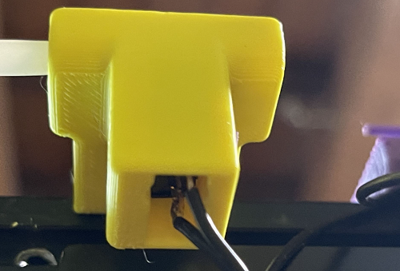
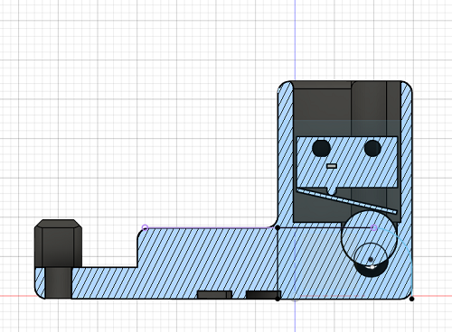

# Filament Runout Sensor
This is DIY filament runout sensor for Voron 2.4 and Trident

This replaces standard bowen_retainer.stl.

Works on Klipper and RRF.

## BOM

Size | Qty
--- | ---
7mm steel ball | 1
Microswitch with lever | 1
M2x10 Self tapping screw or pieces of filament | 2
M2x8mm for frame mount | 1
M2 t-nut slot insert for frame mount | 1

## Printing instrctions

- Printed in ABS or ASA 
- Use standard Voron settings
- No support required


## Wiring
- Wiring is the same as standard end stops.
- Connect the two outer pin of the switch to an input pin on your board.

## Assembly
1. Put the 7mm ball in the body in the rounded hole.
Insert the microswitch with the lever facing outside see the [section picture](./images/FS_section.png)

2. Insert the M2x10 Self tapping screw to secure the switch.
_Alternatively_
Print the [Switch_Lock.stl](./STL/Switch_Lock.stl) and insert 2 pieces of filament in the holes. Than use this to secure the switch.

3. Mount on the frame using M2x8mm and M2 t-nut


## Firmware configuration
#### RRF 

Standard configuration is with command [M591](https://docs.duet3d.com/User_manual/Reference/Gcodes#m591-configure-filament-sensing)

If you are using the tool board 1LC and connect the filament sensor to the main board
```
;Filament sensor
M950 J1 C"io3.in"
M581 T1 P1 R0 S0
```
#### Klipper
```
[filament_switch_sensor runout_sensor]
switch_pin: gpio16
pause_on_runout: True
```

This is a remix of this [head filament sensor](https://github.com/EtteGit/EnragedRabbitProject/tree/main/usermods/LGX_Toolhead_Sensor) from Th3FalleN#9999 and the original Voron bowen retainer.





