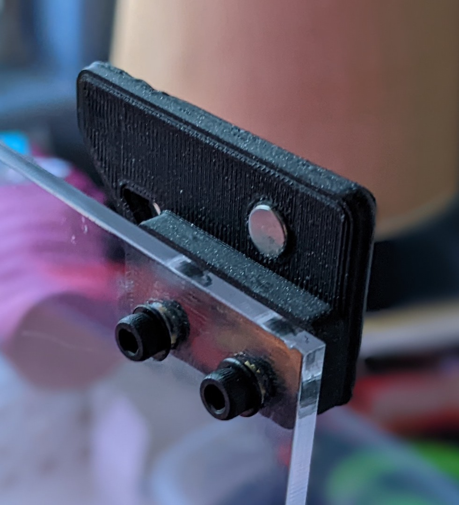
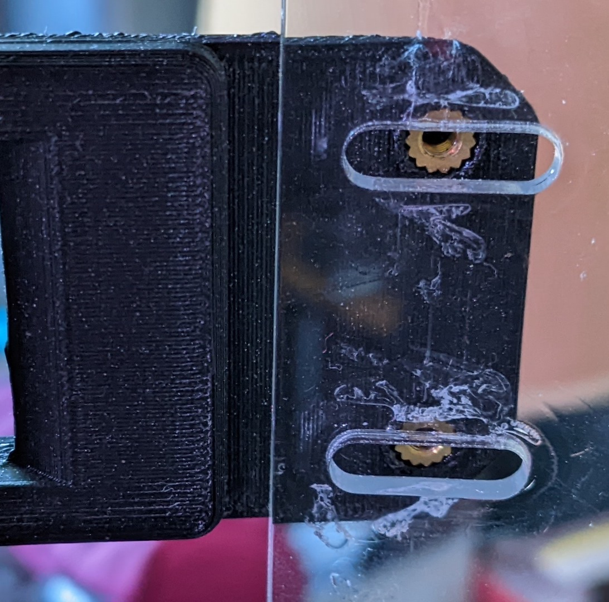
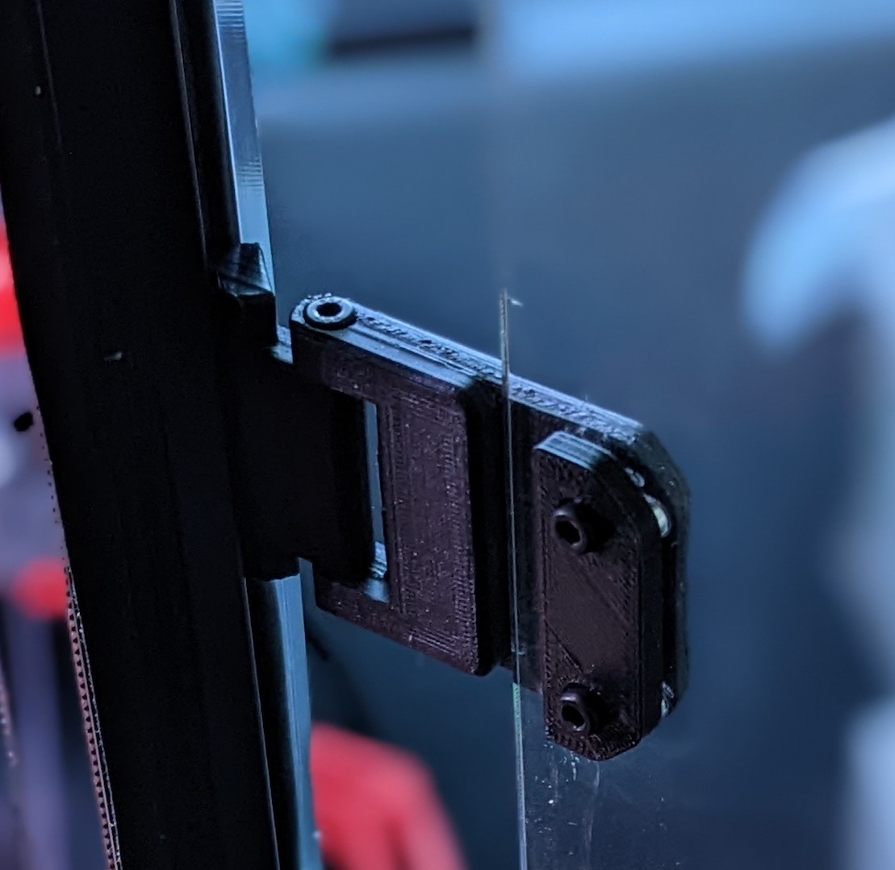
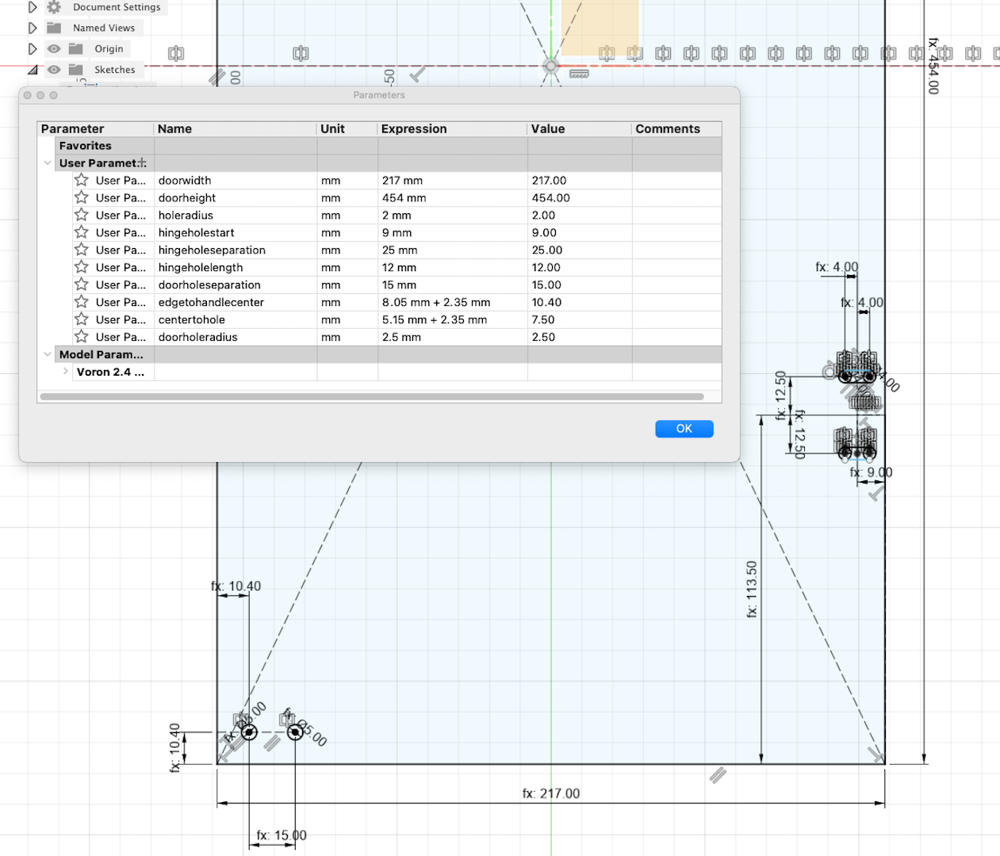
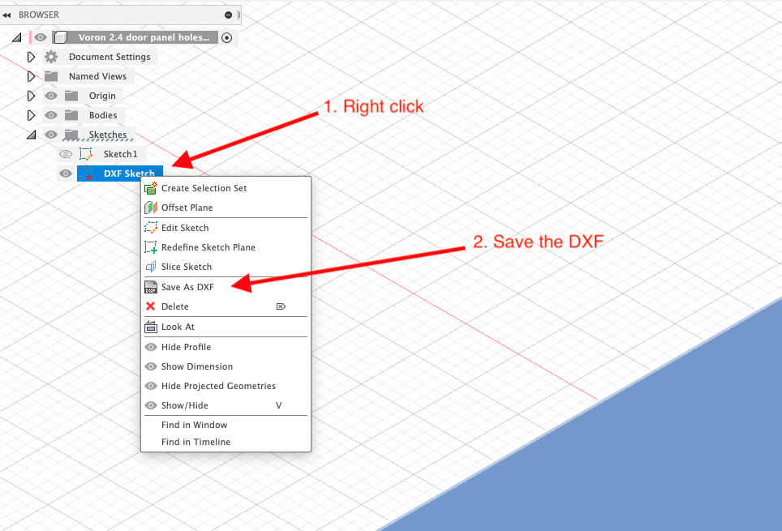

# Laser Cut Door Panels

As my distaste for all solutions VHB related, I was looking for how to replace the hinges on my 2.4.  The most popular solution seems to be the [270 Degree Hinge](../../chrisrgonzales/270_degree_hinge) which was based on [Randell's Door Hinges](../../randell/Door_Hinges).

The challenge with both of these is that they require you to drill your acrylic to mount them.  Maybe that's super easy, but I did some research on it, including what drill bits to buy, etc, and it seemed complicated with a reasonable chance that I was going to crack my panels.

But I do have access to a laser from my [local makerspace](https://www.heatsynclabs.org) and experience there, so I CAD'd the panels in Fusion360 and created the DXFs to cut them.

# Design Goals
The idea behind these files is to allow you to laser cut the door panels to have the horizontal flexibility to dial in the fit. So the holes for the hinges are ovals to allow you that flexibility.  Be aware that thermal expansion will have some impact on your fit.   Mine are tightly aligned when cold, but will stick a little bit when the printer is fully heatsoaked.  

To that end, the holes for the handles are slightly larger and will likely require either a washer or button head screws.  This is intentional to allow you to be able to move those around by a few mm.  I also found that the door latches sat a little too far out for the standard acrylic + 1mm tape, so I modifed the latches to sit back a little more.

There are now CAD files for cutting the holes in front doors.  Although they are parametric (doorwidth) there are f3d and dxf files for 250, 300 and 350mm.  There are also dxf files for all of those in the dxf directory.

**NOTE:** The R2 update of the V2.4 changed the size of panels to make them 1mm smaller all around.  That means that they are .5mm narrower and 1mm shorter.  I've updated the DXFs to those dimensions.  (I think it probably helps with the latch fitment too).  The dimensions are now:

* 250mm: 191.5mm x 403mm
* 300mm: 216.5mm x 453mm
* 350mm: 241.5mm x 503mm

# Files

## CAD

Remember, in Fusion360, the dimensions for the doors are parametric, so you can just change it there instead of opening these individually.  The default version is for the 300mm.  I've removed the other versions because if you have to edit the parameters it doesn't matter what you start with, and the DXF are accurate for the given sizes.

"But hey, what about those of who don't use Fusion?"

Don't worry, I got you too.  Step file also included.

* [door-panel-holes.f3d](CAD/door-panel-holes.f3d)	
* [door-panel-holes.step](CAD/door-panel-holes.step)
* [modified-door-latch.f3d](CAD/modified-door-latch.f3d)

## DXF

For easy import to your laser software.  These can't be parametric, but they're easy to use.

* [250mm-door-panel-holes.dxf](DXF/250mm-door-panel-holes.dxf)
* [300mm-door-panel-holes.dxf](DXF/300mm-door-panel-holes.dxf)
* [350mm-door-panel-holes.dxf](DXF/350mm-door-panel-holes.dxf)

## STL

For easy 3D printing of the modified door latch

* [modified-door-latch.stl](STL/modified-door-latch.stl)

# Images
| Latch |  Cut hinge holes |  Assembled | Parameters |
| --- | --- | --- | --- |
  |   |   | 
| Save as DXF |
| | 

