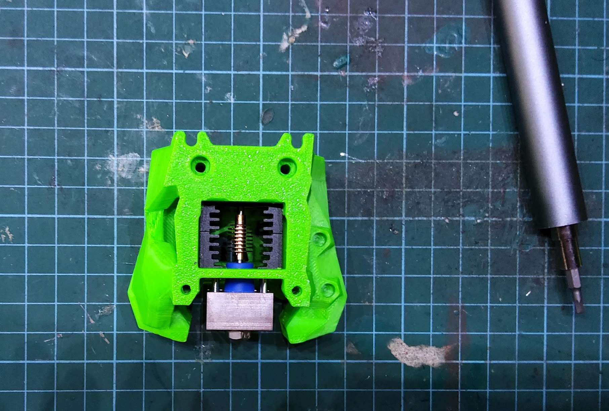
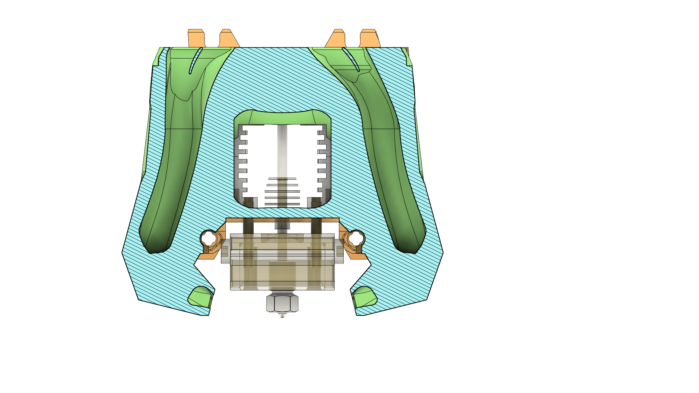
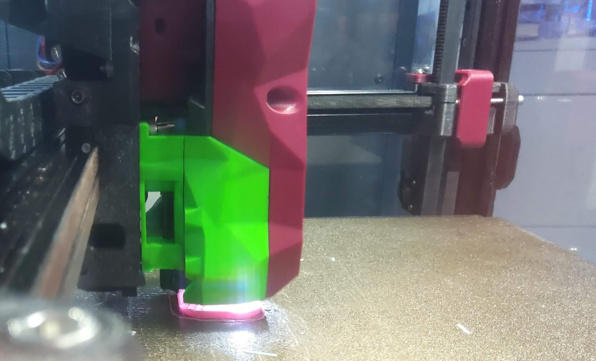

# Stealthburner + Clockwork2 Toolhead for HF Crazy Mozzie

This is a a toolhead mount for the HF Crazy Mozzie (or other Mosquito clones), compatible with Stealthburner RC1 and Clockwork 2. [Design source.](https://a360.co/3CtpGPo)

The airflow pattern is designed and tested for the high-flow version. Here it is shown with the regular version:

In action:

