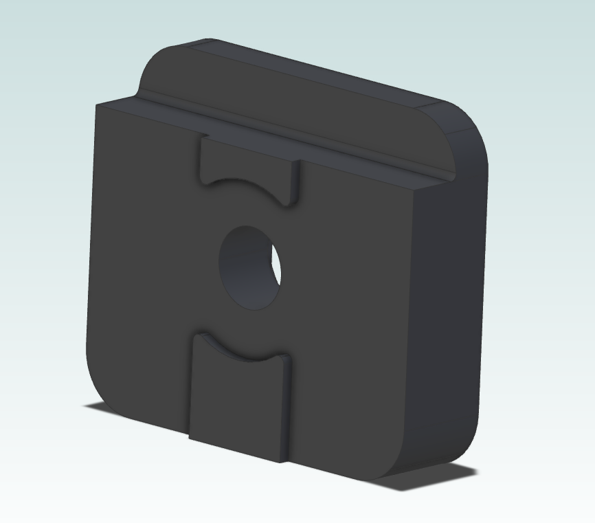

## **Switchwire Z Carriage Stop Pass Through**

This is a modified version of the z_carriage_stop that allows pass through of wires such as the Neopixel light bars.

This is a direct replacement for the stock z_carriage_stop part and does not require additional modifications or disassembly to be used.

