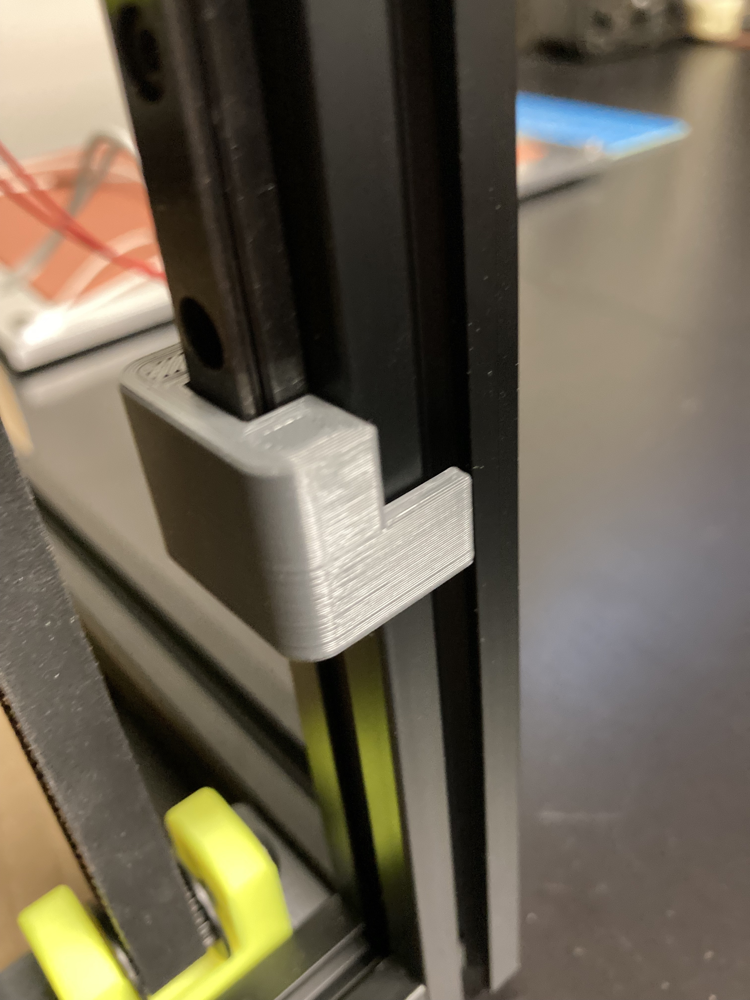

# Dual Rail Installation Guide

A guide for centering the Voron 2.4 dual X rails during installation.

The guide is identical to the [core Voron 2.4 rail installtion guide](https://github.com/VoronDesign/Voron-2/blob/Voron2.4/STLs/VORON2.4/Tools/rail_installation_guide_center_x2.stl), with the top extruded another 10mm longer so it can touch the face of the extrusion even after the first rail is installed.  If that doesn't make sense, see the picture... or just print it and you'll see :)

Since creating this model, I discovered that the Pro Tip™ way to align that second rail is by mounting it loose then using the toolhead - as the manual says, ask on discord if you have questions :)

## Printing

Use the standard Voron 2.4 recommended print settings.  As with the core part, you will want to print two.  If you choose to use this you can skip printing the core guide - you don't need both.

## Images

