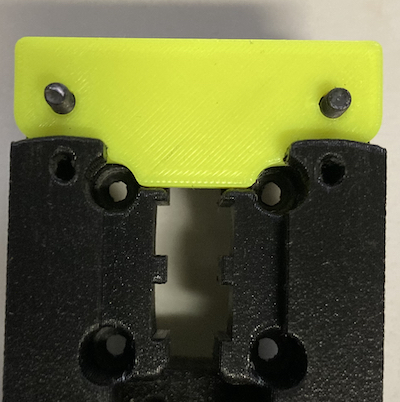

# Afterburner + LGX

Useful links, info, and models for using the The LGX™ Large Gears eXtruder with Afterburner...

If you have anything to add/modify/delete hit me up on discord - I'd like to keep this information as useful and current as possible to make LGX life easier for all.

- [Afterburner LGX Mounts](#afterburner-lgx-mounts)
- [MGN12/Trident X Carriage](#mgn12trident-x-carriage)
- [Stealthburner](#stealthburner)
- [Wiring](#wiring)
- [Klipper config](#klipper-config)
- [Extra LGX Models](#extra-lgx-models)
  * [LGX Cable Cover](#lgx-cable-cover)
  * [LGX Gear Cover](#lgx-gear-cover)
  * [LGX Lever Cover](#lgx-lever-cover)
  * [30mm Mount Screws](#30mm-mount-screws)

---

### Afterburner LGX Mounts

Mounting the LXG to AfterBurner requires some additional mounting plates.  You will need both of `@Nemgrea`'s mounts from Discord:

  * `@Nemgrea`'s `lgx_AftB_Mount_Front.STL` ([Discord file link](https://cdn.discordapp.com/attachments/635687829254701107/823914498700083220/lgx_AftB_Mount_Front.STL))
  * `@Nemgrea`'s `lgx_AftB_Mount_Rear.STL` ([Discord file link](https://cdn.discordapp.com/attachments/635687829254701107/823914501405540442/lgx_AftB_Mount_Rear.STL))

These models are pinned in the [#voronuser_mods](https://discord.com/channels/460117602945990666/635687829254701107/823914498808217621) channel on Discord, and can be found in [this message](https://discord.com/channels/460117602945990666/635687829254701107/823914498808217621).

Thanks to `@Nemgrea V2.199 V0.000` and the crew for their efforts designing and testing the mounts, and offering them to the community.

### MGN12/Trident X Carriage

The above Afterburner mounts will work without alteration in the current MGN12/Trident x carriage.  However, once the rear mount is installed you can no longer access the linear rail block screws.  This mod to the rear mount addresses that.

  * [`lgx-mgn12-mount-rear.stl`](STLs/mgn12/lgx-mgn12-mount-rear.stl)



### Stealthburner

**The Stealthburner beta does not include support for LGX.**

Please don't ask the Stealthburner crew about LGX support, LGX mounts, etc - they have plenty of other Stealthburner things to focus on :)

That said, a number of people are unofficialy running LGX with Stealthburner using the Afterburner mounts.


### Wiring

The LGX uses a JST-PH 6-pin connector, which is not part of any standard Voron BOM so you'll need to source that on your own.

Technical specifications for the motor can be found on the [Bondtech website](https://www.bondtech.se/product/lgx-pancake-25mm-stepper-motor/), including a [wiring diagram](https://www.bondtech.se/wp-content/uploads/2021/01/Bondtech-E-Motor-LDO-42STH25-1004ACGBDT-RevB.pdf).  In case the wiring diagram goes away you can also find it [here](images/Bondtech-E-Motor-LDO-42STH25-1004ACGBDT-RevB.pdf).

Note that the wiring diagram mixes up the wire color names with the color representation


so don't necessarily rely on the colors (which you shouldn't be doing anyway - see the [Stepper Motor Wiring](https://docs.vorondesign.com/build/electrical/#stepper-motor-wiring) notes in the Voron build guide).

Once wired up, be sure to buzz your extruder stepper, as described in the [Voron initial startup](https://docs.vorondesign.com/build/startup/#stepper-motor-check) documentation.  For example:

```
STEPPER_BUZZ STEPPER=extruder
```

If your LGX grinds instead of operating normally, make sure that you have the inner two wires (pins 3 and 4) matched up properly - inverting center two wires is a common initial issue.


### Klipper config

Bondtech has some official documentation for configuring Klipper [here](https://www.bondtech.se/product-category/upgrade-kits/lgx/).  Below is the configuration I am currently running.

```
rotation_distance: 8
microsteps: 16
full_steps_per_rotation: 200

# use either these two config options together
#    gear_ratio: 44:14, 37:17
#    rotation_distance: 55
# or
#    rotation_distance: 8
# by itself, but definitely not
#    gear_ratio: 44:14, 37:17
#    rotation_distance: 8
# or bad things will happen!
```

The `either...or` warning is not from Bondtech, but provided here to honor the memory and sacrifice of my first hotend and save those that may come after from suffering the same fate...

### Extra LGX Models

#### LGX Cable Cover

Besides the mounting parts, most people end up asking about a cable cover.  There are a few posted around Discord, but after seeing [Craxoor's PCB cover](https://github.com/craxoor/VoronMods/tree/master/PCB%20Cover) I designed a similar cover from scratch for use with the LGX.  Note that this cover *does not* work with the toolhead PCB - it just looks similar.

  * [`lgx-cable-cover.stl`](STLs/extras/lgx-cable-cover.stl)


(Cereal not included)

#### LGX Gear Cover

A little cover for the Large Gears on the LGX so it doesn't chew through the fan wires.

  * [`lgx-gear-cover.stl`](STLs/extras/lgx-gear-cover.stl)


#### LGX Lever Cover

Drop-in replacement for the filament pre-tension lever, in case you want a different color:

  * [`lgx-lever-cover.stl`](STLs/extras/lgx-lever-cover.stl)


#### 30mm Mount Screws

I stripped one of the M3x27 low-profile screws that came with the LGX, and have yet to find replacements.  To keep going, I made some adjustments to the front mount and blower housing to accommodate standard M3x30 screws.

  * [`30mm-lgx-mount-front.stl`](STLs/30mm-screws/30mm-lgx-mount-front.stl)
  * [`30mm-lgx-blower-housing-rear.stl`](STLs/30mm-screws/30mm-lgx-blower-housing-rear.stl)

