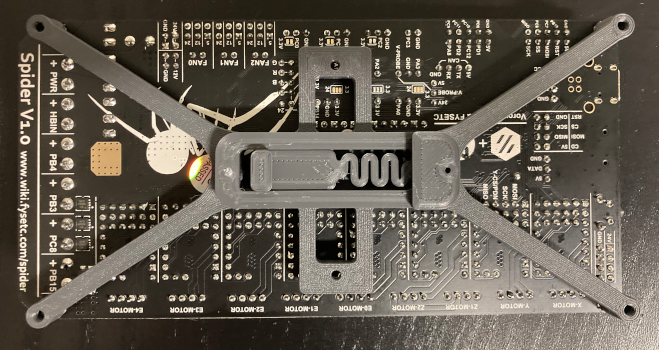

# FYSETC SPIDER DIN Bracket

Minimalist DIN bracket for the [FYSETC SPIDER](https://wiki.fysetc.com/Spider/), based on the simple design of the core SKR bracket.  It uses a [standard build `pcb_din_clip_x3.stl`](https://github.com/VoronDesign/Voron-2/blob/Voron2.4/STLs/VORON2.4/Electronics_Compartment/DIN_Brackets/pcb_din_clip_x3.stl), and provides integrated horizontal and vertical mount options so you can choose on the fly.

## Printing

Use the standard Voron 2.4 recommended print settings.

## BOM

* 4 x M3x8 SHCS screws
* 1 x [`pcb_din_clip_x3.stl`](https://github.com/VoronDesign/Voron-2/blob/Voron2.4/STLs/VORON2.4/Electronics_Compartment/DIN_Brackets/pcb_din_clip_x3.stl)
* 2 x whatever hardware you use to mount your other `pcb_din_clip_x3.stl` clips (I use M2x6 screws, but the BOM self-tapping screws work as well).

## Images

