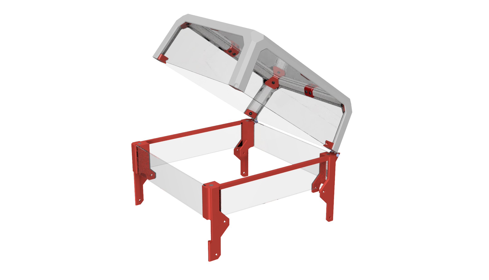
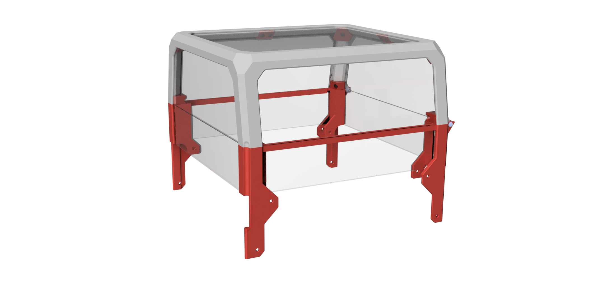
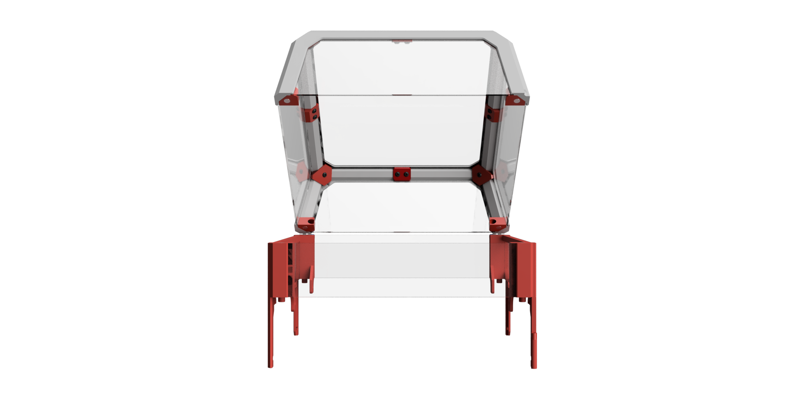
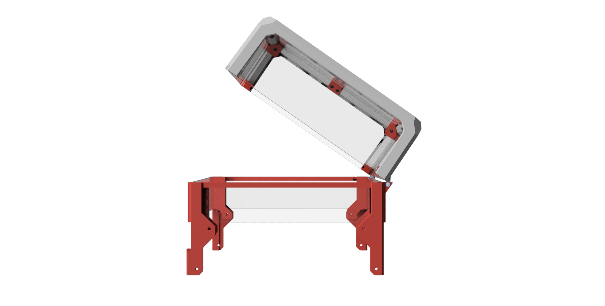
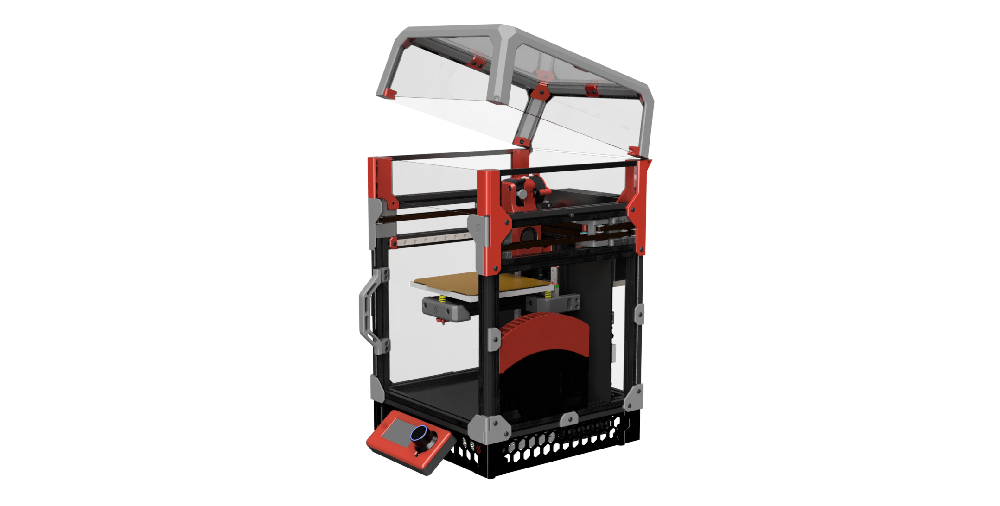

# V0.1 Extended tophat hinge

## Contents

* STL files with print number suffix
* Manual for simplier assembly - TBD
* BOM
* Renders
* cad file

## Explanation
For people who cant print hinged tophat parts as it not fits v0 bed, you can print **hinge_for_stock_tophat_x2.stl** and connect it to default v0.1 tophat with 2x10mm self tapping screws, small 1.2mm holes needs to be made in tophat back parts to secure it with screws.

## BOM
In addition to preloaded nuts and screws that are in stock v0.1 you also need:
* 8 x standard v0.1 BOM magnets 6x3mm
* optional: 2x10mm self taping screws in case of connecting default tophat with **hinge_for_stock_tophat_x2.stl**
* 2 x M3x16 BHCS
* 2 x M3 Nylon-Insert Locknut
* Acrylic/PC 3mm thick or printed panels (dxf included)
  * 1 x front plate - 210x48 mm
  * 2 x side plate - 208x45 mm
  * 1 x back plate - 207x48 mm

## Renders

