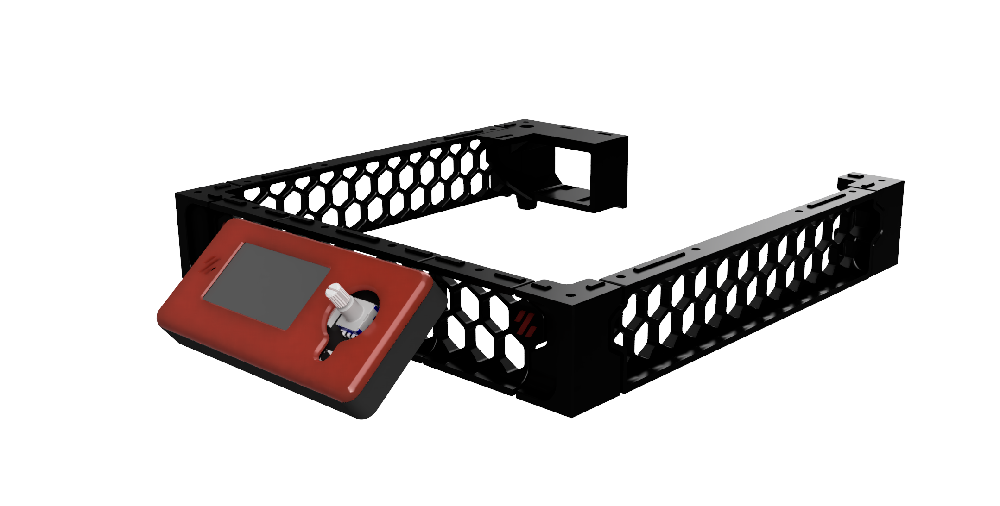
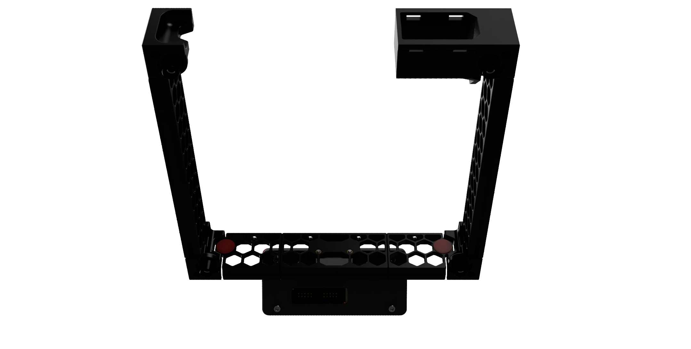
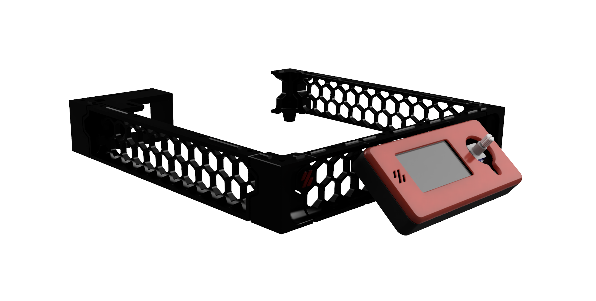
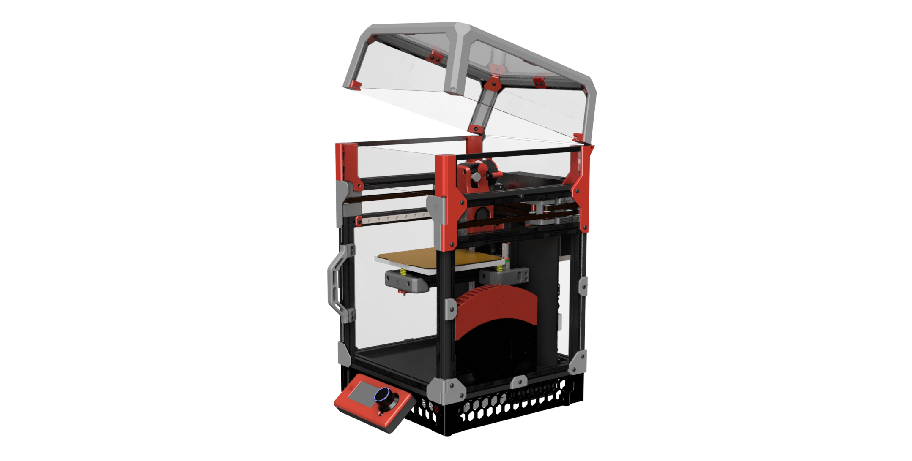
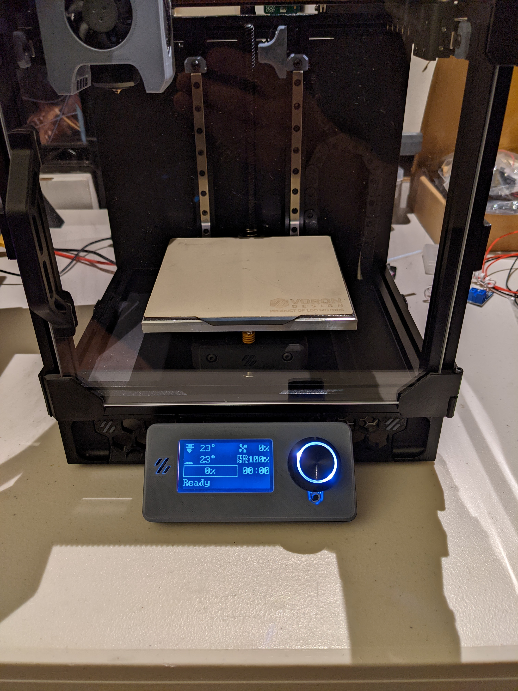
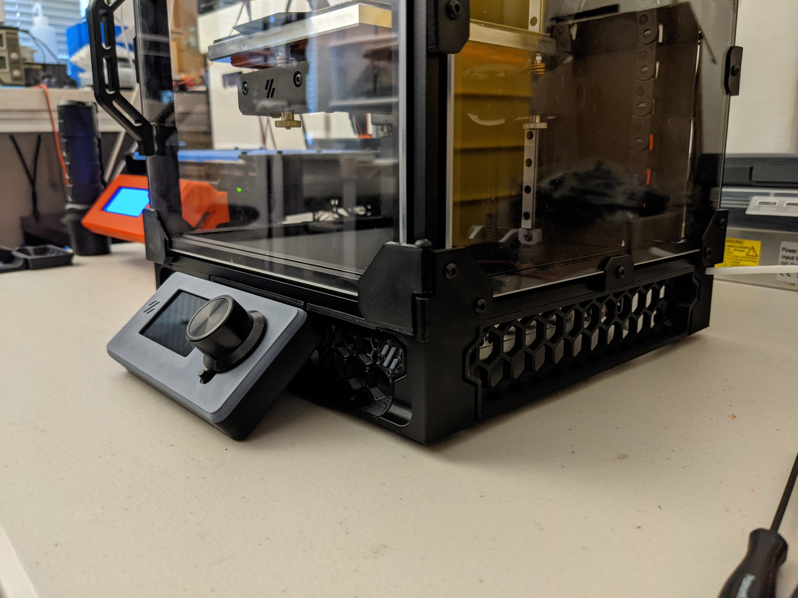

# V0.1 Trident skirt remix with 12864 LCD

## Contents

* STL files with print number suffix
* Manual for simplier assembly
* BOM
* Renders
* Live photos
* cad file

## BOM
In addition to preloaded nuts and screw that are in default v0.1 version you need also:
* 4 x standard v0.1 BOM heat set inserts
* 6 x M3x12 BHCS
* 2 x M3x6 BHCS
* BTT MINI 12864 V1.0

## Renders

## Live photos

Courtesy of Revnull

Courtesy of Revnull

## Collaboration
Big thanks for all who gave ideas, showed mistakes and discussed about this little mod.

Especially for:
* hartk for lcd_case_front_mini12864 step and stl files
* DaveR for front_skirt_one_piece.stl and v0.1_trident_skirt_foot_rear_right_bowden_tube_connector_x1.stl
